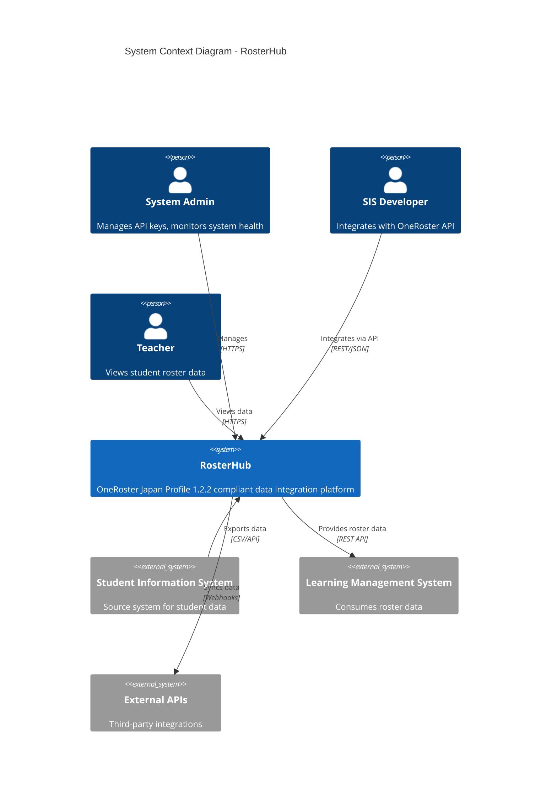
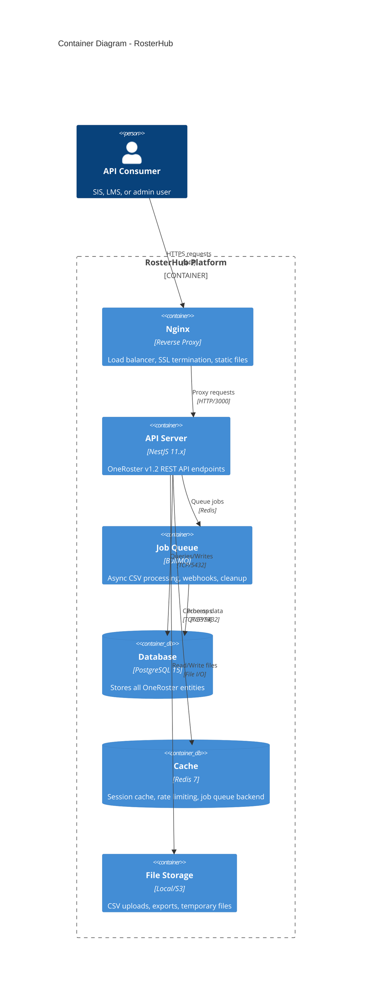
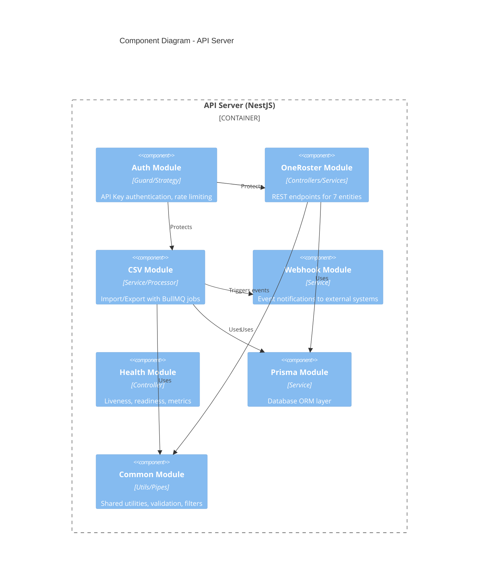
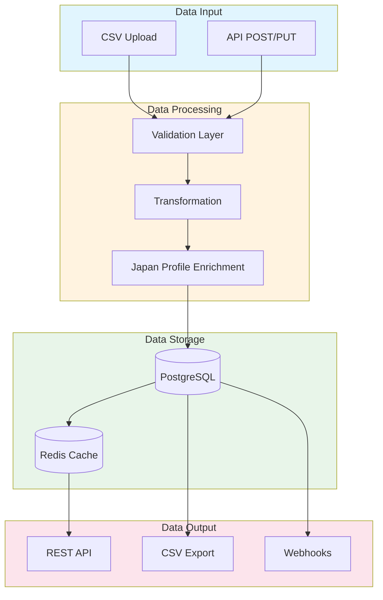
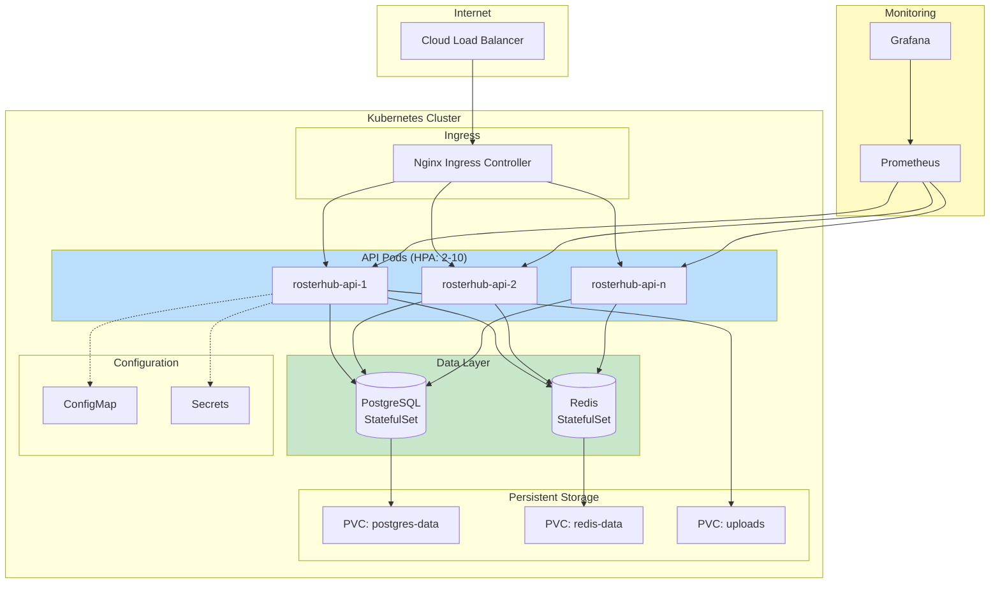
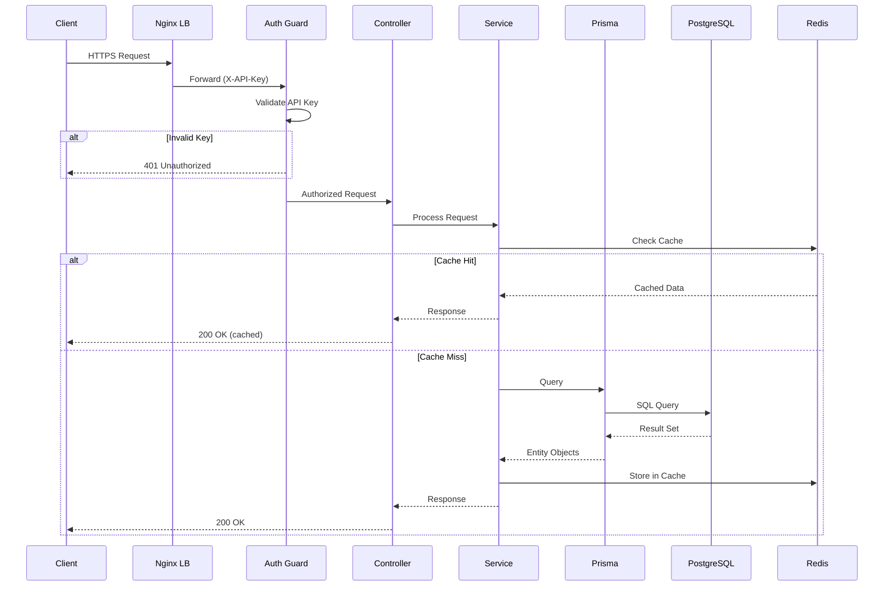
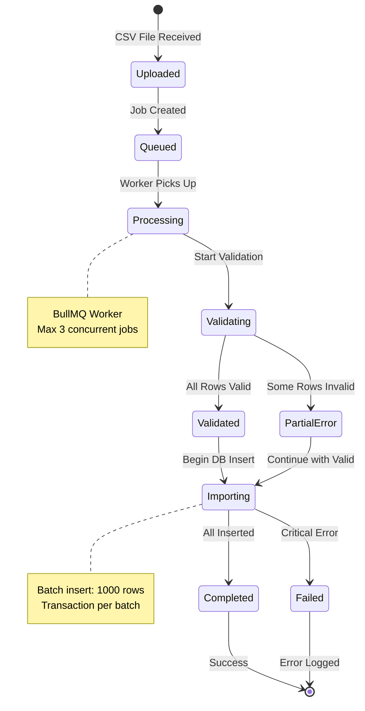

# RosterHub System Architecture Diagrams

## C4 Model Architecture Diagrams

This document contains Mermaid-based architecture diagrams for the RosterHub system following the C4 model approach.

### Level 1: System Context Diagram



### Level 2: Container Diagram



### Level 3: Component Diagram (API Server)



### Data Flow Diagram



### Entity Relationship Diagram

```mermaid
erDiagram
    Org ||--o{ User : "has"
    Org ||--o{ AcademicSession : "has"
    Org ||--o{ Class : "has"
    Org ||--o{ Course : "offers"
    
    User ||--o{ Enrollment : "enrolled"
    User }o--o{ Class : "teaches (userProfiles)"
    
    Class ||--o{ Enrollment : "contains"
    Class }o--|| Course : "implements"
    Class }o--o| AcademicSession : "during"
    
    Course ||--o{ Class : "implemented by"

    Org {
        uuid sourcedId PK
        string name
        enum type
        enum status
        json metadata
    }

    User {
        uuid sourcedId PK
        string username
        string givenName
        string familyName
        enum role
        json metadata
    }

    Class {
        uuid sourcedId PK
        string title
        enum classType
        string classCode
        json metadata
    }

    Course {
        uuid sourcedId PK
        string title
        string courseCode
        json metadata
    }

    AcademicSession {
        uuid sourcedId PK
        string title
        date startDate
        date endDate
        enum type
    }

    Enrollment {
        uuid sourcedId PK
        enum role
        boolean primary
    }
```

### Deployment Architecture (Kubernetes)



### Request Flow Sequence



### CSV Import Job Flow



---

## Technology Stack Summary

| Layer | Technology | Version |
|-------|-----------|---------|
| Runtime | Node.js | 20.x LTS |
| Framework | NestJS | 11.x |
| Language | TypeScript | 5.7 |
| ORM | Prisma | 6.x |
| Database | PostgreSQL | 15 |
| Cache | Redis | 7.x |
| Queue | BullMQ | 5.x |
| Testing | Jest | 30.x |
| Container | Docker | 24.x |
| Orchestration | Kubernetes | 1.28+ |

## Related Documents

- [System Architecture Design Part 1](system-architecture-design-part1-20251114.md)
- [System Architecture Design Part 2](system-architecture-design-part2-20251114.md)
- [Database Design](../../database/database-design-rosterhub-20251114.md)
- [API Documentation](../api/)

---
Last Updated: 2025-01-13
