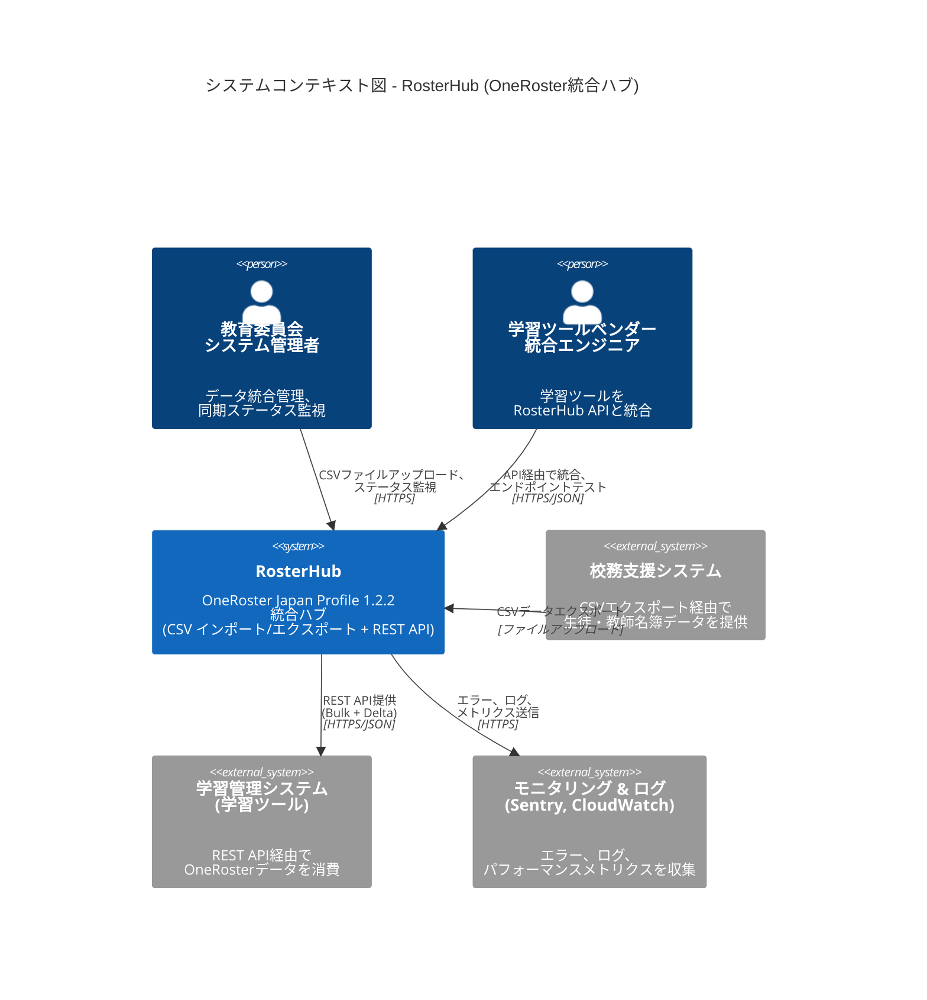
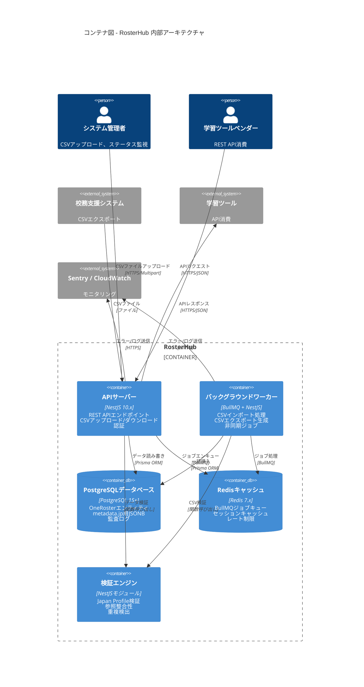
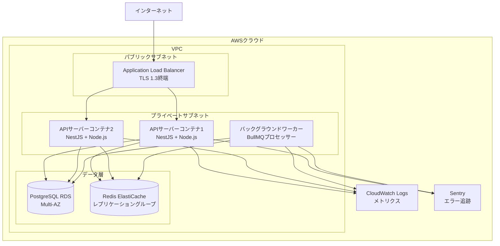

# RosterHub システムアーキテクチャ設計書
## パート1: 概要、エグゼクティブサマリー、C4 Context & Container 図

**プロジェクト**: RosterHub - OneRoster Japan Profile 1.2.2 統合ハブ
**バージョン**: 1.0
**日付**: 2025-11-14
**作成者**: System Architect AI
**ステータス**: ドラフト
**コンプライアンス**: OneRoster Japan Profile 1.2.2、個人情報保護法、GDPR、文科省ガイドライン

---

## 目次（パート1）

1. [エグゼクティブサマリー](#1-エグゼクティブサマリー)
2. [アーキテクチャ概要](#2-アーキテクチャ概要)
3. [C4モデル - レベル1: システムコンテキスト](#3-c4モデル---レベル1-システムコンテキスト)
4. [C4モデル - レベル2: コンテナ図](#4-c4モデル---レベル2-コンテナ図)
5. [デプロイメントアーキテクチャ](#5-デプロイメントアーキテクチャ)

---

## 1. エグゼクティブサマリー

### 1.1 プロジェクト概要

**RosterHub** は **OneRoster Japan Profile 1.2.2 統合ハブ** であり、校務支援システムと学習ツール間の教育データ統合を標準化・自動化するために設計されています。このシステムは、教育委員会レベルのデプロイメントを対象とした集約型データハブとして機能し、複数の学校にわたる10,000～200,000ユーザーを管理します。

**主要機能**:
- **CSV インポート/エクスポート**: 100MB以上のファイル、200,000件以上のレコードに対応した一括データ操作
- **REST API**: Bulk APIとDelta/Incremental APIエンドポイントによる完全なCRUD操作
- **データ検証**: Japan Profileコンプライアンスチェックと詳細なエラーレポート
- **セキュリティ**: APIキー + IPホワイトリスト認証、監査ログ
- **コンプライアンス**: 個人情報保護法、GDPR、文科省ガイドライン

### 1.2 アーキテクチャスタイル

**パターン**: **統合ハブ** 特性を持つ **3層レイヤードアーキテクチャ**

- **プレゼンテーション層**: REST APIエンドポイント、CSVアップロード/ダウンロードインターフェース
- **ビジネスロジック層**: データ検証、変換、オーケストレーション
- **データアクセス層**: Prisma ORMを使用したPostgreSQLデータベース

**なぜこのアーキテクチャか?**
- ✅ **関心の分離**: API、ビジネスロジック、データアクセス間の明確な境界
- ✅ **スケーラビリティ**: ステートレスAPIサーバーによる水平スケーリング
- ✅ **保守性**: OneRosterエンティティに沿ったモジュラー構造
- ✅ **テスト容易性**: 各層を独立してテスト可能
- ✅ **標準パターン**: 開発チームに理解されやすい

**統合ハブの特性**:
- **エンドユーザー向けUIなし**: API優先設計、外部システムによる消費
- **データ変換**: 校務支援システムCSV → OneRoster標準 → REST API JSON
- **デカップリング**: 校務支援システムと学習ツールを分離し、ベンダーロックインを軽減

### 1.3 主要なアーキテクチャ決定

| 決定事項 | 選択 | 根拠 |
|----------|--------|-----------|
| **バックエンドフレームワーク** | NestJS 10.x | TypeScript優先、エンタープライズグレードの構造、優れたDI |
| **データベース** | PostgreSQL 15+ | ACID準拠、metadata.jp.*用のJSONB、行レベルセキュリティ |
| **ORM** | Prisma 5.x | 型安全、優れたTypeScript統合、自動マイグレーション |
| **CSVパーサー** | csv-parse 5.x | ストリーミングパーサー、100MB以上のファイル対応、UTF-8 BOMサポート |
| **バックグラウンドジョブ** | BullMQ 4.x | Redis基盤、ジョブ進捗追跡、リトライロジック |
| **認証** | APIキー + IPホワイトリスト | OneRoster推奨、システム統合にOAuthより簡単 |
| **APIスタイル** | REST (JSON) | OneRoster 1.2標準、GraphQLより消費しやすい |
| **モノレポツール** | pnpm + Turborepo | 高速、効率的、インクリメンタルビルド |

### 1.4 品質特性（優先順位）

要件分析に基づき、システムは以下を優先します:

1. **正確性（Correctness）**: OneRoster Japan Profile 1.2.2への100%準拠
2. **拡張性（Extensibility）**: 新しいエンティティやJapan Profile更新の追加が容易
3. **保守性（Maintainability）**: 80%以上のテストカバレッジ、明確なコード構造
4. **運用性（Operability）**: 包括的なログ、モニタリング、エラー追跡可能性
5. **性能（Performance）**: 200,000ユーザーを30分以内にインポート

### 1.5 コンプライアンスフレームワーク

**法的要件**:
- **個人情報保護法**: 生徒・教師の個人データ保護
- **GDPR**: アクセス権、修正権、削除権（EU居住者向け）
- **文科省ガイドライン**: 教育データセキュリティのベストプラクティス

**技術的実装**:
- **保存時の暗号化**: AES-256（PostgreSQL）
- **通信時の暗号化**: TLS 1.3（全API通信）
- **監査ログ**: タイムスタンプ、ユーザー、IPアドレスを含む全CRUD操作のログ
- **データ保持**: 設定可能（監査ログのデフォルト: 3年）
- **アクセス制御**: APIキー認証 + IPホワイトリスト

---

## 2. アーキテクチャ概要

### 2.1 システムコンテキスト

**教育データエコシステムにおけるRosterHubの位置づけ**:

```
校務支援システム         →   RosterHub   →   学習ツール
(School Information System)  (統合ハブ)    (Learning Tools)

CSV エクスポート（手動）  →   CSV インポート  →   REST API（自動化）
                             検証              Delta Sync
                             変換              Bulk Access
```

**主要な役割**:
- **データソース**: 校務支援システムが生徒・教師の名簿データを提供
- **統合ハブ**: RosterHubがデータを検証、標準化し、API経由で公開
- **データ消費者**: 学習ツール（LMS、SIS等）が標準化されたOneRoster APIを消費

### 2.2 高レベルコンポーネント

```
┌─────────────────────────────────────────────────────────────┐
│                        RosterHub                            │
│                                                             │
│  ┌─────────────┐  ┌──────────────┐  ┌──────────────┐      │
│  │   CSV       │  │  REST API    │  │  バックグラウンド │      │
│  │  インポート/  │  │  (Bulk +     │  │  ジョブ       │      │
│  │  エクスポート │  │   Delta)     │  │  (BullMQ)    │      │
│  └─────────────┘  └──────────────┘  └──────────────┘      │
│         │                │                   │             │
│         └────────────────┴───────────────────┘             │
│                          │                                 │
│                 ┌────────▼────────┐                        │
│                 │  データ検証      │                        │
│                 │  & 変換          │                        │
│                 └────────┬────────┘                        │
│                          │                                 │
│                 ┌────────▼────────┐                        │
│                 │   PostgreSQL    │                        │
│                 │   (OneRoster    │                        │
│                 │    エンティティ)  │                        │
│                 └─────────────────┘                        │
└─────────────────────────────────────────────────────────────┘
```

### 2.3 データフローパターン

**1. CSVインポートフロー（一括アップロード）**
```
校務支援システムCSVエクスポート
    ↓
ファイルアップロード（HTTP POST）
    ↓
BullMQバックグラウンドジョブ（非同期）
    ↓
ストリーミングCSVパーサー（csv-parse）
    ↓
Japan Profile検証
    ↓
一括データベース挿入（Prisma）
    ↓
監査ログ記録
    ↓
インポートステータス更新
```

**2. REST API Bulkクエリフロー**
```
学習ツール → GET /ims/oneroster/v1p2/users
    ↓
APIキー認証
    ↓
IPホワイトリストチェック
    ↓
データベースクエリ（Prisma）
    ↓
JSONレスポンス（OneRoster形式）
    ↓
監査ログ記録
```

**3. REST API Deltaクエリフロー**
```
学習ツール → GET /ims/oneroster/v1p2/users?filter=dateLastModified>2025-01-01T00:00:00Z
    ↓
APIキー認証
    ↓
IPホワイトリストチェック
    ↓
dateLastModifiedフィルタでクエリ（インデックス使用）
    ↓
JSONレスポンス（変更されたレコードのみ）
    ↓
監査ログ記録
```

### 2.4 技術スタック概要

**バックエンド**:
- **ランタイム**: Node.js 20.x LTS
- **フレームワーク**: NestJS 10.x（TypeScript）
- **ORM**: Prisma 5.x
- **CSV**: csv-parse 5.x（ストリーミングパーサー）
- **ジョブ**: BullMQ 4.x（Redis基盤）

**データベース**:
- **プライマリ**: PostgreSQL 15+（metadata.jp.*用のJSONB）
- **キャッシュ/キュー**: Redis 7.x（BullMQバックエンド、セッションキャッシュ）

**インフラストラクチャ**:
- **コンテナ**: Docker（PostgreSQL、Redis）
- **デプロイメント**: AWS ECS FargateまたはRailway（Phase 1）
- **モニタリング**: Sentry（エラー）、CloudWatch（ログ）

**開発**:
- **言語**: TypeScript 5.3+
- **パッケージマネージャー**: pnpm 8.x
- **モノレポ**: Turborepo 1.x
- **テスト**: Vitest（ユニット）、Playwright（E2E）

---

## 3. C4モデル - レベル1: システムコンテキスト

### 3.1 システムコンテキスト図



### 3.2 外部アクター

**1. 教育委員会システム管理者（主要利用者）**
- **役割**: RosterHub設定管理、CSVファイルアップロード、統合ステータス監視
- **責任**:
  - 校務支援システムからの週次CSVアップロード
  - 学習ツールベンダー向けAPIキー生成
  - IPホワイトリスト設定
  - エラーレポートと監査ログのレビュー
- **インタラクション**: Webインターフェース（Phase 2）またはダイレクトAPIコール（Phase 1）

**2. 学習ツールベンダー統合エンジニア（技術利用者）**
- **役割**: 学習ツール向けのOneRoster APIクライアント実装
- **責任**:
  - 初期一括データ取得（全ユーザー、組織、クラス、登録）
  - 日次Delta APIポーリング（変更取得）
  - エラーハンドリングとリトライロジック
- **インタラクション**: REST API（HTTPS/JSON）

### 3.3 外部システム

**1. 校務支援システム**
- **タイプ**: 外部データソース
- **データフロー**: CSVエクスポート（手動またはスケジュール）
- **形式**: OneRoster Japan Profile 1.2.2 CSV
- **頻度**: 週次または日次（設定可能）
- **ボリューム**: 10,000～200,000ユーザー、100MB以上のファイルサイズ

**2. 学習管理システム（学習ツール）**
- **タイプ**: 外部データ消費者
- **データフロー**: REST API（Bulk + Delta）
- **形式**: OneRoster JSON（v1.2）
- **頻度**: 初期一括取得、その後日次Delta同期
- **ボリューム**: 1日あたり1,000～10,000 APIリクエスト

**3. モニタリング & ログシステム**
- **タイプ**: 可観測性インフラストラクチャ
- **コンポーネント**:
  - **Sentry**: エラー追跡とアラート
  - **CloudWatch**: ログ集約（AWSデプロイメント）
  - **Prometheus/Grafana**（オプション）: メトリクスダッシュボード
- **目的**: エラー検出、パフォーマンス追跡、SLA準拠確保（99%稼働率）

### 3.4 システム境界

**スコープ内（RosterHubの責任）**:
- OneRoster CSVインポート/エクスポート
- REST API（BulkおよびDeltaエンドポイント）
- データ検証と変換
- API認証（APIキー + IPホワイトリスト）
- 監査ログ
- バックグラウンドジョブ処理（CSVインポート）

**スコープ外（外部システムの責任）**:
- 校務支援システムによるCSV生成
- 学習ツールの内部データモデルマッピング
- ユーザー認証（SSO）- Phase 2
- リアルタイム通知（webhook）- Phase 2
- データ編集UI - Phase 2

---

## 4. C4モデル - レベル2: コンテナ図

### 4.1 コンテナ図



### 4.2 コンテナ説明

**1. APIサーバー（NestJS 10.x）**
- **技術**: NestJS、TypeScript、Node.js 20.x
- **責任**:
  - REST APIエンドポイント（GET、POST、PUT、DELETE）
  - CSVファイルアップロード（multipart/form-data）
  - CSVファイルダウンロード（ストリーミングレスポンス）
  - APIキー認証
  - IPホワイトリスト検証
  - レート制限（APIキーごと）
  - リクエスト/レスポンスログ
- **スケーラビリティ**: ステートレス、ロードバランサー経由の水平スケーリング
- **エンドポイント**:
  - `/ims/oneroster/v1p2/users`（Bulk API）
  - `/ims/oneroster/v1p2/users?filter=dateLastModified>{timestamp}`（Delta API）
  - `/csv/import`（CSVアップロード）
  - `/csv/export`（CSVダウンロード）

**2. バックグラウンドワーカー（BullMQ + NestJS）**
- **技術**: BullMQ（Redis基盤ジョブキュー）、NestJS
- **責任**:
  - 非同期CSVインポート処理（ストリーミングパーサー）
  - CSVエクスポート生成（大規模データセット）
  - 失敗ジョブのリトライロジック
  - ジョブ進捗追跡
  - エラーレポート
- **ジョブタイプ**:
  - `csv-import`: CSVファイルインポート（最大30分）
  - `csv-export`: CSVファイル生成（最大10分）
- **並行性**: 5並行ジョブ（設定可能）

**3. PostgreSQLデータベース（PostgreSQL 15+）**
- **技術**: JSONB対応PostgreSQL 15+
- **スキーマ**:
  - OneRosterエンティティ（Users、Orgs、Classes、Courses、Enrollments、AcademicSessions、Demographics）
  - 監査ログ（AuditLogテーブル）
  - APIキー（ApiKeyテーブル）
  - CSVインポートジョブ（CsvImportJobテーブル）
- **インデックス**:
  - `sourcedId`（一意、主要アクセスパターン）
  - `dateLastModified`（Delta APIクエリ）
  - `status`（アクティブ/非アクティブレコードフィルタ）
  - 複合: `(dateLastModified, status)`（パフォーマンス用）
- **JSONB使用**: `metadata`カラムがJapan Profile拡張を格納（例: `metadata.jp.kanaGivenName`）

**4. Redisキャッシュ（Redis 7.x）**
- **技術**: Redis 7.x
- **ユースケース**:
  - **BullMQジョブキュー**: バックグラウンドジョブの永続化
  - **セッションキャッシュ**: APIキー検証キャッシュ（DB負荷軽減）
  - **レート制限**: キー/IPごとのAPIリクエストカウント追跡
- **永続化**: RDB + AOF（ジョブキューには永続化が必要）
- **退避ポリシー**: セッションキャッシュにLRU

**5. 検証エンジン（NestJSモジュール）**
- **技術**: NestJSサービス（TypeScript）
- **責任**:
  - OneRoster Japan Profile 1.2.2フィールド検証
  - データ型検証（string、integer、date、enum）
  - 必須フィールドチェック
  - 参照整合性（外部キー検証）
  - 重複検出（sourcedId一意性）
  - カスタムJapan Profileルール（例: kanaGivenName形式）
- **統合**: APIサーバー（同期）およびバックグラウンドワーカー（非同期）から呼び出し

### 4.3 通信パターン

**1. 同期通信（リクエスト-レスポンス）**
- **APIサーバー → PostgreSQL**: REST APIクエリ（Prisma ORM）
- **APIサーバー → 検証エンジン**: 書き込み前のデータ検証
- **学習ツール → APIサーバー**: REST APIコール（HTTPS/JSON）

**2. 非同期通信（ジョブキュー）**
- **APIサーバー → Redis（BullMQ）**: CSVインポートジョブのエンキュー
- **バックグラウンドワーカー → Redis（BullMQ）**: キューからジョブ処理
- **バックグラウンドワーカー → PostgreSQL**: 一括挿入/更新操作

**3. ストリーミング通信**
- **CSVインポート**: ストリーミングCSVパーサー（csv-parse）で100MB以上のファイルをメモリに読み込まずに処理
- **CSVエクスポート**: ストリーミングデータベースクエリ + CSV生成（OOMエラー回避）

### 4.4 データストレージ戦略

**プライマリデータ（PostgreSQL）**:
- OneRosterエンティティ（Users、Orgs、Classes等）
- 監査ログ（3年保持）
- APIキー（bcryptハッシュ）
- CSVインポートジョブメタデータ

**一時データ（Redis）**:
- BullMQジョブキュー（アクティブジョブ、24時間の完了ジョブ）
- APIキー検証キャッシュ（5分TTL）
- レート制限カウンター（1時間スライディングウィンドウ）

**ファイルストレージ（将来のPhase 2）**:
- アップロードされたCSVファイル用AWS S3またはVercel Blob（90日保持）
- 生成されたCSVエクスポート（7日保持）

---

## 5. デプロイメントアーキテクチャ

### 5.1 インフラストラクチャ図（AWS ECS）



### 5.2 デプロイメント仕様

**APIサーバー（ECS Fargateタスク）**:
- **コンテナ**: Dockerイメージ（Node.js 20-alpine）
- **リソース**: 2 vCPU、4GB RAM（インスタンスあたり）
- **スケーリング**: オートスケーリング（2～10インスタンス）
  - ターゲット: CPU使用率70%
  - スケールアウト: 5分間CPU > 70%で追加
  - スケールイン: 10分間CPU < 30%で削減
- **ヘルスチェック**: `/health`エンドポイント（200 OK）

**バックグラウンドワーカー（ECS Fargateタスク）**:
- **コンテナ**: Dockerイメージ（Node.js 20-alpine）
- **リソース**: 4 vCPU、8GB RAM（CSV処理集約型）
- **スケーリング**: 固定1～2インスタンス（オートスケーリングなし）
- **並行性**: インスタンスあたり5並行ジョブ

**PostgreSQL（AWS RDS）**:
- **インスタンス**: db.r6g.xlarge（4 vCPU、32GB RAM）
- **ストレージ**: 500GB GP3 SSD（3000 IOPS）
- **Multi-AZ**: 有効（自動フェイルオーバー）
- **バックアップ**: 自動日次バックアップ（30日保持）
- **暗号化**: AES-256（保存時）

**Redis（AWS ElastiCache）**:
- **インスタンス**: cache.r6g.large（2 vCPU、13GB RAM）
- **レプリケーション**: 1プライマリ + 1レプリカ
- **永続化**: AOF有効（BullMQジョブ耐久性）
- **自動フェイルオーバー**: 有効

### 5.3 スケーラビリティ戦略

**水平スケーリング（APIサーバー）**:
- **ステートレス設計**: APIサーバーにセッション状態なし（JWTトークン）
- **ロードバランシング**: ALBがインスタンス間でリクエスト分散
- **コネクションプーリング**: Prismaコネクションプール（インスタンスあたり10接続）
- **キャッシュ**: RedisセッションキャッシュでDB負荷軽減

**垂直スケーリング（データベース）**:
- **リードレプリカ**: Bulk APIクエリ用PostgreSQLリードレプリカ追加（Phase 2）
- **インスタンスサイズ**: 必要に応じてRDSインスタンスタイプアップグレード

**データパーティショニング（将来のPhase 3）**:
- **マルチテナンシー**: 教育委員会ごとに個別スキーマ
- **シャーディング**: `orgSourcedId`（学区）でパーティショニング

### 5.4 高可用性

**目標SLA**: 99%稼働率（年間8.76時間のダウンタイム）

**HAコンポーネント**:
- **Multi-AZ RDS**: 自動フェイルオーバー（< 2分）
- **Redisレプリケーション**: 自動フェイルオーバー（< 1分）
- **APIサーバーインスタンス**: アベイラビリティゾーン間で2以上のインスタンス
- **ロードバランサー**: ヘルスチェック付きAWS ALB

**障害シナリオ**:
| 障害 | 影響 | 復旧 | RTO |
|---------|--------|----------|-----|
| APIインスタンスクラッシュ | 影響なし（他のインスタンスが提供） | オートスケーリングで新インスタンス追加 | 5分 |
| バックグラウンドワーカークラッシュ | ジョブは自動リトライ（BullMQ） | ECSがコンテナ再起動 | 2分 |
| PostgreSQLプライマリ障害 | フェイルオーバー中は読み取り専用モード | Multi-AZフェイルオーバー | < 2分 |
| Redisプライマリ障害 | ジョブキュー一時停止 | レプリケーションフェイルオーバー | < 1分 |
| AZ全体障害 | パフォーマンス低下 | 他のAZへトラフィックルーティング | 0分 |

### 5.5 モニタリング & 可観測性

**メトリクス（CloudWatch）**:
- APIレスポンス時間（p50、p95、p99）
- APIエラー率（5xxレスポンス）
- バックグラウンドジョブ時間
- データベースコネクションプール使用率
- Redisメモリ使用率

**ログ（CloudWatch Logs）**:
- 構造化JSONログ（WinstonまたはPino）
- ログレベル: ERROR、WARN、INFO、DEBUG
- 保持期間: 90日

**アラート**:
- APIエラー率 > 5%（5分）
- データベースCPU > 80%（10分）
- バックグラウンドジョブ失敗（即時）
- ディスク使用率 > 85%

**エラー追跡（Sentry）**:
- 自動エラーキャプチャ
- ソースマップ付きスタックトレース
- リリース追跡
- 新規エラーのメールアラート

---

## 次のステップ

このドキュメントは **パート2** で続きます:
- C4モデル - レベル3: コンポーネント図（NestJSモジュール）
- C4モデル - レベル4: コード図（クラス図）
- データフロー図（詳細）
- モジュール構造（NestJS構成）
- セキュリティアーキテクチャ
- 統合パターン

**ファイル**: `system-architecture-design-part2-20251114.md`

---

**ドキュメントステータス**: ドラフト - パート1完了
**レビュー必要**: 外部ベンダー、システムアーキテクト、DevOpsエンジニア
**次回レビュー日**: 2025-11-21

---

**バージョン履歴**

| バージョン | 日付 | 作成者 | 変更内容 |
|---------|------|--------|---------|
| 1.0 | 2025-11-14 | System Architect AI | 初版作成 - パート1（概要、C4 Context、C4 Container、デプロイメント） |
