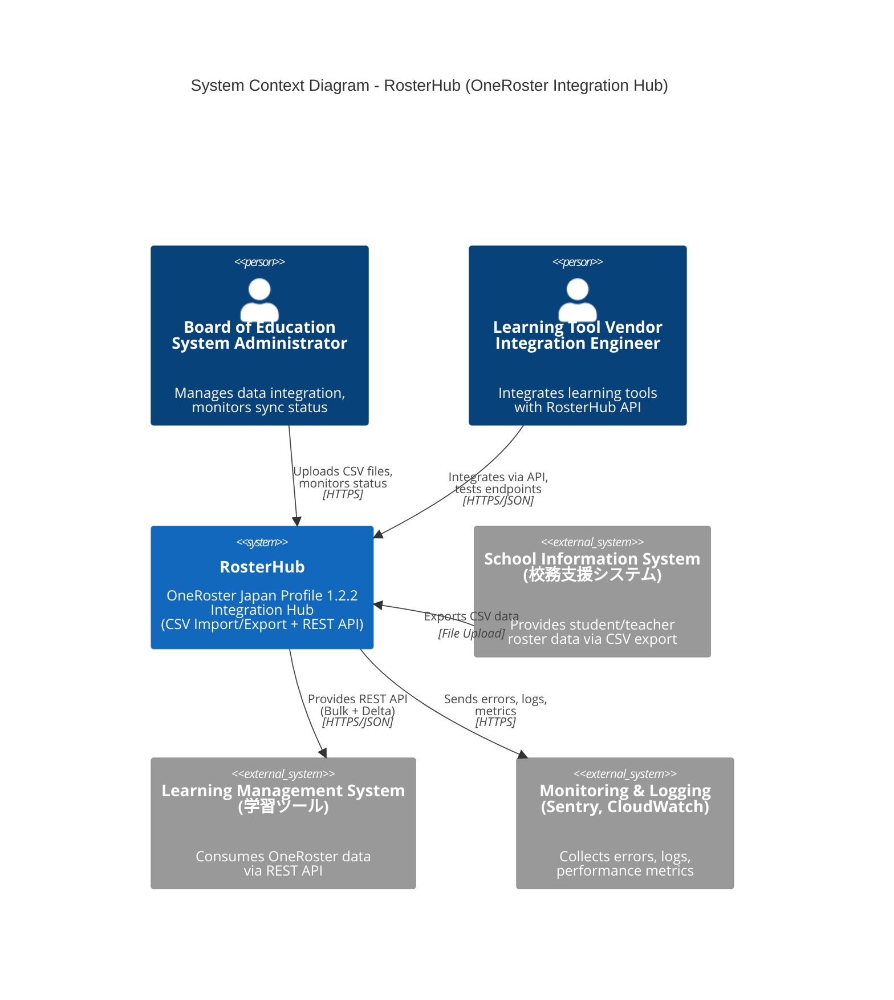
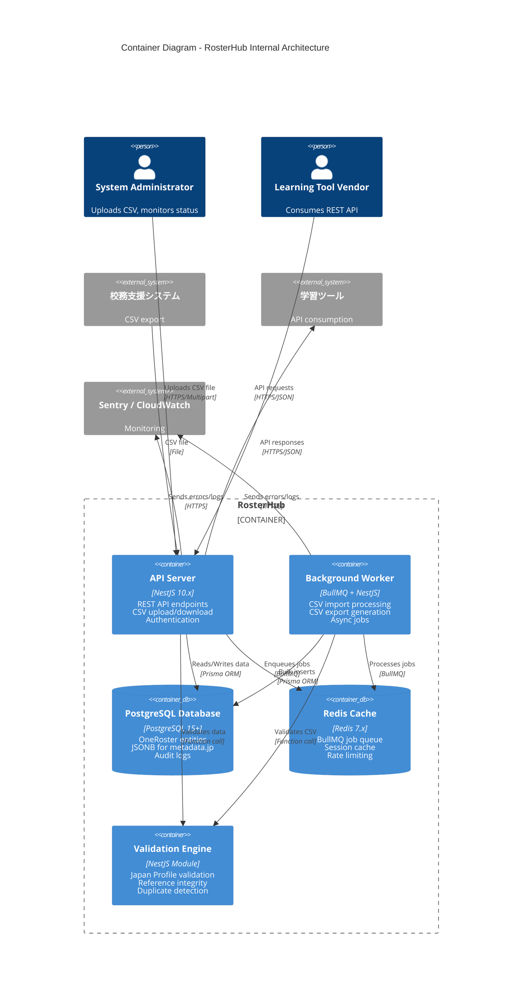
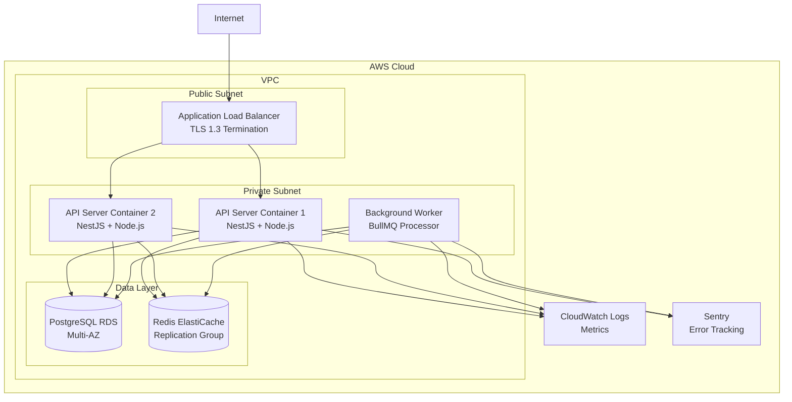

# RosterHub System Architecture Design Document
## Part 1: Overview, Executive Summary, C4 Context & Container Diagrams

**Project**: RosterHub - OneRoster Japan Profile 1.2.2 Integration Hub
**Version**: 1.0
**Date**: 2025-11-14
**Author**: System Architect AI
**Status**: Draft
**Compliance**: OneRoster Japan Profile 1.2.2, Personal Information Protection Act, GDPR, MEXT Guidelines

---

## Table of Contents (Part 1)

1. [Executive Summary](#1-executive-summary)
2. [Architecture Overview](#2-architecture-overview)
3. [C4 Model - Level 1: System Context](#3-c4-model---level-1-system-context)
4. [C4 Model - Level 2: Container Diagram](#4-c4-model---level-2-container-diagram)
5. [Deployment Architecture](#5-deployment-architecture)

---

## 1. Executive Summary

### 1.1 Project Overview

**RosterHub** is a **OneRoster Japan Profile 1.2.2 Integration Hub** designed to standardize and automate educational data integration between school information systems (校務支援システム) and learning tools. The system serves as a centralized data hub for Board of Education (教育委員会) level deployments, managing 10,000 to 200,000 users across multiple schools.

**Primary Capabilities**:
- **CSV Import/Export**: Bulk data operations supporting 100MB+ files, 200,000+ records
- **REST API**: Full CRUD operations with Bulk and Delta/Incremental API endpoints
- **Data Validation**: Japan Profile compliance checks with detailed error reporting
- **Security**: API Key + IP whitelist authentication, audit logging
- **Compliance**: Personal Information Protection Act, GDPR, MEXT Guidelines

### 1.2 Architecture Style

**Pattern**: **3-Tier Layered Architecture** with **Integration Hub** characteristics

- **Presentation Layer**: REST API endpoints, CSV upload/download interfaces
- **Business Logic Layer**: Data validation, transformation, orchestration
- **Data Access Layer**: PostgreSQL database with Prisma ORM

**Why This Architecture?**
- ✅ **Separation of Concerns**: Clear boundaries between API, business logic, and data access
- ✅ **Scalability**: Horizontal scaling via stateless API servers
- ✅ **Maintainability**: Modular structure aligned with OneRoster entities
- ✅ **Testability**: Each layer can be tested independently
- ✅ **Standard Pattern**: Well-understood by development teams

**Integration Hub Characteristics**:
- **No UI for end users**: API-first design, consumed by external systems
- **Data transformation**:校務支援システム CSV → OneRoster Standard → REST API JSON
- **Decoupling**: Isolates 校務支援システム from 学習ツール, reducing vendor lock-in

### 1.3 Key Architecture Decisions

| Decision | Choice | Rationale |
|----------|--------|-----------|
| **Backend Framework** | NestJS 10.x | TypeScript-first, enterprise-grade structure, excellent DI |
| **Database** | PostgreSQL 15+ | ACID compliance, JSONB for metadata.jp.*, row-level security |
| **ORM** | Prisma 5.x | Type-safe, excellent TypeScript integration, auto-migrations |
| **CSV Parser** | csv-parse 5.x | Streaming parser, handles 100MB+ files, UTF-8 BOM support |
| **Background Jobs** | BullMQ 4.x | Redis-backed, job progress tracking, retry logic |
| **Authentication** | API Key + IP Whitelist | OneRoster recommendation, simpler than OAuth for system integration |
| **API Style** | REST (JSON) | OneRoster 1.2 standard, easier to consume than GraphQL |
| **Monorepo Tool** | pnpm + Turborepo | Fast, efficient, incremental builds |

### 1.4 Quality Attributes (Priority Order)

Based on requirements analysis, the system prioritizes:

1. **Correctness (正確性)**: 100% OneRoster Japan Profile 1.2.2 compliance
2. **Extensibility (拡張性)**: Easy to add new entities or Japan Profile updates
3. **Maintainability (保守性)**: 80%+ test coverage, clear code structure
4. **Operability (運用性)**: Comprehensive logging, monitoring, error traceability
5. **Performance (性能)**: 200,000 users imported in < 30 minutes

### 1.5 Compliance Framework

**Legal Requirements**:
- **Personal Information Protection Act (個人情報保護法)**: Student/teacher personal data protection
- **GDPR**: Right to access, rectification, deletion (for EU residents)
- **MEXT Guidelines (文科省ガイドライン)**: Educational data security best practices

**Technical Implementation**:
- **Encryption at Rest**: AES-256 (PostgreSQL)
- **Encryption in Transit**: TLS 1.3 (all API communications)
- **Audit Logging**: All CRUD operations logged with timestamp, user, IP address
- **Data Retention**: Configurable (default: 3 years for audit logs)
- **Access Control**: API Key authentication + IP whitelist

---

## 2. Architecture Overview

### 2.1 System Context

**RosterHub Position in Educational Data Ecosystem**:

```
校務支援システム         →   RosterHub   →   学習ツール
(School Information System)  (Integration Hub)  (Learning Tools)

CSV Export (manual)      →   CSV Import     →   REST API (automated)
                             Validation         Delta Sync
                             Transformation     Bulk Access
```

**Key Roles**:
- **Data Source**: 校務支援システム provides student/teacher roster data
- **Integration Hub**: RosterHub validates, standardizes, and exposes data via API
- **Data Consumer**: 学習ツール (LMS, SIS, etc.) consume standardized OneRoster API

### 2.2 High-Level Components

```
┌─────────────────────────────────────────────────────────────┐
│                        RosterHub                            │
│                                                             │
│  ┌─────────────┐  ┌──────────────┐  ┌──────────────┐      │
│  │   CSV       │  │  REST API    │  │  Background  │      │
│  │  Import/    │  │  (Bulk +     │  │  Jobs        │      │
│  │  Export     │  │   Delta)     │  │  (BullMQ)    │      │
│  └─────────────┘  └──────────────┘  └──────────────┘      │
│         │                │                   │             │
│         └────────────────┴───────────────────┘             │
│                          │                                 │
│                 ┌────────▼────────┐                        │
│                 │  Data Validation│                        │
│                 │  & Transformation│                        │
│                 └────────┬────────┘                        │
│                          │                                 │
│                 ┌────────▼────────┐                        │
│                 │   PostgreSQL    │                        │
│                 │   (OneRoster    │                        │
│                 │    Entities)    │                        │
│                 └─────────────────┘                        │
└─────────────────────────────────────────────────────────────┘
```

### 2.3 Data Flow Patterns

**1. CSV Import Flow (Bulk Upload)**
```
校務支援システム CSV Export
    ↓
File Upload (HTTP POST)
    ↓
BullMQ Background Job (async)
    ↓
Streaming CSV Parser (csv-parse)
    ↓
Japan Profile Validation
    ↓
Bulk Database Insert (Prisma)
    ↓
Audit Log Recording
    ↓
Import Status Update
```

**2. REST API Bulk Query Flow**
```
学習ツール → GET /ims/oneroster/v1p2/users
    ↓
API Key Authentication
    ↓
IP Whitelist Check
    ↓
Query Database (Prisma)
    ↓
JSON Response (OneRoster format)
    ↓
Audit Log Recording
```

**3. REST API Delta Query Flow**
```
学習ツール → GET /ims/oneroster/v1p2/users?filter=dateLastModified>2025-01-01T00:00:00Z
    ↓
API Key Authentication
    ↓
IP Whitelist Check
    ↓
Query with dateLastModified filter (indexed)
    ↓
JSON Response (changed records only)
    ↓
Audit Log Recording
```

### 2.4 Technology Stack Summary

**Backend**:
- **Runtime**: Node.js 20.x LTS
- **Framework**: NestJS 10.x (TypeScript)
- **ORM**: Prisma 5.x
- **CSV**: csv-parse 5.x (streaming parser)
- **Jobs**: BullMQ 4.x (Redis-based)

**Database**:
- **Primary**: PostgreSQL 15+ (JSONB for metadata.jp.*)
- **Cache/Queue**: Redis 7.x (BullMQ backend, session cache)

**Infrastructure**:
- **Container**: Docker (PostgreSQL, Redis)
- **Deployment**: AWS ECS Fargate or Railway (Phase 1)
- **Monitoring**: Sentry (errors), CloudWatch (logs)

**Development**:
- **Language**: TypeScript 5.3+
- **Package Manager**: pnpm 8.x
- **Monorepo**: Turborepo 1.x
- **Testing**: Vitest (unit), Playwright (E2E)

---

## 3. C4 Model - Level 1: System Context

### 3.1 System Context Diagram



### 3.2 External Actors

**1. Board of Education System Administrator (主要利用者)**
- **Role**: Manages RosterHub configuration, uploads CSV files, monitors integration status
- **Responsibilities**:
  - Weekly CSV upload from 校務支援システム
  - Generate API keys for learning tool vendors
  - Configure IP whitelists
  - Review error reports and audit logs
- **Interaction**: Web interface (Phase 2) or direct API calls (Phase 1)

**2. Learning Tool Vendor Integration Engineer (技術利用者)**
- **Role**: Implements OneRoster API clients for learning tools
- **Responsibilities**:
  - Initial bulk data fetch (all users, orgs, classes, enrollments)
  - Daily Delta API polling (fetch changes)
  - Error handling and retry logic
- **Interaction**: REST API (HTTPS/JSON)

### 3.3 External Systems

**1. School Information System (校務支援システム)**
- **Type**: External data source
- **Data Flow**: CSV export (manual or scheduled)
- **Format**: OneRoster Japan Profile 1.2.2 CSV
- **Frequency**: Weekly or daily (configurable)
- **Volume**: 10,000 - 200,000 users, 100MB+ file size

**2. Learning Management System (学習ツール)**
- **Type**: External data consumer
- **Data Flow**: REST API (Bulk + Delta)
- **Format**: OneRoster JSON (v1.2)
- **Frequency**: Initial bulk fetch, then daily delta sync
- **Volume**: 1,000 - 10,000 API requests per day

**3. Monitoring & Logging Systems**
- **Type**: Observability infrastructure
- **Components**:
  - **Sentry**: Error tracking and alerting
  - **CloudWatch**: Log aggregation (AWS deployment)
  - **Prometheus/Grafana** (optional): Metrics dashboard
- **Purpose**: Detect errors, track performance, ensure SLA compliance (99% uptime)

### 3.4 System Boundaries

**In Scope (RosterHub Responsibilities)**:
- OneRoster CSV import/export
- REST API (Bulk + Delta endpoints)
- Data validation and transformation
- API authentication (API Key + IP whitelist)
- Audit logging
- Background job processing (CSV import)

**Out of Scope (External System Responsibilities)**:
- CSV generation by 校務支援システム
- Learning tool's internal data model mapping
- User authentication (SSO) - Phase 2
- Real-time notifications (webhooks) - Phase 2
- Data editing UI - Phase 2

---

## 4. C4 Model - Level 2: Container Diagram

### 4.1 Container Diagram



### 4.2 Container Descriptions

**1. API Server (NestJS 10.x)**
- **Technology**: NestJS, TypeScript, Node.js 20.x
- **Responsibilities**:
  - REST API endpoints (GET, POST, PUT, DELETE)
  - CSV file upload (multipart/form-data)
  - CSV file download (streaming response)
  - API Key authentication
  - IP whitelist validation
  - Rate limiting (per API key)
  - Request/response logging
- **Scalability**: Stateless, horizontal scaling via load balancer
- **Endpoints**:
  - `/ims/oneroster/v1p2/users` (Bulk API)
  - `/ims/oneroster/v1p2/users?filter=dateLastModified>{timestamp}` (Delta API)
  - `/csv/import` (CSV upload)
  - `/csv/export` (CSV download)

**2. Background Worker (BullMQ + NestJS)**
- **Technology**: BullMQ (Redis-based job queue), NestJS
- **Responsibilities**:
  - Async CSV import processing (streaming parser)
  - CSV export generation (large datasets)
  - Retry logic for failed jobs
  - Job progress tracking
  - Error reporting
- **Job Types**:
  - `csv-import`: Import CSV file (30 min max)
  - `csv-export`: Generate CSV file (10 min max)
- **Concurrency**: 5 concurrent jobs (configurable)

**3. PostgreSQL Database (PostgreSQL 15+)**
- **Technology**: PostgreSQL 15+ with JSONB support
- **Schema**:
  - OneRoster entities (Users, Orgs, Classes, Courses, Enrollments, AcademicSessions, Demographics)
  - Audit logs (AuditLog table)
  - API keys (ApiKey table)
  - CSV import jobs (CsvImportJob table)
- **Indexes**:
  - `sourcedId` (unique, primary access pattern)
  - `dateLastModified` (Delta API queries)
  - `status` (filter active/inactive records)
  - Composite: `(dateLastModified, status)` for performance
- **JSONB Usage**: `metadata` column stores Japan Profile extensions (e.g., `metadata.jp.kanaGivenName`)

**4. Redis Cache (Redis 7.x)**
- **Technology**: Redis 7.x
- **Use Cases**:
  - **BullMQ Job Queue**: Background job persistence
  - **Session Cache**: API key validation cache (reduce DB load)
  - **Rate Limiting**: Track API request counts per key/IP
- **Persistence**: RDB + AOF (job queue requires persistence)
- **Eviction Policy**: LRU for session cache

**5. Validation Engine (NestJS Module)**
- **Technology**: NestJS service (TypeScript)
- **Responsibilities**:
  - OneRoster Japan Profile 1.2.2 field validation
  - Data type validation (string, integer, date, enum)
  - Required field checks
  - Reference integrity (foreign key validation)
  - Duplicate detection (sourcedId uniqueness)
  - Custom Japan Profile rules (e.g., kanaGivenName format)
- **Integration**: Called by API Server (synchronous) and Background Worker (async)

### 4.3 Communication Patterns

**1. Synchronous Communication (Request-Response)**
- **API Server → PostgreSQL**: REST API queries (Prisma ORM)
- **API Server → Validation Engine**: Data validation before write
- **Learning Tool → API Server**: REST API calls (HTTPS/JSON)

**2. Asynchronous Communication (Job Queue)**
- **API Server → Redis (BullMQ)**: Enqueue CSV import job
- **Background Worker → Redis (BullMQ)**: Process jobs from queue
- **Background Worker → PostgreSQL**: Bulk insert/update operations

**3. Streaming Communication**
- **CSV Import**: Streaming CSV parser (csv-parse) to handle 100MB+ files without loading into memory
- **CSV Export**: Streaming database query + CSV generation (avoid OOM errors)

### 4.4 Data Storage Strategy

**Primary Data (PostgreSQL)**:
- OneRoster entities (Users, Orgs, Classes, etc.)
- Audit logs (3-year retention)
- API keys (bcrypt hashed)
- CSV import job metadata

**Temporary Data (Redis)**:
- BullMQ job queue (active jobs, completed jobs for 24 hours)
- API key validation cache (5-minute TTL)
- Rate limit counters (1-hour sliding window)

**File Storage (Future Phase 2)**:
- AWS S3 or Vercel Blob for uploaded CSV files (90-day retention)
- Generated CSV exports (7-day retention)

---

## 5. Deployment Architecture

### 5.1 Infrastructure Diagram (AWS ECS)



### 5.2 Deployment Specifications

**API Server (ECS Fargate Task)**:
- **Container**: Docker image (Node.js 20-alpine)
- **Resources**: 2 vCPU, 4GB RAM (per instance)
- **Scaling**: Auto-scaling (2-10 instances)
  - Target: 70% CPU utilization
  - Scale-out: Add instance when CPU > 70% for 5 minutes
  - Scale-in: Remove instance when CPU < 30% for 10 minutes
- **Health Check**: `/health` endpoint (200 OK)

**Background Worker (ECS Fargate Task)**:
- **Container**: Docker image (Node.js 20-alpine)
- **Resources**: 4 vCPU, 8GB RAM (CSV processing intensive)
- **Scaling**: Fixed 1-2 instances (not auto-scaling)
- **Concurrency**: 5 concurrent jobs per instance

**PostgreSQL (AWS RDS)**:
- **Instance**: db.r6g.xlarge (4 vCPU, 32GB RAM)
- **Storage**: 500GB GP3 SSD (3000 IOPS)
- **Multi-AZ**: Enabled (automatic failover)
- **Backups**: Automated daily backups (30-day retention)
- **Encryption**: AES-256 at rest

**Redis (AWS ElastiCache)**:
- **Instance**: cache.r6g.large (2 vCPU, 13GB RAM)
- **Replication**: 1 primary + 1 replica
- **Persistence**: AOF enabled (BullMQ job durability)
- **Automatic Failover**: Enabled

### 5.3 Scalability Strategy

**Horizontal Scaling (API Server)**:
- **Stateless Design**: No session state in API server (JWT tokens)
- **Load Balancing**: ALB distributes requests across instances
- **Connection Pooling**: Prisma connection pool (10 connections per instance)
- **Cache**: Redis session cache reduces DB load

**Vertical Scaling (Database)**:
- **Read Replicas**: Add PostgreSQL read replicas for Bulk API queries (Phase 2)
- **Instance Size**: Upgrade RDS instance type as needed

**Data Partitioning (Future Phase 3)**:
- **Multi-tenancy**: Separate schemas per Board of Education
- **Sharding**: Partition by `orgSourcedId` (school district)

### 5.4 High Availability

**Target SLA**: 99% uptime (8.76 hours downtime/year)

**HA Components**:
- **Multi-AZ RDS**: Automatic failover (< 2 minutes)
- **Redis Replication**: Automatic failover (< 1 minute)
- **API Server Instances**: 2+ instances across availability zones
- **Load Balancer**: AWS ALB with health checks

**Failure Scenarios**:
| Failure | Impact | Recovery | RTO |
|---------|--------|----------|-----|
| API instance crash | No impact (other instances serve) | Auto-scaling adds new instance | 5 min |
| Background worker crash | Jobs retry automatically (BullMQ) | ECS restarts container | 2 min |
| PostgreSQL primary failure | Read-only mode during failover | Multi-AZ failover | < 2 min |
| Redis primary failure | Job queue paused | Replication failover | < 1 min |
| Entire AZ failure | Degraded performance | Traffic routes to other AZ | 0 min |

### 5.5 Monitoring & Observability

**Metrics (CloudWatch)**:
- API response time (p50, p95, p99)
- API error rate (5xx responses)
- Background job duration
- Database connection pool usage
- Redis memory usage

**Logs (CloudWatch Logs)**:
- Structured JSON logs (Winston or Pino)
- Log levels: ERROR, WARN, INFO, DEBUG
- Retention: 90 days

**Alerts**:
- API error rate > 5% (5 minutes)
- Database CPU > 80% (10 minutes)
- Background job failure (immediate)
- Disk usage > 85%

**Error Tracking (Sentry)**:
- Automatic error capture
- Stack traces with source maps
- Release tracking
- Email alerts for new errors

---

## Next Steps

This document will continue in **Part 2** with:
- C4 Model - Level 3: Component Diagram (NestJS modules)
- C4 Model - Level 4: Code Diagrams (class diagrams)
- Data Flow Diagrams (detailed)
- Module Structure (NestJS organization)
- Security Architecture
- Integration Patterns

**File**: `system-architecture-design-part2-20251114.md`

---

**Document Status**: Draft - Part 1 Complete
**Review Required**: External Vendor, System Architect, DevOps Engineer
**Next Review Date**: 2025-11-21

---

**Version History**

| Version | Date | Author | Changes |
|---------|------|--------|---------|
| 1.0 | 2025-11-14 | System Architect AI | Initial draft - Part 1 (Overview, C4 Context, C4 Container, Deployment) |
