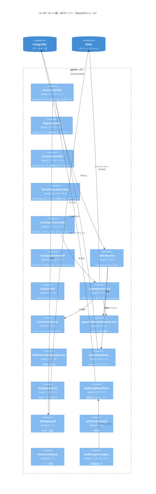
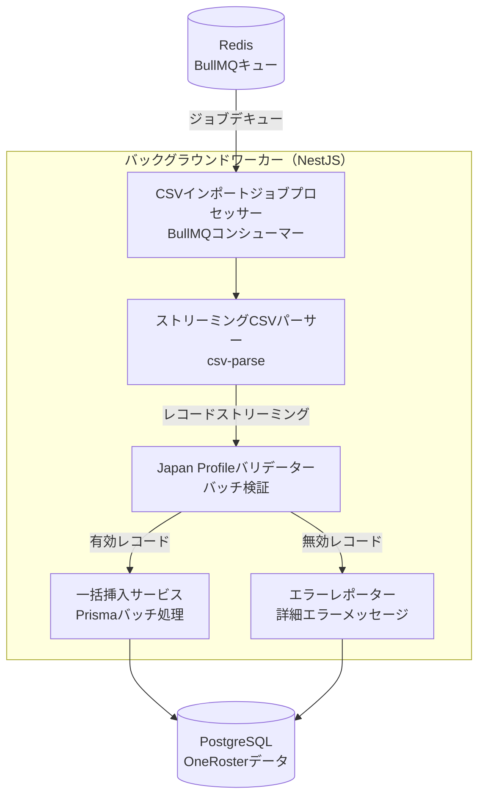
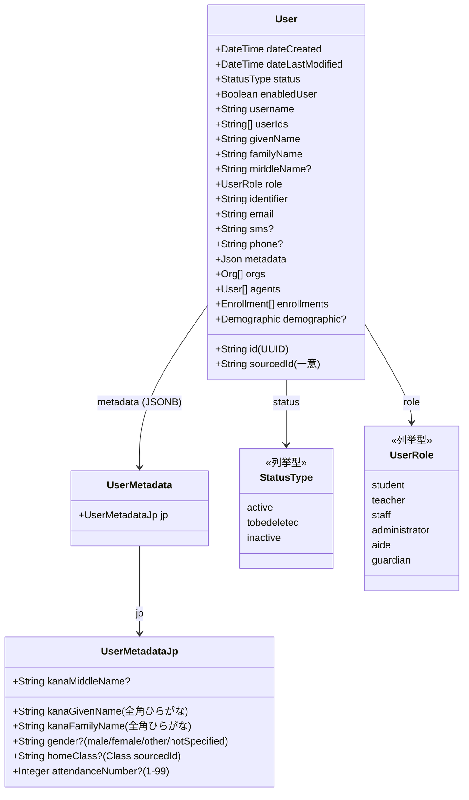
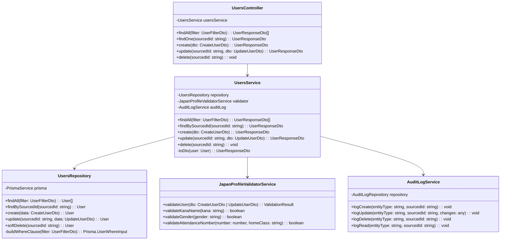
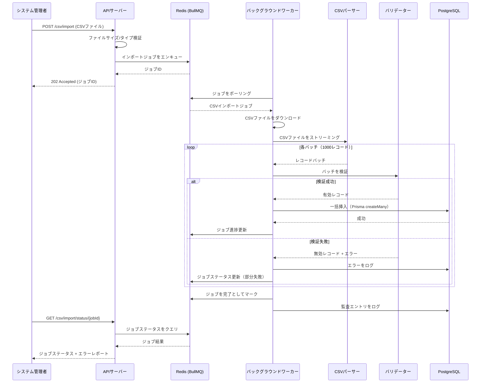
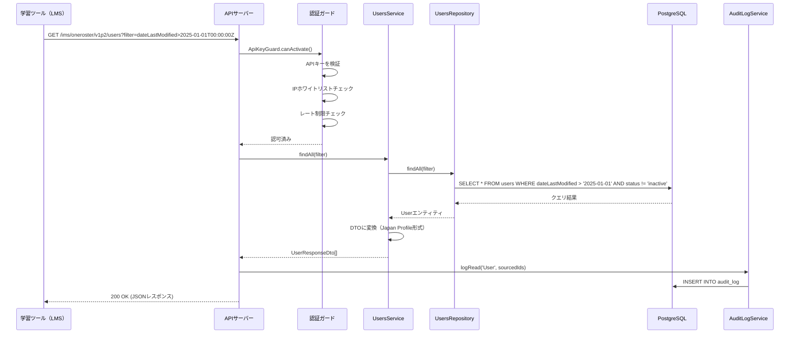
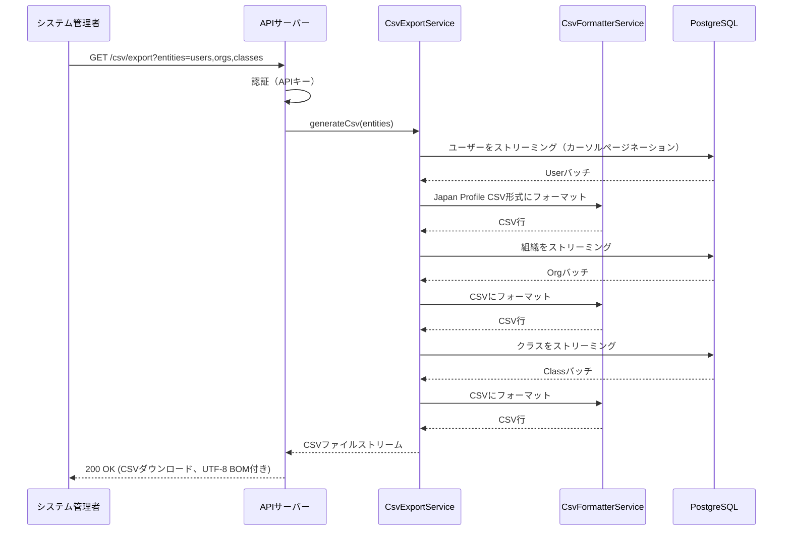
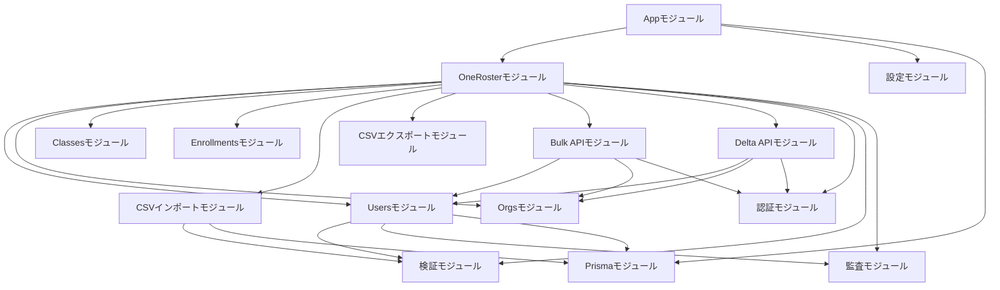
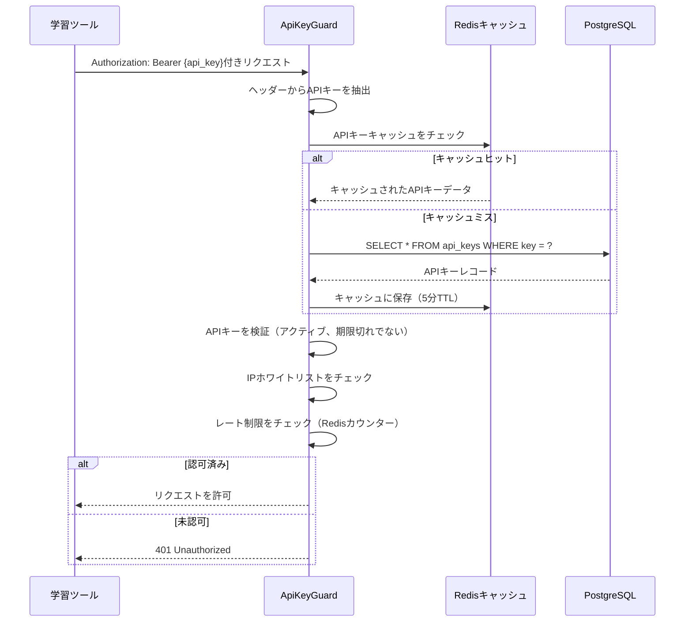

# RosterHub システムアーキテクチャ設計書
## パート2: C4 Component、データフロー、モジュール構造、セキュリティ

**プロジェクト**: RosterHub - OneRoster Japan Profile 1.2.2 統合ハブ
**バージョン**: 1.0
**日付**: 2025-11-14
**作成者**: System Architect AI
**ステータス**: ドラフト
**前提条件**: パート1を先に読む（`system-architecture-design-part1-20251114.md`）

---

## 目次（パート2）

6. [C4モデル - レベル3: コンポーネント図](#6-c4モデル---レベル3-コンポーネント図)
7. [C4モデル - レベル4: コード図](#7-c4モデル---レベル4-コード図)
8. [データフロー図](#8-データフロー図)
9. [モジュール構造（NestJS）](#9-モジュール構造nestjs)
10. [セキュリティアーキテクチャ](#10-セキュリティアーキテクチャ)
11. [統合パターン](#11-統合パターン)

---

## 6. C4モデル - レベル3: コンポーネント図

### 6.1 NestJS APIサーバーコンポーネント



### 6.2 コンポーネントの責任

**コントローラー（APIエンドポイント）**:
- **UsersController**: `GET /ims/oneroster/v1p2/users`、`POST`、`PUT`、`DELETE`
- **OrgsController**: `GET /ims/oneroster/v1p2/orgs`等
- **ClassesController**: `GET /ims/oneroster/v1p2/classes`等
- **EnrollmentsController**: `GET /ims/oneroster/v1p2/enrollments`等
- **CsvImportController**: `POST /csv/import`（マルチパートファイルアップロード）
- **CsvExportController**: `GET /csv/export`（ストリーミングダウンロード）

**サービス（ビジネスロジック）**:
- **UsersService**: UserのCRUD操作、ビジネスルール
- **OrgsService**: OrgのCRUD操作、階層管理
- **CsvImportService**: CSVインポートオーケストレーション、ジョブ作成
- **CsvParserService**: ストリーミングCSV解析（csv-parseライブラリ）
- **CsvFormatterService**: CSV生成（Japan Profile形式）

**バリデーター（データ品質）**:
- **JapanProfileValidatorService**: Japan Profileフィールド検証
  - kanaGivenName形式（全角ひらがな）
  - homeroom内でのattendanceNumber一意性
  - gender列挙型検証
- **ReferenceValidatorService**: 外部キー検証
  - Org親が存在
  - Userエージェントが存在
  - Classコースが存在
- **DuplicateDetectorService**: sourcedId重複検出

**リポジトリ（データアクセス）**:
- **UsersRepository**: `findAll()`、`findBySourcedId()`、`create()`、`update()`、`softDelete()`
- **OrgsRepository**: 同様のCRUDメソッド
- **AuditLogRepository**: `logCreate()`、`logUpdate()`、`logDelete()`、`logRead()`

**ガード（セキュリティ）**:
- **ApiKeyGuard**: `Authorization: Bearer {key}`ヘッダーからAPIキーを検証
- **IpWhitelistGuard**: リクエストIPを許可リストと照合
- **RateLimitGuard**: レート制限を強制（APIキーあたり1000リクエスト/時間）

**インターセプター（横断的関心事）**:
- **AuditLogInterceptor**: 全リクエストの自動監査ログ
- **LoggingInterceptor**: 構造化リクエスト/レスポンスログ
- **TransformInterceptor**: レスポンスをOneRoster JSON形式に変換

### 6.3 バックグラウンドワーカーコンポーネント



**ジョブ処理フロー**:
1. **JobProcessor**: BullMQキューからジョブ受信
2. **CsvParser**: CSVファイルをストリーミング（OOMなしで100MB以上対応）
3. **Validator**: 各レコードバッチを検証（1000レコード）
4. **BulkInserter**: 有効レコードをバッチ挿入（Prisma `createMany`）
5. **ErrorReporter**: 無効レコードを詳細エラーメッセージとともにログ

---

## 7. C4モデル - レベル4: コード図

### 7.1 Userエンティティクラス図



### 7.2 サービス層クラス図



### 7.3 リポジトリパターン実装

```typescript
// 例: UsersRepository実装
@Injectable()
export class UsersRepository {
  constructor(private readonly prisma: PrismaService) {}

  async findAll(filter: UserFilterDto): Promise<User[]> {
    return this.prisma.user.findMany({
      where: this.buildWhereClause(filter),
      orderBy: filter.sort || { dateLastModified: 'desc' },
      skip: filter.offset || 0,
      take: filter.limit || 100,
      include: {
        orgs: true,
        agents: true,
        enrollments: true,
        demographics: true,
      },
    });
  }

  async findBySourcedId(sourcedId: string): Promise<User | null> {
    return this.prisma.user.findUnique({
      where: { sourcedId },
      include: {
        orgs: true,
        agents: true,
        enrollments: true,
        demographics: true,
      },
    });
  }

  async create(data: CreateUserDto): Promise<User> {
    return this.prisma.user.create({
      data: {
        ...data,
        sourcedId: generateSourcedId('user'),
        dateCreated: new Date(),
        dateLastModified: new Date(),
      },
    });
  }

  async update(sourcedId: string, data: UpdateUserDto): Promise<User> {
    return this.prisma.user.update({
      where: { sourcedId },
      data: {
        ...data,
        dateLastModified: new Date(),
      },
    });
  }

  async softDelete(sourcedId: string): Promise<User> {
    return this.prisma.user.update({
      where: { sourcedId },
      data: {
        status: 'tobedeleted',
        dateLastModified: new Date(),
      },
    });
  }

  private buildWhereClause(filter: UserFilterDto): Prisma.UserWhereInput {
    const where: Prisma.UserWhereInput = {};

    if (filter.dateLastModified) {
      where.dateLastModified = { gte: new Date(filter.dateLastModified) };
    }

    if (filter.role) {
      where.role = filter.role;
    }

    if (filter.status) {
      where.status = filter.status;
    }

    return where;
  }
}
```

---

## 8. データフロー図

### 8.1 CSVインポートフロー（詳細）



### 8.2 REST API Deltaクエリフロー



### 8.3 CSVエクスポートフロー



---

## 9. モジュール構造（NestJS）

### 9.1 ルートモジュール構成

```
src/
├── app.module.ts                   # ルートモジュール（全機能モジュールをインポート）
├── main.ts                         # アプリケーションエントリーポイント
│
├── oneroster/                      # OneRosterドメインモジュール
│   ├── entities/                   # エンティティモジュール（Users、Orgs、Classes等）
│   ├── csv/                        # CSVインポート/エクスポートモジュール
│   ├── api/                        # REST APIモジュール
│   ├── auth/                       # 認証モジュール
│   ├── validation/                 # 検証モジュール
│   ├── audit/                      # 監査ログモジュール
│   └── oneroster.module.ts         # ルートOneRosterモジュール
│
├── common/                         # 共有ユーティリティ
│   ├── decorators/
│   ├── filters/
│   ├── guards/
│   ├── interceptors/
│   ├── pipes/
│   └── utils/
│
├── config/                         # 設定管理
│   ├── database.config.ts
│   ├── redis.config.ts
│   ├── auth.config.ts
│   └── app.config.ts
│
└── prisma/                         # Prisma ORM
    ├── schema.prisma
    ├── migrations/
    └── seed.ts
```

### 9.2 エンティティモジュールパターン（例: Users）

```
oneroster/entities/users/
├── users.controller.ts             # REST APIエンドポイント
├── users.service.ts                # ビジネスロジック
├── users.repository.ts             # データアクセス層
├── users.module.ts                 # NestJSモジュール定義
├── dto/                            # データ転送オブジェクト
│   ├── create-user.dto.ts          # POSTリクエストボディ
│   ├── update-user.dto.ts          # PUT/PATCHリクエストボディ
│   ├── user-response.dto.ts        # APIレスポンス形式
│   └── user-filter.dto.ts          # クエリフィルタ
└── entities/                       # Prismaエンティティモデル
    └── user.entity.ts              # TypeScriptエンティティクラス
```

### 9.3 CSVモジュール構造

```
oneroster/csv/
├── import/                         # CSVインポート機能
│   ├── csv-import.controller.ts    # アップロードエンドポイント
│   ├── csv-import.service.ts       # オーケストレーションロジック
│   ├── csv-parser.service.ts       # ストリーミングパーサー（csv-parse）
│   ├── csv-validator.service.ts    # Japan Profile検証
│   ├── bulk-insert.service.ts      # データベース一括挿入
│   ├── import-job.processor.ts     # BullMQバックグラウンドジョブ
│   ├── dto/
│   │   ├── csv-import-request.dto.ts
│   │   └── csv-import-status.dto.ts
│   └── csv-import.module.ts
│
└── export/                         # CSVエクスポート機能
    ├── csv-export.controller.ts    # ダウンロードエンドポイント
    ├── csv-export.service.ts       # CSV生成ロジック
    ├── csv-formatter.service.ts    # Japan Profileフォーマット
    ├── dto/
    │   ├── csv-export-request.dto.ts
    │   └── csv-export-response.dto.ts
    └── csv-export.module.ts
```

### 9.4 モジュール依存関係



---

## 10. セキュリティアーキテクチャ

### 10.1 認証フロー（APIキー + IPホワイトリスト）



### 10.2 APIキー管理

**APIキー構造**:
```typescript
interface ApiKey {
  id: string;                    // UUID
  key: string;                   // 一意のAPIキー（32文字）
  hashedKey: string;             // bcryptハッシュ（DBに保存）
  name: string;                  // 人間が読める名前（例: "LMSベンダーA"）
  organizationId: string;        // 教育委員会ID
  ipWhitelist: string[];         // 許可IPアドレス（例: ["203.0.113.0/24"]）
  rateLimit: number;             // 時間あたりリクエスト数（デフォルト: 1000）
  isActive: boolean;             // 削除せずに無効化可能
  expiresAt: Date | null;        // オプション有効期限
  createdAt: Date;
  lastUsedAt: Date | null;       // 使用状況追跡
}
```

**キー生成**:
- 32文字のランダム文字列（base62エンコーディング）
- データベースにハッシュ保存（bcrypt、12ラウンド）
- 作成時に1回だけ元のキーを表示（保存しない）

**キーローテーション**:
- 新しいキーを生成、30日間の移行期間中は古いキーをアクティブに保つ
- すべてのクライアントが移行後、古いキーを無効化

### 10.3 認可モデル

**ロールベースアクセス制御（RBAC）**:

| ロール | 権限 |
|------|-------------|
| **SuperAdmin** | すべての操作（CRUD）、APIキー管理、監査ログ閲覧 |
| **OrgAdmin** | 自組織のみのCRUD操作、自組織の監査ログ閲覧 |
| **Vendor（API消費者）** | REST API経由の読み取り専用アクセス（GETエンドポイントのみ） |

**リソースレベル権限**:
- APIキーは特定組織（教育委員会）にスコープ
- クエリは自動的に`organizationId`でフィルタ
- 組織横断のデータ漏洩なし

### 10.4 データ暗号化

**保存時**:
- **PostgreSQL**: AWS RDS暗号化（AES-256）
- **Redis**: AWS ElastiCache保存時暗号化
- **バックアップ**: AWS KMS暗号化

**通信時**:
- **TLS 1.3**: すべてのAPI通信
- **証明書**: Let's EncryptまたはAWS Certificate Manager
- **HSTS**: Strict-Transport-Securityヘッダー有効

**機密データ**:
- **APIキー**: bcryptハッシュ（平文保存なし）
- **個人データ**: 追加コンプライアンスが必要な場合は暗号化保存（将来）

### 10.5 監査ログ

**ログされるイベント**:
- すべてのCRUD操作（CREATE、UPDATE、DELETE、READ）
- APIキー使用（認証試行）
- CSVインポート/エクスポート操作
- 認証失敗試行
- レート制限違反

**監査ログスキーマ**:
```typescript
interface AuditLog {
  id: string;                    // UUID
  timestamp: Date;               // イベントタイムスタンプ
  action: string;                // CREATE、UPDATE、DELETE、READ
  entityType: string;            // User、Org、Class等
  entitySourcedId: string;       // 影響を受けたエンティティ
  userId: string | null;         // APIキー所有者（該当する場合）
  ipAddress: string;             // リクエストIP
  requestMethod: string;         // GET、POST、PUT、DELETE
  requestPath: string;           // APIエンドポイント
  requestBody: any;              // リクエストペイロード（機密データ除外）
  responseStatus: number;        // HTTPステータスコード
  changes: any;                  // 前後の値（UPDATEのみ）
}
```

**保持ポリシー**:
- 監査ログは3年間保持（設定可能）
- 古いログはS3 Glacierにアーカイブ（オプション）

### 10.6 レート制限

**実装**: Redisベーススライディングウィンドウ

**制限**:
- **デフォルト**: APIキーあたり1時間に1000リクエスト
- **設定可能**: APIキーごと（大量クライアント向けに増加可能）
- **バースト**: 1分間に100リクエスト許可（短時間バースト防止）

**レスポンス**:
- **429 Too Many Requests**と`Retry-After`ヘッダー
- エラーメッセージ: "レート制限を超えました。{秒}秒後に再試行してください。"

### 10.7 セキュリティヘッダー

**HTTPヘッダー**（NestJSで設定）:
```typescript
{
  'Strict-Transport-Security': 'max-age=31536000; includeSubDomains',
  'X-Frame-Options': 'DENY',
  'X-Content-Type-Options': 'nosniff',
  'X-XSS-Protection': '1; mode=block',
  'Content-Security-Policy': "default-src 'self'",
  'Referrer-Policy': 'no-referrer',
}
```

---

## 11. 統合パターン

### 11.1 CSVインポート統合（校務支援システム → RosterHub）

**パターン**: ファイルアップロード（非同期処理）

**手順**:
1. 校務支援システムがOneRoster Japan Profile CSVファイルをエクスポート
2. 管理者がAPI経由またはWeb UI（Phase 2）経由でCSVファイルをアップロード
3. RosterHubがファイル形式を検証、バックグラウンドジョブをエンキュー
4. バックグラウンドワーカーがCSVを処理（ストリーミングパーサー）
5. 管理者がエラーレポート付きの完了通知を受信

**エラーハンドリング**:
- **検証エラー**: 行番号、フィールド、エラーメッセージ付き詳細レポート
- **部分成功**: 有効レコードはインポート、無効レコードはスキップ
- **リトライ**: 管理者がエラーを修正して再アップロード可能

### 11.2 REST API統合（RosterHub → 学習ツール）

**パターン**: RESTful API（Bulk + Delta）

**初期同期（Bulk API）**:
1. 学習ツールがすべてのデータをリクエスト（`GET /ims/oneroster/v1p2/users`）
2. RosterHubがページネーションされたJSONレスポンスを返す（ページあたり100レコード）
3. 学習ツールが内部データベースにデータを保存
4. 他のエンティティ（orgs、classes、enrollments）について繰り返し

**増分同期（Delta API）**:
1. 学習ツールが最後の同期タイムスタンプを追跡
2. 変更されたレコードをリクエスト（`GET /ims/oneroster/v1p2/users?filter=dateLastModified>2025-01-01T00:00:00Z`）
3. RosterHubが変更されたレコードのみを返す（新規、更新、削除）
4. 学習ツールが内部データベースを更新

**ページネーション**:
- **デフォルト**: ページあたり100レコード
- **最大**: ページあたり1000レコード（設定可能）
- **ヘッダー**: `X-Total-Count`、次/前URLの`Link`ヘッダー

**フィルタリング**:
- `filter=dateLastModified>{timestamp}`（Delta API）
- `filter=status=active`（非アクティブレコード除外）
- `filter=role=student`（ロールでフィルタ）

**ソート**:
- `sort=familyName`（昇順）
- `sort=-dateLastModified`（降順、`-`接頭辞）

### 11.3 エラーハンドリング戦略

**HTTPステータスコード**:
- **200 OK**: 成功したGETリクエスト
- **201 Created**: 成功したPOSTリクエスト
- **204 No Content**: 成功したDELETEリクエスト
- **400 Bad Request**: 検証エラー（レスポンスに詳細エラーメッセージ）
- **401 Unauthorized**: 無効なAPIキーまたはIPがホワイトリストにない
- **404 Not Found**: sourcedIdのエンティティが見つからない
- **409 Conflict**: sourcedIdの重複
- **429 Too Many Requests**: レート制限超過
- **500 Internal Server Error**: 予期しないエラー（Sentryにログ）

**エラーレスポンス形式**（OneRoster標準）:
```json
{
  "imsx_codeMajor": "failure",
  "imsx_severity": "error",
  "imsx_description": "検証エラー: kanaGivenNameは全角ひらがなでなければなりません",
  "imsx_codeMinor": {
    "imsx_codeMinorField": [
      {
        "imsx_codeMinorFieldName": "kanaGivenName",
        "imsx_codeMinorFieldValue": "invalid_format"
      }
    ]
  }
}
```

**リトライ戦略**（学習ツール向け）:
- **一時的エラー（5xx）**: 指数バックオフ（1秒、2秒、4秒、8秒、16秒）
- **レート制限（429）**: `Retry-After`秒待機
- **クライアントエラー（4xx）**: リトライしない（データを修正して再送信）

---

## まとめ

このパート2ドキュメントでは以下をカバーしました:
- ✅ **C4コンポーネント図**: NestJSモジュール、サービス、リポジトリ
- ✅ **C4コード図**: Userエンティティとサービス層のクラス図
- ✅ **データフロー図**: CSVインポート、REST APIクエリ、CSVエクスポート
- ✅ **モジュール構造**: NestJS構成、エンティティモジュール、CSVモジュール
- ✅ **セキュリティアーキテクチャ**: APIキー認証、監査ログ、暗号化
- ✅ **統合パターン**: CSVアップロード、REST API消費、エラーハンドリング

**次のドキュメント**: アーキテクチャ決定記録（ADR）- 8つの主要決定

---

**ドキュメントステータス**: ドラフト - パート2完了
**レビュー必要**: 外部ベンダー、セキュリティ監査者、ソフトウェア開発者
**次回レビュー日**: 2025-11-21

---

**バージョン履歴**

| バージョン | 日付 | 作成者 | 変更内容 |
|---------|------|--------|---------|
| 1.0 | 2025-11-14 | System Architect AI | 初版作成 - パート2（コンポーネント、データフロー、モジュール、セキュリティ） |
