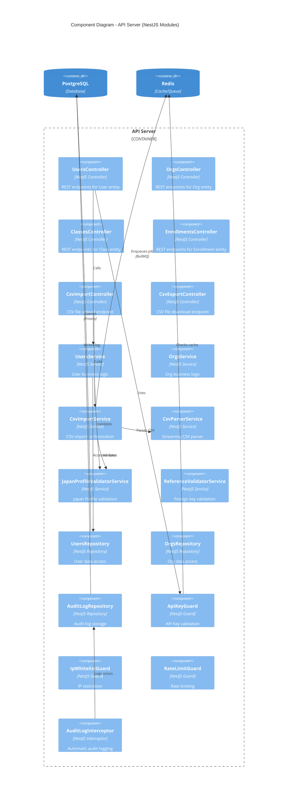
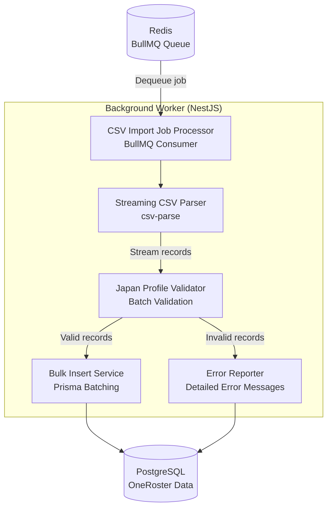
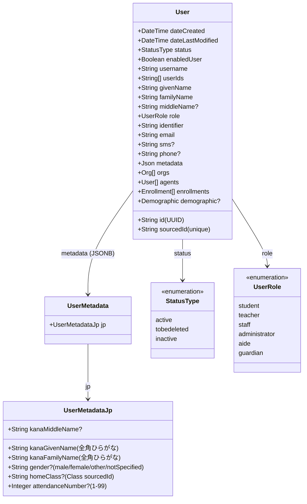
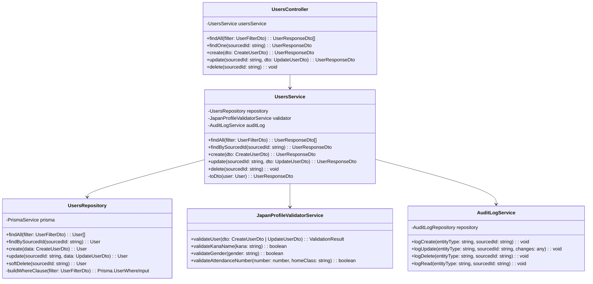
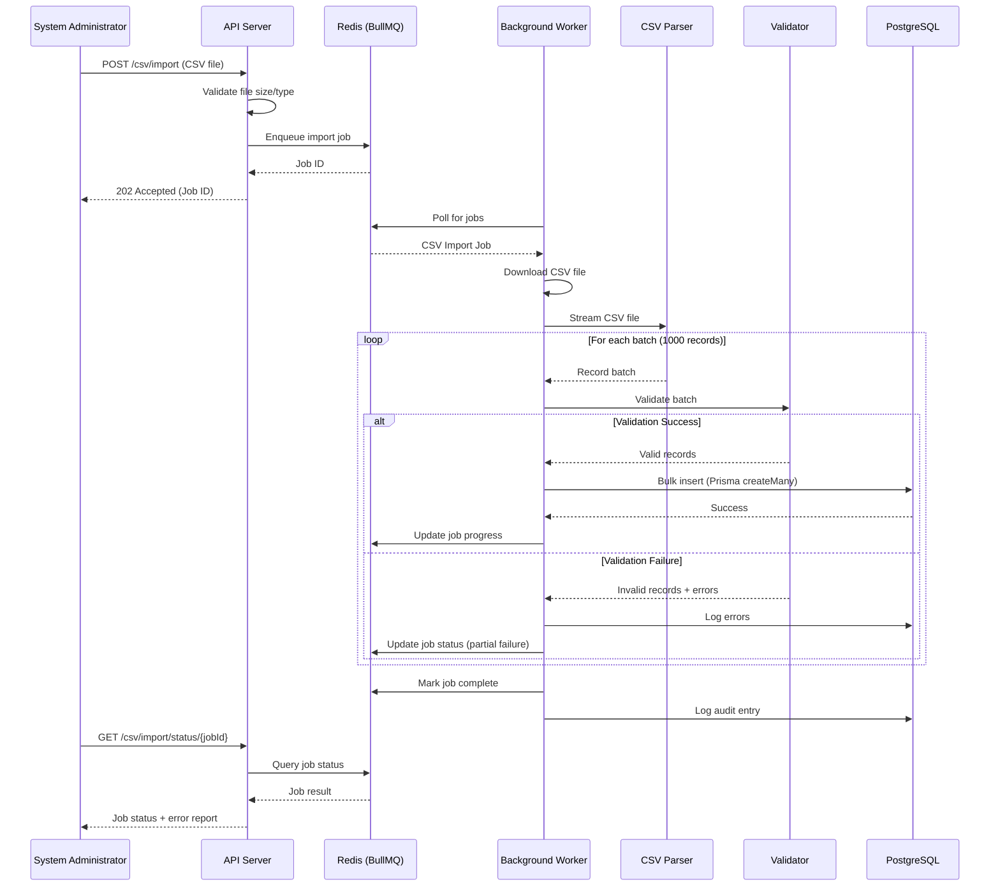
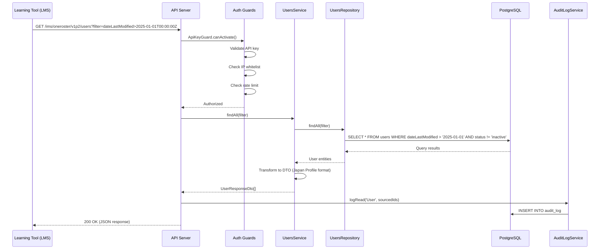
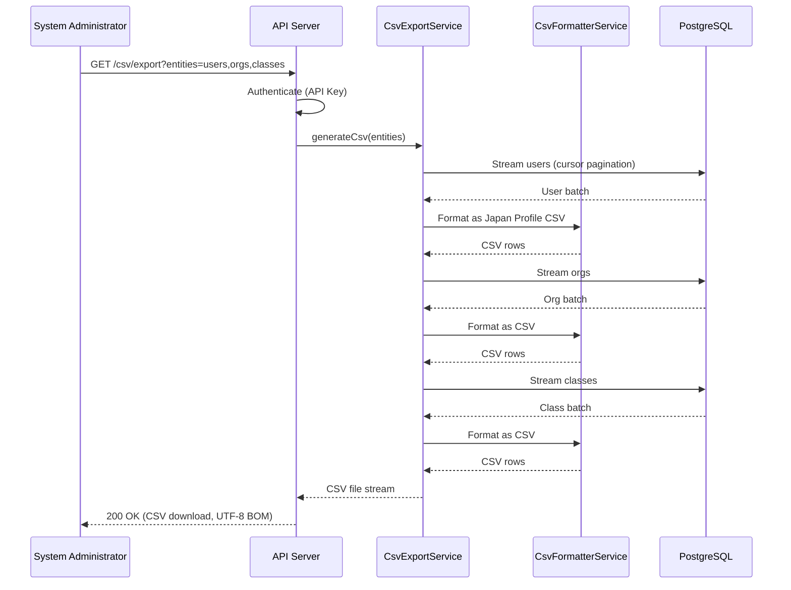
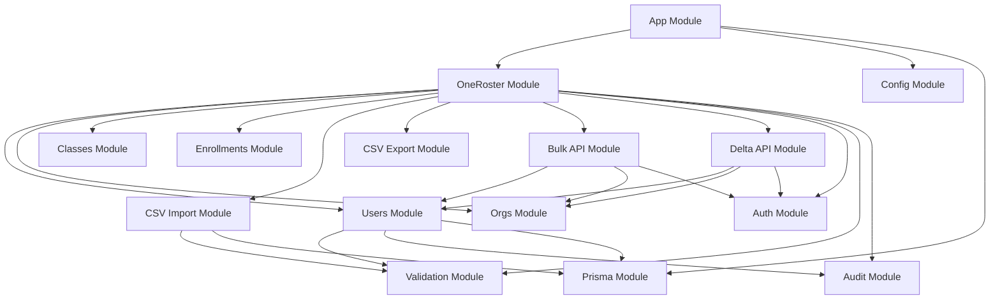
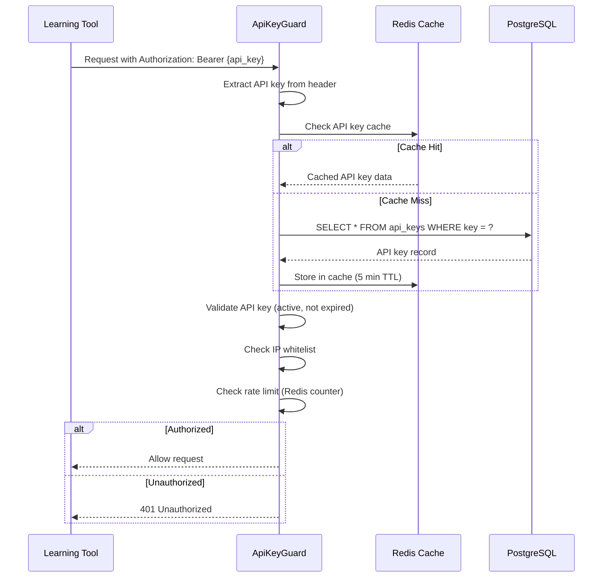

# RosterHub System Architecture Design Document
## Part 2: C4 Component, Data Flow, Module Structure, Security

**Project**: RosterHub - OneRoster Japan Profile 1.2.2 Integration Hub
**Version**: 1.0
**Date**: 2025-11-14
**Author**: System Architect AI
**Status**: Draft
**Prerequisite**: Read Part 1 first (`system-architecture-design-part1-20251114.md`)

---

## Table of Contents (Part 2)

6. [C4 Model - Level 3: Component Diagram](#6-c4-model---level-3-component-diagram)
7. [C4 Model - Level 4: Code Diagrams](#7-c4-model---level-4-code-diagrams)
8. [Data Flow Diagrams](#8-data-flow-diagrams)
9. [Module Structure (NestJS)](#9-module-structure-nestjs)
10. [Security Architecture](#10-security-architecture)
11. [Integration Patterns](#11-integration-patterns)

---

## 6. C4 Model - Level 3: Component Diagram

### 6.1 NestJS API Server Components



### 6.2 Component Responsibilities

**Controllers (API Endpoints)**:
- **UsersController**: `GET /ims/oneroster/v1p2/users`, `POST`, `PUT`, `DELETE`
- **OrgsController**: `GET /ims/oneroster/v1p2/orgs`, etc.
- **ClassesController**: `GET /ims/oneroster/v1p2/classes`, etc.
- **EnrollmentsController**: `GET /ims/oneroster/v1p2/enrollments`, etc.
- **CsvImportController**: `POST /csv/import` (multipart file upload)
- **CsvExportController**: `GET /csv/export` (streaming download)

**Services (Business Logic)**:
- **UsersService**: User CRUD operations, business rules
- **OrgsService**: Org CRUD operations, hierarchy management
- **CsvImportService**: CSV import orchestration, job creation
- **CsvParserService**: Streaming CSV parsing (csv-parse library)
- **CsvFormatterService**: CSV generation (Japan Profile format)

**Validators (Data Quality)**:
- **JapanProfileValidatorService**: Japan Profile field validation
  - kanaGivenName format (全角ひらがな)
  - attendanceNumber uniqueness within homeroom
  - gender enum validation
- **ReferenceValidatorService**: Foreign key validation
  - Org parent exists
  - User agents exist
  - Class course exists
- **DuplicateDetectorService**: Detect duplicate sourcedId

**Repositories (Data Access)**:
- **UsersRepository**: `findAll()`, `findBySourcedId()`, `create()`, `update()`, `softDelete()`
- **OrgsRepository**: Similar CRUD methods
- **AuditLogRepository**: `logCreate()`, `logUpdate()`, `logDelete()`, `logRead()`

**Guards (Security)**:
- **ApiKeyGuard**: Validate API key from `Authorization: Bearer {key}` header
- **IpWhitelistGuard**: Check request IP against allowed list
- **RateLimitGuard**: Enforce rate limits (1000 req/hour per API key)

**Interceptors (Cross-cutting Concerns)**:
- **AuditLogInterceptor**: Automatic audit logging for all requests
- **LoggingInterceptor**: Structured request/response logging
- **TransformInterceptor**: Transform response to OneRoster JSON format

### 6.3 Background Worker Components



**Job Processing Flow**:
1. **JobProcessor**: Receives job from BullMQ queue
2. **CsvParser**: Streams CSV file (handles 100MB+ without OOM)
3. **Validator**: Validates each record batch (1000 records)
4. **BulkInserter**: Inserts valid records in batches (Prisma `createMany`)
5. **ErrorReporter**: Logs invalid records with detailed error messages

---

## 7. C4 Model - Level 4: Code Diagrams

### 7.1 User Entity Class Diagram



### 7.2 Service Layer Class Diagram



### 7.3 Repository Pattern Implementation

```typescript
// Example: UsersRepository Implementation
@Injectable()
export class UsersRepository {
  constructor(private readonly prisma: PrismaService) {}

  async findAll(filter: UserFilterDto): Promise<User[]> {
    return this.prisma.user.findMany({
      where: this.buildWhereClause(filter),
      orderBy: filter.sort || { dateLastModified: 'desc' },
      skip: filter.offset || 0,
      take: filter.limit || 100,
      include: {
        orgs: true,
        agents: true,
        enrollments: true,
        demographics: true,
      },
    });
  }

  async findBySourcedId(sourcedId: string): Promise<User | null> {
    return this.prisma.user.findUnique({
      where: { sourcedId },
      include: {
        orgs: true,
        agents: true,
        enrollments: true,
        demographics: true,
      },
    });
  }

  async create(data: CreateUserDto): Promise<User> {
    return this.prisma.user.create({
      data: {
        ...data,
        sourcedId: generateSourcedId('user'),
        dateCreated: new Date(),
        dateLastModified: new Date(),
      },
    });
  }

  async update(sourcedId: string, data: UpdateUserDto): Promise<User> {
    return this.prisma.user.update({
      where: { sourcedId },
      data: {
        ...data,
        dateLastModified: new Date(),
      },
    });
  }

  async softDelete(sourcedId: string): Promise<User> {
    return this.prisma.user.update({
      where: { sourcedId },
      data: {
        status: 'tobedeleted',
        dateLastModified: new Date(),
      },
    });
  }

  private buildWhereClause(filter: UserFilterDto): Prisma.UserWhereInput {
    const where: Prisma.UserWhereInput = {};

    if (filter.dateLastModified) {
      where.dateLastModified = { gte: new Date(filter.dateLastModified) };
    }

    if (filter.role) {
      where.role = filter.role;
    }

    if (filter.status) {
      where.status = filter.status;
    }

    return where;
  }
}
```

---

## 8. Data Flow Diagrams

### 8.1 CSV Import Flow (Detailed)



### 8.2 REST API Delta Query Flow



### 8.3 CSV Export Flow



---

## 9. Module Structure (NestJS)

### 9.1 Root Module Organization

```
src/
├── app.module.ts                   # Root module (imports all feature modules)
├── main.ts                         # Application entry point
│
├── oneroster/                      # OneRoster domain module
│   ├── entities/                   # Entity modules (Users, Orgs, Classes, etc.)
│   ├── csv/                        # CSV import/export modules
│   ├── api/                        # REST API modules
│   ├── auth/                       # Authentication module
│   ├── validation/                 # Validation module
│   ├── audit/                      # Audit logging module
│   └── oneroster.module.ts         # Root OneRoster module
│
├── common/                         # Shared utilities
│   ├── decorators/
│   ├── filters/
│   ├── guards/
│   ├── interceptors/
│   ├── pipes/
│   └── utils/
│
├── config/                         # Configuration management
│   ├── database.config.ts
│   ├── redis.config.ts
│   ├── auth.config.ts
│   └── app.config.ts
│
└── prisma/                         # Prisma ORM
    ├── schema.prisma
    ├── migrations/
    └── seed.ts
```

### 9.2 Entity Module Pattern (Example: Users)

```
oneroster/entities/users/
├── users.controller.ts             # REST API endpoints
├── users.service.ts                # Business logic
├── users.repository.ts             # Data access layer
├── users.module.ts                 # NestJS module definition
├── dto/                            # Data transfer objects
│   ├── create-user.dto.ts          # POST request body
│   ├── update-user.dto.ts          # PUT/PATCH request body
│   ├── user-response.dto.ts        # API response format
│   └── user-filter.dto.ts          # Query filters
└── entities/                       # Prisma entity models
    └── user.entity.ts              # TypeScript entity class
```

### 9.3 CSV Module Structure

```
oneroster/csv/
├── import/                         # CSV import feature
│   ├── csv-import.controller.ts    # Upload endpoint
│   ├── csv-import.service.ts       # Orchestration logic
│   ├── csv-parser.service.ts       # Streaming parser (csv-parse)
│   ├── csv-validator.service.ts    # Japan Profile validation
│   ├── bulk-insert.service.ts      # Database bulk insert
│   ├── import-job.processor.ts     # BullMQ background job
│   ├── dto/
│   │   ├── csv-import-request.dto.ts
│   │   └── csv-import-status.dto.ts
│   └── csv-import.module.ts
│
└── export/                         # CSV export feature
    ├── csv-export.controller.ts    # Download endpoint
    ├── csv-export.service.ts       # CSV generation logic
    ├── csv-formatter.service.ts    # Japan Profile formatting
    ├── dto/
    │   ├── csv-export-request.dto.ts
    │   └── csv-export-response.dto.ts
    └── csv-export.module.ts
```

### 9.4 Module Dependencies



---

## 10. Security Architecture

### 10.1 Authentication Flow (API Key + IP Whitelist)



### 10.2 API Key Management

**API Key Structure**:
```typescript
interface ApiKey {
  id: string;                    // UUID
  key: string;                   // Unique API key (32 characters)
  hashedKey: string;             // bcrypt hashed (stored in DB)
  name: string;                  // Human-readable name (e.g., "LMS Vendor A")
  organizationId: string;        // Board of Education ID
  ipWhitelist: string[];         // Allowed IP addresses (e.g., ["203.0.113.0/24"])
  rateLimit: number;             // Requests per hour (default: 1000)
  isActive: boolean;             // Can be deactivated without deletion
  expiresAt: Date | null;        // Optional expiration date
  createdAt: Date;
  lastUsedAt: Date | null;       // Track usage
}
```

**Key Generation**:
- 32-character random string (base62 encoding)
- Stored hashed in database (bcrypt, 12 rounds)
- Original key shown once at creation (never stored)

**Key Rotation**:
- Generate new key, keep old key active for 30-day transition period
- Deactivate old key after all clients migrated

### 10.3 Authorization Model

**Role-Based Access Control (RBAC)**:

| Role | Permissions |
|------|-------------|
| **SuperAdmin** | All operations (CRUD), manage API keys, view audit logs |
| **OrgAdmin** | CRUD operations for own organization only, view own audit logs |
| **Vendor (API Consumer)** | Read-only access via REST API (GET endpoints only) |

**Resource-Level Permissions**:
- API keys scoped to specific organizations (Board of Education)
- Queries automatically filtered by `organizationId`
- No cross-organization data leakage

### 10.4 Data Encryption

**At Rest**:
- **PostgreSQL**: AWS RDS encryption (AES-256)
- **Redis**: AWS ElastiCache encryption at rest
- **Backups**: Encrypted with AWS KMS

**In Transit**:
- **TLS 1.3**: All API communications
- **Certificate**: Let's Encrypt or AWS Certificate Manager
- **HSTS**: Strict-Transport-Security header enabled

**Sensitive Data**:
- **API Keys**: bcrypt hashed (never stored plaintext)
- **Personal Data**: Stored encrypted if additional compliance required (future)

### 10.5 Audit Logging

**Logged Events**:
- All CRUD operations (CREATE, UPDATE, DELETE, READ)
- API Key usage (authentication attempts)
- CSV import/export operations
- Failed authentication attempts
- Rate limit violations

**Audit Log Schema**:
```typescript
interface AuditLog {
  id: string;                    // UUID
  timestamp: Date;               // Event timestamp
  action: string;                // CREATE, UPDATE, DELETE, READ
  entityType: string;            // User, Org, Class, etc.
  entitySourcedId: string;       // Affected entity
  userId: string | null;         // API key owner (if applicable)
  ipAddress: string;             // Request IP
  requestMethod: string;         // GET, POST, PUT, DELETE
  requestPath: string;           // API endpoint
  requestBody: any;              // Request payload (excluding sensitive data)
  responseStatus: number;        // HTTP status code
  changes: any;                  // Before/after values (UPDATE only)
}
```

**Retention Policy**:
- Audit logs retained for 3 years (configurable)
- Older logs archived to S3 Glacier (optional)

### 10.6 Rate Limiting

**Implementation**: Redis-based sliding window

**Limits**:
- **Default**: 1000 requests per hour per API key
- **Configurable**: Per API key (can increase for high-volume clients)
- **Burst**: Allow 100 requests in 1 minute (prevent short bursts)

**Response**:
- **429 Too Many Requests** with `Retry-After` header
- Error message: "Rate limit exceeded. Please retry after {seconds} seconds."

### 10.7 Security Headers

**HTTP Headers** (configured in NestJS):
```typescript
{
  'Strict-Transport-Security': 'max-age=31536000; includeSubDomains',
  'X-Frame-Options': 'DENY',
  'X-Content-Type-Options': 'nosniff',
  'X-XSS-Protection': '1; mode=block',
  'Content-Security-Policy': "default-src 'self'",
  'Referrer-Policy': 'no-referrer',
}
```

---

## 11. Integration Patterns

### 11.1 CSV Import Integration (校務支援システム → RosterHub)

**Pattern**: File Upload (Asynchronous Processing)

**Steps**:
1. 校務支援システム exports OneRoster Japan Profile CSV files
2. Administrator uploads CSV files via API or Web UI (Phase 2)
3. RosterHub validates file format, enqueues background job
4. Background worker processes CSV (streaming parser)
5. Administrator receives completion notification with error report

**Error Handling**:
- **Validation Errors**: Detailed report with row number, field, error message
- **Partial Success**: Valid records imported, invalid records skipped
- **Retry**: Administrator can fix errors and re-upload

### 11.2 REST API Integration (RosterHub → 学習ツール)

**Pattern**: RESTful API (Bulk + Delta)

**Initial Sync (Bulk API)**:
1. Learning tool requests all data (`GET /ims/oneroster/v1p2/users`)
2. RosterHub returns paginated JSON response (100 records per page)
3. Learning tool stores data in internal database
4. Repeat for other entities (orgs, classes, enrollments)

**Incremental Sync (Delta API)**:
1. Learning tool tracks last sync timestamp
2. Request changed records (`GET /ims/oneroster/v1p2/users?filter=dateLastModified>2025-01-01T00:00:00Z`)
3. RosterHub returns only changed records (new, updated, deleted)
4. Learning tool updates internal database

**Pagination**:
- **Default**: 100 records per page
- **Max**: 1000 records per page (configurable)
- **Headers**: `X-Total-Count`, `Link` header with next/prev URLs

**Filtering**:
- `filter=dateLastModified>{timestamp}` (Delta API)
- `filter=status=active` (exclude inactive records)
- `filter=role=student` (filter by role)

**Sorting**:
- `sort=familyName` (ascending)
- `sort=-dateLastModified` (descending, `-` prefix)

### 11.3 Error Handling Strategy

**HTTP Status Codes**:
- **200 OK**: Successful GET request
- **201 Created**: Successful POST request
- **204 No Content**: Successful DELETE request
- **400 Bad Request**: Validation error (detailed error message in response)
- **401 Unauthorized**: Invalid API key or IP not whitelisted
- **404 Not Found**: Entity with sourcedId not found
- **409 Conflict**: Duplicate sourcedId
- **429 Too Many Requests**: Rate limit exceeded
- **500 Internal Server Error**: Unexpected error (logged to Sentry)

**Error Response Format** (OneRoster standard):
```json
{
  "imsx_codeMajor": "failure",
  "imsx_severity": "error",
  "imsx_description": "Validation error: kanaGivenName must be 全角ひらがな",
  "imsx_codeMinor": {
    "imsx_codeMinorField": [
      {
        "imsx_codeMinorFieldName": "kanaGivenName",
        "imsx_codeMinorFieldValue": "invalid_format"
      }
    ]
  }
}
```

**Retry Strategy** (for Learning Tools):
- **Transient Errors (5xx)**: Exponential backoff (1s, 2s, 4s, 8s, 16s)
- **Rate Limit (429)**: Wait `Retry-After` seconds
- **Client Errors (4xx)**: Do not retry (fix data and resend)

---

## Summary

This Part 2 document covered:
- ✅ **C4 Component Diagram**: NestJS modules, services, repositories
- ✅ **C4 Code Diagrams**: Class diagrams for User entity and service layer
- ✅ **Data Flow Diagrams**: CSV import, REST API queries, CSV export
- ✅ **Module Structure**: NestJS organization, entity modules, CSV modules
- ✅ **Security Architecture**: API Key authentication, audit logging, encryption
- ✅ **Integration Patterns**: CSV upload, REST API consumption, error handling

**Next Document**: Architecture Decision Records (ADRs) - 8 key decisions

---

**Document Status**: Draft - Part 2 Complete
**Review Required**: External Vendor, Security Auditor, Software Developer
**Next Review Date**: 2025-11-21

---

**Version History**

| Version | Date | Author | Changes |
|---------|------|--------|---------|
| 1.0 | 2025-11-14 | System Architect AI | Initial draft - Part 2 (Components, Data Flow, Modules, Security) |
