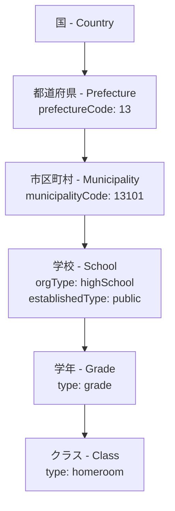
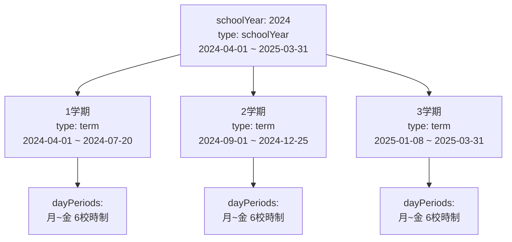
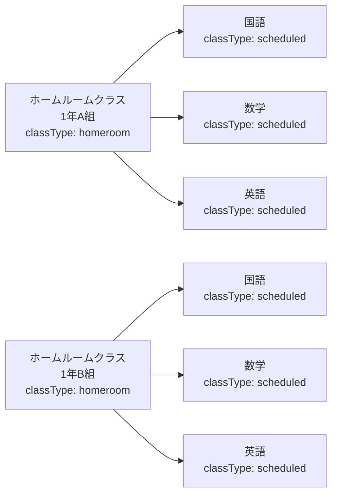
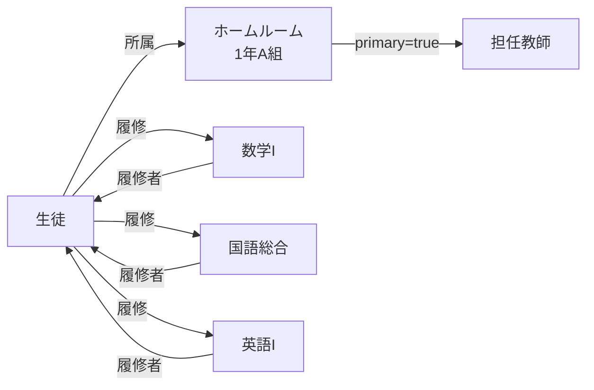
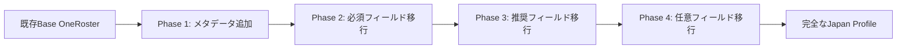

# OneRoster v1.2 Japan Profile - Gap Analysis
## ギャップ分析レポート

**Document Version**: 1.0
**Date**: 2025-11-14
**Project**: RosterHub
**Analysis Scope**: OneRoster v1.2 Base Specification vs Japan Profile v1.2

---

## 1. エグゼクティブサマリー (Executive Summary)

### 1.1 全体評価

OneRoster Japan Profile v1.2は、国際標準であるOneRoster v1.2をベースに、日本の学校教育システムの特性に合わせた拡張仕様です。本ギャップ分析により、以下の主要な差異が明らかになりました：

**主要な差異カテゴリ：**
- 🏫 **学校組織構造の拡張**: 学年・クラス・出席番号の概念追加
- 📅 **時間割システムの日本化**: 校時・曜日ベースの時間割
- 👤 **ユーザー情報の拡張**: ふりがな、性別、保護者情報
- 🏛️ **組織階層の詳細化**: 都道府県・市区町村・学校種別
- 📊 **メタデータの体系化**: `metadata.jp.*` 名前空間による日本固有情報の管理

### 1.2 実装複雑度評価

| カテゴリ | 複雑度 | 影響範囲 | 優先度 |
|---------|-------|---------|-------|
| **エンティティ拡張** | 🟡 Medium | すべてのコアエンティティ | High |
| **時間割システム** | 🔴 High | AcademicSessions, Classes | High |
| **メタデータ管理** | 🟢 Low | データモデル設計 | Medium |
| **CSV形式拡張** | 🟡 Medium | インポート/エクスポート | High |
| **API拡張** | 🟢 Low | 既存API準拠 | Low |
| **バリデーション** | 🟡 Medium | すべてのエンティティ | High |

**総合評価**: 🟡 **Medium-High Complexity**

- Base OneRoster v1.2との後方互換性は維持されている
- 日本固有機能は主にメタデータ拡張とフィールド追加で実装可能
- 既存のOneRoster実装がある場合、段階的移行が可能

### 1.3 主要リスクと考慮事項

#### ✅ 技術的リスク
1. **データモデルの複雑化**: 学年・クラス・出席番号の一意性制約管理
2. **時間割の柔軟性**: 多様な時間割パターンへの対応（6時間制、7時間制等）
3. **メタデータの肥大化**: `metadata.jp.*` フィールドの適切な正規化
4. **パフォーマンス**: 追加フィールドによるデータ量増加

#### ⚠️ 運用リスク
1. **データ移行**: 既存システムからの出席番号等のマッピング
2. **ユーザー教育**: Japan Profile固有の概念（校時、ホームルーム等）の理解
3. **データ品質**: 必須化されたフィールドのデータ整備
4. **国際化対応**: 日本とグローバルの両方のケースへの対応

#### 🔒 コンプライアンスリスク
1. **個人情報保護**: ふりがな、性別、保護者情報の適切な管理
2. **データ標準準拠**: Japan Profile v1.2の厳密な準拠
3. **文字コード**: UTF-8の徹底、異体字・外字の扱い

---

## 2. エンティティ別比較 (Entity-by-Entity Comparison)

### 2.1 Users (ユーザー)

#### フィールド比較表

| フィールド | Base v1.2 | Japan Profile v1.2 | 変更内容 | 必須/任意 |
|-----------|-----------|-------------------|---------|----------|
| `sourcedId` | ✅ | ✅ | 変更なし | Required |
| `status` | ✅ | ✅ | 変更なし | Required |
| `dateLastModified` | ✅ | ✅ | 変更なし | Required |
| `enabledUser` | ✅ | ✅ | 変更なし | Required |
| `username` | ✅ | ✅ | 変更なし | Required |
| `userIds` | ✅ | ✅ | 変更なし | Optional |
| `givenName` | ✅ | ✅ | 変更なし | Required |
| `familyName` | ✅ | ✅ | 変更なし | Required |
| `middleName` | ✅ | ✅ | 変更なし | Optional |
| `role` | ✅ | ✅ | 変更なし | Required |
| `identifier` | ✅ | ✅ | 変更なし | Optional |
| `email` | ✅ | ✅ | 変更なし | Optional |
| `sms` | ✅ | ✅ | 変更なし | Optional |
| `phone` | ✅ | ✅ | 変更なし | Optional |
| `agents` | ✅ | ✅ | 変更なし | Optional |
| `orgs` | ✅ | ✅ | 変更なし | Required |
| `grades` | ✅ | ✅ | 変更なし | Optional |
| `password` | ✅ | ✅ | 変更なし | Optional |
| **`metadata.jp.kanaGivenName`** | ❌ | ✅ | **新規追加** | **Required** |
| **`metadata.jp.kanaFamilyName`** | ❌ | ✅ | **新規追加** | **Required** |
| **`metadata.jp.kanaMiddleName`** | ❌ | ✅ | **新規追加** | Optional |
| **`metadata.jp.gender`** | ❌ | ✅ | **新規追加** | Optional |
| **`metadata.jp.homeClass`** | ❌ | ✅ | **新規追加** | Optional |
| **`metadata.jp.attendanceNumber`** | ❌ | ✅ | **新規追加** | Optional |

#### Japan Profile拡張内容

**1. ふりがな（Kana Name Fields）**
```json
{
  "givenName": "太郎",
  "familyName": "山田",
  "metadata": {
    "jp": {
      "kanaGivenName": "たろう",
      "kanaFamilyName": "やまだ"
    }
  }
}
```
- **目的**: 日本語名の正確な読み方を保持
- **制約**: 全角ひらがなのみ許可
- **必須化**: `givenName`, `familyName`が日本語の場合は必須

**2. 性別（Gender）**
```json
{
  "metadata": {
    "jp": {
      "gender": "male"
    }
  }
}
```
- **許可値**: `male`, `female`, `other`, `notSpecified`
- **用途**: クラス編成、名簿作成、統計情報

**3. ホームルームクラス（Home Class）**
```json
{
  "metadata": {
    "jp": {
      "homeClass": "class-2024-grade1-a"
    }
  }
}
```
- **参照**: Classes エンティティの `sourcedId`
- **制約**: `type=homeroom` のクラスのみ参照可能
- **用途**: 学籍管理、出席管理

**4. 出席番号（Attendance Number）**
```json
{
  "metadata": {
    "jp": {
      "attendanceNumber": 15
    }
  }
}
```
- **型**: Integer (1~99)
- **一意性**: 同一ホームルームクラス内で一意
- **用途**: 名簿作成、座席配置、出席確認

#### バリデーションルールの変更

| ルール | Base v1.2 | Japan Profile v1.2 |
|-------|-----------|-------------------|
| `role` | 6種類の役割 | 同左（変更なし） |
| `grades` | K, IT 含む | **日本の学年コード追加** (`01`~`12`, `IT`) |
| `kanaGivenName` | - | **全角ひらがな、1-50文字** |
| `kanaFamilyName` | - | **全角ひらがな、1-50文字** |
| `gender` | - | **enum: male/female/other/notSpecified** |
| `attendanceNumber` | - | **1-99の整数、ホームルーム内一意** |

---

### 2.2 Orgs (組織)

#### フィールド比較表

| フィールド | Base v1.2 | Japan Profile v1.2 | 変更内容 | 必須/任意 |
|-----------|-----------|-------------------|---------|----------|
| `sourcedId` | ✅ | ✅ | 変更なし | Required |
| `status` | ✅ | ✅ | 変更なし | Required |
| `dateLastModified` | ✅ | ✅ | 変更なし | Required |
| `name` | ✅ | ✅ | 変更なし | Required |
| `type` | ✅ | ✅ | **値の追加** | Required |
| `identifier` | ✅ | ✅ | 変更なし | Optional |
| `parent` | ✅ | ✅ | 変更なし | Optional |
| **`metadata.jp.kanaName`** | ❌ | ✅ | **新規追加** | **Required** |
| **`metadata.jp.orgType`** | ❌ | ✅ | **新規追加** | **Required** |
| **`metadata.jp.establishedType`** | ❌ | ✅ | **新規追加** | Optional |
| **`metadata.jp.prefectureCode`** | ❌ | ✅ | **新規追加** | Optional |
| **`metadata.jp.municipalityCode`** | ❌ | ✅ | **新規追加** | Optional |

#### Japan Profile拡張内容

**1. 組織名ふりがな（Kana Name）**
```json
{
  "name": "東京都立高等学校",
  "metadata": {
    "jp": {
      "kanaName": "とうきょうとりつこうとうがっこう"
    }
  }
}
```

**2. 組織種別（Organization Type）**
```json
{
  "type": "school",
  "metadata": {
    "jp": {
      "orgType": "highSchool"
    }
  }
}
```

**許可値**:
- `elementary`: 小学校
- `juniorHigh`: 中学校
- `highSchool`: 高等学校
- `combined`: 中高一貫校
- `university`: 大学
- `other`: その他

**3. 設置区分（Established Type）**
```json
{
  "metadata": {
    "jp": {
      "establishedType": "public"
    }
  }
}
```

**許可値**:
- `national`: 国立
- `public`: 公立
- `private`: 私立

**4. 都道府県コード（Prefecture Code）**
```json
{
  "metadata": {
    "jp": {
      "prefectureCode": "13"
    }
  }
}
```
- **形式**: JIS X 0401準拠（2桁数字）
- **範囲**: `01` (北海道) ~ `47` (沖縄県)

**5. 市区町村コード（Municipality Code）**
```json
{
  "metadata": {
    "jp": {
      "municipalityCode": "13101"
    }
  }
}
```
- **形式**: JIS X 0402準拠（5桁数字）
- **構成**: 都道府県コード(2桁) + 市区町村コード(3桁)

#### 組織階層の例



---

### 2.3 AcademicSessions (学期・学年・学校歴)

#### フィールド比較表

| フィールド | Base v1.2 | Japan Profile v1.2 | 変更内容 | 必須/任意 |
|-----------|-----------|-------------------|---------|----------|
| `sourcedId` | ✅ | ✅ | 変更なし | Required |
| `status` | ✅ | ✅ | 変更なし | Required |
| `dateLastModified` | ✅ | ✅ | 変更なし | Required |
| `title` | ✅ | ✅ | 変更なし | Required |
| `type` | ✅ | ✅ | 変更なし | Required |
| `startDate` | ✅ | ✅ | 変更なし | Required |
| `endDate` | ✅ | ✅ | 変更なし | Required |
| `parent` | ✅ | ✅ | 変更なし | Optional |
| `schoolYear` | ✅ | ✅ | 変更なし | Required |
| **`metadata.jp.dayPeriods`** | ❌ | ✅ | **新規追加** | **Required** |
| **`metadata.jp.specialDays`** | ❌ | ✅ | **新規追加** | Optional |

#### Japan Profile拡張内容

**1. 校時定義（Day Periods）**

日本の学校特有の「校時制」を表現：

```json
{
  "metadata": {
    "jp": {
      "dayPeriods": [
        {
          "day": "monday",
          "periods": [
            {
              "periodNumber": 1,
              "startTime": "08:45",
              "endTime": "09:35"
            },
            {
              "periodNumber": 2,
              "startTime": "09:45",
              "endTime": "10:35"
            },
            {
              "periodNumber": 3,
              "startTime": "10:45",
              "endTime": "11:35"
            },
            {
              "periodNumber": 4,
              "startTime": "11:45",
              "endTime": "12:35"
            },
            {
              "periodNumber": 5,
              "startTime": "13:25",
              "endTime": "14:15"
            },
            {
              "periodNumber": 6,
              "startTime": "14:25",
              "endTime": "15:15"
            }
          ]
        },
        {
          "day": "tuesday",
          "periods": [
            // 火曜日の校時
          ]
        }
        // 水曜日～金曜日...
      ]
    }
  }
}
```

**構造**:
- `day`: 曜日 (monday, tuesday, wednesday, thursday, friday, saturday, sunday)
- `periodNumber`: 校時番号 (1~10)
- `startTime`: 開始時刻 (HH:MM形式)
- `endTime`: 終了時刻 (HH:MM形式)

**用途**:
- 時間割の自動生成
- 授業時間の管理
- チャイム時刻の設定

**2. 特別日（Special Days）**

休日、行事日等の定義：

```json
{
  "metadata": {
    "jp": {
      "specialDays": [
        {
          "date": "2024-04-29",
          "type": "holiday",
          "title": "昭和の日"
        },
        {
          "date": "2024-10-15",
          "type": "event",
          "title": "体育祭",
          "customPeriods": [
            {
              "periodNumber": 1,
              "startTime": "09:00",
              "endTime": "12:00"
            }
          ]
        }
      ]
    }
  }
}
```

**特別日タイプ**:
- `holiday`: 祝日・休日
- `event`: 学校行事
- `shortDay`: 短縮授業
- `examination`: 試験日

#### 学校歴の階層構造（日本の4月始まり）



---

### 2.4 Classes (クラス・授業)

#### フィールド比較表

| フィールド | Base v1.2 | Japan Profile v1.2 | 変更内容 | 必須/任意 |
|-----------|-----------|-------------------|---------|----------|
| `sourcedId` | ✅ | ✅ | 変更なし | Required |
| `status` | ✅ | ✅ | 変更なし | Required |
| `dateLastModified` | ✅ | ✅ | 変更なし | Required |
| `title` | ✅ | ✅ | 変更なし | Required |
| `classCode` | ✅ | ✅ | 変更なし | Optional |
| `classType` | ✅ | ✅ | **値の追加** | Required |
| `location` | ✅ | ✅ | 変更なし | Optional |
| `grades` | ✅ | ✅ | 変更なし | Optional |
| `subjects` | ✅ | ✅ | 変更なし | Optional |
| `course` | ✅ | ✅ | 変更なし | Required |
| `school` | ✅ | ✅ | 変更なし | Required |
| `terms` | ✅ | ✅ | 変更なし | Required |
| `subjectCodes` | ✅ | ✅ | 変更なし | Optional |
| `periods` | ✅ | ✅ | **形式の拡張** | Optional |
| **`metadata.jp.className`** | ❌ | ✅ | **新規追加** | Optional |
| **`metadata.jp.homeroom`** | ❌ | ✅ | **新規追加** | Optional |
| **`metadata.jp.maxStudents`** | ❌ | ✅ | **新規追加** | Optional |

#### Japan Profile拡張内容

**1. クラス種別の拡張（Class Type）**

Base v1.2の値:
- `homeroom`: ホームルーム
- `scheduled`: 時間割授業

Japan Profile v1.2の追加値:
- **`special`**: 特別活動（部活動、委員会等）
- **`remedial`**: 補習授業
- **`advanced`**: 発展クラス

**2. 日本式クラス名（Class Name）**

```json
{
  "title": "1年A組",
  "classType": "homeroom",
  "metadata": {
    "jp": {
      "className": "A",
      "homeroom": true
    }
  }
}
```

**3. 時間割情報の拡張（Periods）**

Base v1.2形式（曜日+時限指定なし）:
```json
{
  "periods": ["1", "2", "3"]
}
```

Japan Profile v1.2形式（曜日+時限の組み合わせ）:
```json
{
  "periods": [
    "monday-1",
    "monday-2",
    "wednesday-3",
    "friday-4"
  ],
  "metadata": {
    "jp": {
      "timetable": [
        {
          "day": "monday",
          "period": 1,
          "room": "1-A教室"
        },
        {
          "day": "monday",
          "period": 2,
          "room": "1-A教室"
        },
        {
          "day": "wednesday",
          "period": 3,
          "room": "理科室"
        },
        {
          "day": "friday",
          "period": 4,
          "room": "1-A教室"
        }
      ]
    }
  }
}
```

**4. 定員管理（Max Students）**

```json
{
  "metadata": {
    "jp": {
      "maxStudents": 40
    }
  }
}
```

#### ホームルームクラスと授業クラスの関係



---

### 2.5 Courses (科目・コース)

#### フィールド比較表

| フィールド | Base v1.2 | Japan Profile v1.2 | 変更内容 | 必須/任意 |
|-----------|-----------|-------------------|---------|----------|
| `sourcedId` | ✅ | ✅ | 変更なし | Required |
| `status` | ✅ | ✅ | 変更なし | Required |
| `dateLastModified` | ✅ | ✅ | 変更なし | Required |
| `schoolYear` | ✅ | ✅ | 変更なし | Optional |
| `title` | ✅ | ✅ | 変更なし | Required |
| `courseCode` | ✅ | ✅ | 変更なし | Optional |
| `grades` | ✅ | ✅ | 変更なし | Optional |
| `orgSourcedId` | ✅ | ✅ | 変更なし | Required |
| `subjects` | ✅ | ✅ | 変更なし | Optional |
| `subjectCodes` | ✅ | ✅ | **日本の科目コード** | Optional |
| **`metadata.jp.subjectCategory`** | ❌ | ✅ | **新規追加** | Optional |
| **`metadata.jp.creditHours`** | ❌ | ✅ | **新規追加** | Optional |

#### Japan Profile拡張内容

**1. 科目コード（Subject Codes）**

日本の学習指導要領に基づく科目コード:

```json
{
  "title": "数学I",
  "subjectCodes": ["MEXT-MATH-1"],
  "metadata": {
    "jp": {
      "subjectCategory": "mathematics",
      "creditHours": 3
    }
  }
}
```

**科目カテゴリ（Subject Category）**:
- `nationalLanguage`: 国語
- `socialStudies`: 社会
- `mathematics`: 数学
- `science`: 理科
- `foreignLanguage`: 外国語
- `health`: 保健体育
- `arts`: 芸術
- `homeEconomics`: 家庭科
- `technology`: 技術
- `informationStudies`: 情報
- `integratedStudies`: 総合的な学習の時間
- `moralEducation`: 道徳
- `specialActivities`: 特別活動

**2. 単位数（Credit Hours）**

高等学校の単位制に対応:

```json
{
  "metadata": {
    "jp": {
      "creditHours": 2
    }
  }
}
```

- **型**: Number (0.5刻み、最大10単位程度)
- **用途**: 卒業要件の単位数計算

---

### 2.6 Enrollments (履修登録)

#### フィールド比較表

| フィールド | Base v1.2 | Japan Profile v1.2 | 変更内容 | 必須/任意 |
|-----------|-----------|-------------------|---------|----------|
| `sourcedId` | ✅ | ✅ | 変更なし | Required |
| `status` | ✅ | ✅ | 変更なし | Required |
| `dateLastModified` | ✅ | ✅ | 変更なし | Required |
| `classSourcedId` | ✅ | ✅ | 変更なし | Required |
| `schoolSourcedId` | ✅ | ✅ | 変更なし | Required |
| `userSourcedId` | ✅ | ✅ | 変更なし | Required |
| `role` | ✅ | ✅ | 変更なし | Required |
| `primary` | ✅ | ✅ | 変更なし | Optional |
| `beginDate` | ✅ | ✅ | 変更なし | Optional |
| `endDate` | ✅ | ✅ | 変更なし | Optional |
| **`metadata.jp.seatNumber`** | ❌ | ✅ | **新規追加** | Optional |
| **`metadata.jp.groupName`** | ❌ | ✅ | **新規追加** | Optional |

#### Japan Profile拡張内容

**1. 座席番号（Seat Number）**

```json
{
  "classSourcedId": "class-2024-grade1-a",
  "userSourcedId": "user-student-001",
  "role": "student",
  "metadata": {
    "jp": {
      "seatNumber": 15
    }
  }
}
```

- **用途**: 座席配置図、出席確認
- **範囲**: 1~99（クラス内一意）

**2. グループ名（Group Name）**

班活動・グループワーク用:

```json
{
  "metadata": {
    "jp": {
      "groupName": "A班"
    }
  }
}
```

---

## 3. 日本固有の拡張機能 (Japan-Specific Extensions)

### 3.1 メタデータ名前空間: `metadata.jp.*`

Japan Profileでは、すべての日本固有情報を `metadata.jp.*` 名前空間に格納することで、Base仕様との明確な分離を実現しています。

#### メタデータ設計原則

1. **名前空間の一貫性**: すべての日本固有フィールドは `metadata.jp.*` 配下
2. **後方互換性**: Base OneRosterクライアントは `metadata` を無視可能
3. **拡張性**: 将来的な機能追加が容易
4. **型安全性**: JSON Schemaによる厳密な型定義

#### 全メタデータフィールド一覧

| エンティティ | メタデータフィールド | 型 | 説明 |
|------------|-------------------|----|----|
| **Users** | `jp.kanaGivenName` | String | 名のふりがな |
| | `jp.kanaFamilyName` | String | 姓のふりがな |
| | `jp.kanaMiddleName` | String | ミドルネームのふりがな |
| | `jp.gender` | Enum | 性別 |
| | `jp.homeClass` | String | ホームルームクラスID |
| | `jp.attendanceNumber` | Integer | 出席番号 |
| **Orgs** | `jp.kanaName` | String | 組織名ふりがな |
| | `jp.orgType` | Enum | 組織種別 |
| | `jp.establishedType` | Enum | 設置区分 |
| | `jp.prefectureCode` | String | 都道府県コード |
| | `jp.municipalityCode` | String | 市区町村コード |
| **AcademicSessions** | `jp.dayPeriods` | Array | 校時定義 |
| | `jp.specialDays` | Array | 特別日定義 |
| **Classes** | `jp.className` | String | クラス名 |
| | `jp.homeroom` | Boolean | ホームルームフラグ |
| | `jp.maxStudents` | Integer | 定員 |
| | `jp.timetable` | Array | 時間割詳細 |
| **Courses** | `jp.subjectCategory` | Enum | 科目カテゴリ |
| | `jp.creditHours` | Number | 単位数 |
| **Enrollments** | `jp.seatNumber` | Integer | 座席番号 |
| | `jp.groupName` | String | グループ名 |

---

### 3.2 校時・時間割システム (Day/Period System)

日本の学校特有の「校時制」を完全サポート。

#### 校時システムの特徴

1. **曜日別定義**: 月曜日～金曜日（土曜日も対応可能）
2. **柔軟な時限数**: 1日4時限～10時限まで対応
3. **時刻の厳密管理**: HH:MM形式で開始・終了時刻を指定
4. **特別日対応**: 行事日の特別時間割

#### 実装例: 標準的な6時間制

```json
{
  "sourcedId": "session-2024-term1",
  "type": "term",
  "title": "2024年度 1学期",
  "startDate": "2024-04-01",
  "endDate": "2024-07-20",
  "metadata": {
    "jp": {
      "dayPeriods": [
        {
          "day": "monday",
          "periods": [
            { "periodNumber": 1, "startTime": "08:45", "endTime": "09:35" },
            { "periodNumber": 2, "startTime": "09:45", "endTime": "10:35" },
            { "periodNumber": 3, "startTime": "10:45", "endTime": "11:35" },
            { "periodNumber": 4, "startTime": "11:45", "endTime": "12:35" },
            { "periodNumber": 5, "startTime": "13:25", "endTime": "14:15" },
            { "periodNumber": 6, "startTime": "14:25", "endTime": "15:15" }
          ]
        },
        {
          "day": "tuesday",
          "periods": [
            { "periodNumber": 1, "startTime": "08:45", "endTime": "09:35" },
            { "periodNumber": 2, "startTime": "09:45", "endTime": "10:35" },
            { "periodNumber": 3, "startTime": "10:45", "endTime": "11:35" },
            { "periodNumber": 4, "startTime": "11:45", "endTime": "12:35" },
            { "periodNumber": 5, "startTime": "13:25", "endTime": "14:15" },
            { "periodNumber": 6, "startTime": "14:25", "endTime": "15:15" }
          ]
        }
        // 水曜日～金曜日も同様
      ],
      "specialDays": [
        {
          "date": "2024-05-20",
          "type": "shortDay",
          "title": "短縮授業",
          "customPeriods": [
            { "periodNumber": 1, "startTime": "08:45", "endTime": "09:15" },
            { "periodNumber": 2, "startTime": "09:25", "endTime": "09:55" },
            { "periodNumber": 3, "startTime": "10:05", "endTime": "10:35" },
            { "periodNumber": 4, "startTime": "10:45", "endTime": "11:15" }
          ]
        }
      ]
    }
  }
}
```

#### 時間割の参照方法

Classesエンティティの `periods` フィールドで参照:

```json
{
  "sourcedId": "class-math-1a",
  "title": "数学I（1年A組）",
  "classType": "scheduled",
  "periods": [
    "monday-1",
    "wednesday-3",
    "friday-2"
  ]
}
```

**フォーマット**: `{day}-{periodNumber}`
- `day`: monday, tuesday, wednesday, thursday, friday, saturday, sunday
- `periodNumber`: 1~10

---

### 3.3 学年・クラス・出席番号システム

日本の学校特有の組織構造を表現。

#### 階層構造

```
学校 (School)
  └── 学年 (Grade - Org type)
      └── ホームルームクラス (Homeroom Class)
          └── 生徒 (Students with Attendance Numbers)
```

#### データモデル例

**学年組織 (Grade Org)**:
```json
{
  "sourcedId": "org-2024-grade1",
  "name": "1学年",
  "type": "grade",
  "parent": "org-school-001",
  "metadata": {
    "jp": {
      "kanaName": "いちがくねん"
    }
  }
}
```

**ホームルームクラス (Homeroom Class)**:
```json
{
  "sourcedId": "class-2024-grade1-a",
  "title": "1年A組",
  "classType": "homeroom",
  "school": "org-school-001",
  "grades": ["01"],
  "metadata": {
    "jp": {
      "className": "A",
      "homeroom": true,
      "maxStudents": 40
    }
  }
}
```

**生徒の出席番号 (Student with Attendance Number)**:
```json
{
  "sourcedId": "user-student-001",
  "givenName": "太郎",
  "familyName": "山田",
  "role": "student",
  "grades": ["01"],
  "metadata": {
    "jp": {
      "kanaGivenName": "たろう",
      "kanaFamilyName": "やまだ",
      "homeClass": "class-2024-grade1-a",
      "attendanceNumber": 15
    }
  }
}
```

#### 出席番号の一意性制約

**ルール**:
- 出席番号は同一ホームルームクラス内で一意
- 範囲: 1~99
- 転入生の場合は欠番に割り当て、または最大番号+1

**バリデーション例**:
```sql
-- PostgreSQL制約例
CREATE UNIQUE INDEX idx_unique_attendance_number
ON users ((metadata->'jp'->>'homeClass'), (metadata->'jp'->>'attendanceNumber'))
WHERE metadata->'jp'->>'attendanceNumber' IS NOT NULL;
```

---

### 3.4 ふりがな (Kana Name Fields)

日本語名の正確な読み方を保持するための必須フィールド。

#### 対象エンティティ

1. **Users**: `kanaGivenName`, `kanaFamilyName`, `kanaMiddleName`
2. **Orgs**: `kanaName`

#### バリデーションルール

**文字種**: 全角ひらがなのみ
```regex
^[ぁ-ん]+$
```

**長さ制限**:
- `kanaGivenName`: 1~50文字
- `kanaFamilyName`: 1~50文字
- `kanaName`: 1~100文字

#### 実装例

**正しい例**:
```json
{
  "givenName": "太郎",
  "familyName": "山田",
  "metadata": {
    "jp": {
      "kanaGivenName": "たろう",
      "kanaFamilyName": "やまだ"
    }
  }
}
```

**誤った例（カタカナ使用）**:
```json
{
  "metadata": {
    "jp": {
      "kanaGivenName": "タロウ",  // ❌ カタカナは不可
      "kanaFamilyName": "ヤマダ"  // ❌ カタカナは不可
    }
  }
}
```

#### ソート順序

日本語名のソートはふりがなを使用:

```sql
-- PostgreSQL例: ふりがなでソート
SELECT *
FROM users
ORDER BY
  metadata->'jp'->>'kanaFamilyName',
  metadata->'jp'->>'kanaGivenName';
```

---

### 3.5 ホームルームクラス (Homeroom Class Type)

日本の学校特有の「ホームルーム (学級)」概念。

#### ホームルームの定義

**特徴**:
- 生徒の所属する基本単位
- 担任教師が配置される
- 朝・帰りのSHR (Short Home Room) の実施場所
- 出席番号が紐づく

**Base OneRosterとの違い**:
- Base: ホームルームは単なる `classType=homeroom`
- Japan Profile: `metadata.jp.homeroom=true` でより明示的に管理

#### データモデル

**ホームルームクラスの定義**:
```json
{
  "sourcedId": "class-2024-grade1-a",
  "title": "1年A組",
  "classType": "homeroom",
  "school": "org-school-001",
  "grades": ["01"],
  "course": "course-homeroom",
  "terms": ["session-2024"],
  "metadata": {
    "jp": {
      "className": "A",
      "homeroom": true,
      "maxStudents": 40
    }
  }
}
```

**担任教師の登録 (Enrollment)**:
```json
{
  "sourcedId": "enrollment-teacher-homeroom",
  "classSourcedId": "class-2024-grade1-a",
  "userSourcedId": "user-teacher-001",
  "role": "teacher",
  "primary": true
}
```

**生徒の所属 (User)**:
```json
{
  "sourcedId": "user-student-001",
  "role": "student",
  "metadata": {
    "jp": {
      "homeClass": "class-2024-grade1-a",
      "attendanceNumber": 1
    }
  }
}
```

#### ホームルームと授業クラスの関係



---

## 4. APIエンドポイントの差異 (API Endpoint Differences)

### 4.1 エンドポイント一覧

**結論**: Japan Profile v1.2は、Base OneRoster v1.2のすべてのエンドポイントを**そのまま使用**します。日本固有の新規エンドポイントは**追加されていません**。

#### Base OneRoster v1.2エンドポイント（Japan Profileでも同一）

| カテゴリ | エンドポイント | メソッド | 説明 |
|---------|-------------|---------|------|
| **Users** | `/users` | GET | 全ユーザー取得 |
| | `/users/{id}` | GET | 特定ユーザー取得 |
| | `/schools/{id}/users` | GET | 学校別ユーザー取得 |
| | `/schools/{id}/students` | GET | 学校別生徒取得 |
| | `/schools/{id}/teachers` | GET | 学校別教師取得 |
| **Orgs** | `/orgs` | GET | 全組織取得 |
| | `/orgs/{id}` | GET | 特定組織取得 |
| | `/schools` | GET | 全学校取得 |
| | `/schools/{id}` | GET | 特定学校取得 |
| **Classes** | `/classes` | GET | 全クラス取得 |
| | `/classes/{id}` | GET | 特定クラス取得 |
| | `/schools/{id}/classes` | GET | 学校別クラス取得 |
| | `/teachers/{id}/classes` | GET | 教師別クラス取得 |
| | `/students/{id}/classes` | GET | 生徒別クラス取得 |
| **Courses** | `/courses` | GET | 全コース取得 |
| | `/courses/{id}` | GET | 特定コース取得 |
| | `/schools/{id}/courses` | GET | 学校別コース取得 |
| **Enrollments** | `/enrollments` | GET | 全履修登録取得 |
| | `/classes/{id}/enrollments` | GET | クラス別履修登録取得 |
| | `/schools/{id}/enrollments` | GET | 学校別履修登録取得 |
| **AcademicSessions** | `/academicSessions` | GET | 全学期取得 |
| | `/academicSessions/{id}` | GET | 特定学期取得 |
| | `/schools/{id}/academicSessions` | GET | 学校別学期取得 |

---

### 4.2 クエリパラメータ

Base OneRoster v1.2と同一のクエリパラメータを使用:

| パラメータ | 説明 | 例 |
|----------|------|----|
| `limit` | 取得件数制限 | `?limit=100` |
| `offset` | オフセット | `?offset=50` |
| `sort` | ソート | `?sort=familyName` |
| `orderBy` | ソート方向 | `?orderBy=asc` |
| `filter` | フィルタ条件 | `?filter=status='active'` |
| `fields` | 取得フィールド指定 | `?fields=sourcedId,givenName` |

#### Japan Profile固有のフィルタ例

**ふりがなでフィルタ**:
```
GET /users?filter=metadata.jp.kanaFamilyName='やまだ'
```

**ホームルームクラスでフィルタ**:
```
GET /users?filter=metadata.jp.homeClass='class-2024-grade1-a'
```

**出席番号でソート**:
```
GET /users?sort=metadata.jp.attendanceNumber&orderBy=asc
```

**校時が定義されている学期のみ**:
```
GET /academicSessions?filter=metadata.jp.dayPeriods!=null
```

---

### 4.3 レスポンス形式

Japan Profileのレスポンスは、Base OneRoster v1.2と同一の構造に `metadata.jp.*` が追加される形:

**Base OneRoster v1.2レスポンス例**:
```json
{
  "user": {
    "sourcedId": "user-001",
    "status": "active",
    "dateLastModified": "2024-01-15T10:30:00Z",
    "givenName": "Taro",
    "familyName": "Yamada",
    "role": "student"
  }
}
```

**Japan Profile v1.2レスポンス例**:
```json
{
  "user": {
    "sourcedId": "user-001",
    "status": "active",
    "dateLastModified": "2024-01-15T10:30:00Z",
    "givenName": "太郎",
    "familyName": "山田",
    "role": "student",
    "metadata": {
      "jp": {
        "kanaGivenName": "たろう",
        "kanaFamilyName": "やまだ",
        "gender": "male",
        "homeClass": "class-2024-grade1-a",
        "attendanceNumber": 15
      }
    }
  }
}
```

---

### 4.4 エラーレスポンス

Base OneRoster v1.2と同一:

```json
{
  "imsx_codeMajor": "failure",
  "imsx_severity": "error",
  "imsx_description": "Invalid request",
  "imsx_codeMinor": {
    "imsx_codeMinorField": [
      {
        "imsx_codeMinorFieldName": "metadata.jp.kanaGivenName",
        "imsx_codeMinorFieldValue": "invalid_characters"
      }
    ]
  }
}
```

**Japan Profile固有のエラーコード例**:
- `invalid_kana_format`: ふりがなが全角ひらがなでない
- `duplicate_attendance_number`: 出席番号が重複
- `invalid_homeroom_reference`: ホームルームクラスが存在しない
- `invalid_period_format`: 校時フォーマットが不正

---

### 4.5 ページネーション

Base OneRoster v1.2と同一:

**リクエスト**:
```
GET /users?limit=100&offset=0
```

**レスポンスヘッダー**:
```
X-Total-Count: 1234
Link: </users?limit=100&offset=100>; rel="next",
      </users?limit=100&offset=1200>; rel="last"
```

---

## 5. CSV形式の差異 (CSV Format Differences)

### 5.1 CSV形式の概要

OneRoster Japan Profile v1.2では、Base v1.2のCSVフォーマットに**カラムを追加**する形で拡張されています。

#### 基本仕様

| 項目 | Base v1.2 | Japan Profile v1.2 |
|------|-----------|-------------------|
| **文字コード** | UTF-8 (BOM optional) | **UTF-8 (BOM required)** |
| **改行コード** | CRLF or LF | **CRLF推奨** |
| **区切り文字** | `,` (カンマ) | `,` (カンマ) |
| **エスケープ** | RFC 4180準拠 | RFC 4180準拠 |
| **日付形式** | `YYYY-MM-DD` | `YYYY-MM-DD` |
| **日時形式** | ISO 8601 | ISO 8601 |

---

### 5.2 users.csv

#### ヘッダー行比較

**Base v1.2**:
```csv
sourcedId,status,dateLastModified,enabledUser,orgSourcedIds,role,username,userIds,givenName,familyName,middleName,identifier,email,sms,phone,agentSourcedIds,grades,password
```

**Japan Profile v1.2**:
```csv
sourcedId,status,dateLastModified,enabledUser,orgSourcedIds,role,username,userIds,givenName,familyName,middleName,identifier,email,sms,phone,agentSourcedIds,grades,password,metadata.jp.kanaGivenName,metadata.jp.kanaFamilyName,metadata.jp.kanaMiddleName,metadata.jp.gender,metadata.jp.homeClass,metadata.jp.attendanceNumber
```

#### 追加カラム

| カラム名 | 型 | 必須 | 説明 | 例 |
|---------|----|----|------|---|
| `metadata.jp.kanaGivenName` | String | Required | 名のふりがな | `たろう` |
| `metadata.jp.kanaFamilyName` | String | Required | 姓のふりがな | `やまだ` |
| `metadata.jp.kanaMiddleName` | String | Optional | ミドルネームのふりがな | - |
| `metadata.jp.gender` | Enum | Optional | 性別 | `male` |
| `metadata.jp.homeClass` | String | Optional | ホームルームクラスID | `class-2024-grade1-a` |
| `metadata.jp.attendanceNumber` | Integer | Optional | 出席番号 | `15` |

#### サンプルデータ

```csv
sourcedId,status,dateLastModified,enabledUser,orgSourcedIds,role,username,userIds,givenName,familyName,middleName,identifier,email,sms,phone,agentSourcedIds,grades,password,metadata.jp.kanaGivenName,metadata.jp.kanaFamilyName,metadata.jp.kanaMiddleName,metadata.jp.gender,metadata.jp.homeClass,metadata.jp.attendanceNumber
user-001,active,2024-01-15T10:30:00Z,TRUE,org-school-001,student,yamada.taro,,太郎,山田,,ST001,taro@example.com,,,,,01,,たろう,やまだ,,male,class-2024-grade1-a,15
user-002,active,2024-01-15T10:31:00Z,TRUE,org-school-001,student,suzuki.hanako,,花子,鈴木,,ST002,hanako@example.com,,,,,01,,はなこ,すずき,,female,class-2024-grade1-a,16
user-003,active,2024-01-15T10:32:00Z,TRUE,org-school-001,teacher,tanaka.sensei,,先生,田中,,TC001,tanaka@example.com,,,,,,,せんせい,たなか,,,
```

---

### 5.3 orgs.csv

#### ヘッダー行比較

**Base v1.2**:
```csv
sourcedId,status,dateLastModified,name,type,identifier,parentSourcedId
```

**Japan Profile v1.2**:
```csv
sourcedId,status,dateLastModified,name,type,identifier,parentSourcedId,metadata.jp.kanaName,metadata.jp.orgType,metadata.jp.establishedType,metadata.jp.prefectureCode,metadata.jp.municipalityCode
```

#### 追加カラム

| カラム名 | 型 | 必須 | 説明 | 例 |
|---------|----|----|------|---|
| `metadata.jp.kanaName` | String | Required | 組織名ふりがな | `とうきょうとりつこうとうがっこう` |
| `metadata.jp.orgType` | Enum | Required | 組織種別 | `highSchool` |
| `metadata.jp.establishedType` | Enum | Optional | 設置区分 | `public` |
| `metadata.jp.prefectureCode` | String | Optional | 都道府県コード | `13` |
| `metadata.jp.municipalityCode` | String | Optional | 市区町村コード | `13101` |

#### サンプルデータ

```csv
sourcedId,status,dateLastModified,name,type,identifier,parentSourcedId,metadata.jp.kanaName,metadata.jp.orgType,metadata.jp.establishedType,metadata.jp.prefectureCode,metadata.jp.municipalityCode
org-school-001,active,2024-01-01T00:00:00Z,東京都立高等学校,school,SC001,,とうきょうとりつこうとうがっこう,highSchool,public,13,13101
org-grade-001,active,2024-01-01T00:00:00Z,1学年,grade,,org-school-001,いちがくねん,,,
org-grade-002,active,2024-01-01T00:00:00Z,2学年,grade,,org-school-001,にがくねん,,,
```

---

### 5.4 academicSessions.csv

#### ヘッダー行比較

**Base v1.2**:
```csv
sourcedId,status,dateLastModified,title,type,startDate,endDate,parentSourcedId,schoolYear
```

**Japan Profile v1.2**:
```csv
sourcedId,status,dateLastModified,title,type,startDate,endDate,parentSourcedId,schoolYear,metadata.jp.dayPeriods,metadata.jp.specialDays
```

#### 追加カラム

| カラム名 | 型 | 必須 | 説明 | フォーマット |
|---------|----|----|------|------------|
| `metadata.jp.dayPeriods` | JSON | Required | 校時定義 | JSON文字列 |
| `metadata.jp.specialDays` | JSON | Optional | 特別日定義 | JSON文字列 |

#### サンプルデータ

```csv
sourcedId,status,dateLastModified,title,type,startDate,endDate,parentSourcedId,schoolYear,metadata.jp.dayPeriods,metadata.jp.specialDays
session-2024,active,2024-01-01T00:00:00Z,2024年度,schoolYear,2024-04-01,2025-03-31,,2024,"[{""day"":""monday"",""periods"":[{""periodNumber"":1,""startTime"":""08:45"",""endTime"":""09:35""}]}]","[{""date"":""2024-04-29"",""type"":""holiday"",""title"":""昭和の日""}]"
```

**注意**: JSONはダブルクォート `"` をエスケープ `""` する必要があります（RFC 4180）。

---

### 5.5 classes.csv

#### ヘッダー行比較

**Base v1.2**:
```csv
sourcedId,status,dateLastModified,title,grades,courseSourcedId,classCode,classType,location,schoolSourcedId,termSourcedIds,subjects,subjectCodes,periods
```

**Japan Profile v1.2**:
```csv
sourcedId,status,dateLastModified,title,grades,courseSourcedId,classCode,classType,location,schoolSourcedId,termSourcedIds,subjects,subjectCodes,periods,metadata.jp.className,metadata.jp.homeroom,metadata.jp.maxStudents,metadata.jp.timetable
```

#### 追加カラム

| カラム名 | 型 | 必須 | 説明 | 例 |
|---------|----|----|------|---|
| `metadata.jp.className` | String | Optional | クラス名 | `A` |
| `metadata.jp.homeroom` | Boolean | Optional | ホームルームフラグ | `TRUE` |
| `metadata.jp.maxStudents` | Integer | Optional | 定員 | `40` |
| `metadata.jp.timetable` | JSON | Optional | 時間割詳細 | JSON文字列 |

#### サンプルデータ

```csv
sourcedId,status,dateLastModified,title,grades,courseSourcedId,classCode,classType,location,schoolSourcedId,termSourcedIds,subjects,subjectCodes,periods,metadata.jp.className,metadata.jp.homeroom,metadata.jp.maxStudents,metadata.jp.timetable
class-2024-grade1-a,active,2024-01-01T00:00:00Z,1年A組,01,course-homeroom,1A,homeroom,1-A教室,org-school-001,session-2024,,,,,A,TRUE,40,
class-math-1a,active,2024-01-01T00:00:00Z,数学I（1年A組）,01,course-math1,MATH1-1A,scheduled,数学教室,org-school-001,session-2024,mathematics,MEXT-MATH-1,"monday-1,wednesday-3,friday-2",,,,"[{""day"":""monday"",""period"":1,""room"":""数学教室""}]"
```

---

### 5.6 courses.csv

#### ヘッダー行比較

**Base v1.2**:
```csv
sourcedId,status,dateLastModified,schoolYearSourcedId,title,courseCode,grades,orgSourcedId,subjects,subjectCodes
```

**Japan Profile v1.2**:
```csv
sourcedId,status,dateLastModified,schoolYearSourcedId,title,courseCode,grades,orgSourcedId,subjects,subjectCodes,metadata.jp.subjectCategory,metadata.jp.creditHours
```

#### 追加カラム

| カラム名 | 型 | 必須 | 説明 | 例 |
|---------|----|----|------|---|
| `metadata.jp.subjectCategory` | Enum | Optional | 科目カテゴリ | `mathematics` |
| `metadata.jp.creditHours` | Number | Optional | 単位数 | `3` |

#### サンプルデータ

```csv
sourcedId,status,dateLastModified,schoolYearSourcedId,title,courseCode,grades,orgSourcedId,subjects,subjectCodes,metadata.jp.subjectCategory,metadata.jp.creditHours
course-math1,active,2024-01-01T00:00:00Z,session-2024,数学I,MATH1,01,org-school-001,mathematics,MEXT-MATH-1,mathematics,3
course-japanese,active,2024-01-01T00:00:00Z,session-2024,国語総合,JPN1,01,org-school-001,language,MEXT-JPN-1,nationalLanguage,4
```

---

### 5.7 enrollments.csv

#### ヘッダー行比較

**Base v1.2**:
```csv
sourcedId,status,dateLastModified,classSourcedId,schoolSourcedId,userSourcedId,role,primary,beginDate,endDate
```

**Japan Profile v1.2**:
```csv
sourcedId,status,dateLastModified,classSourcedId,schoolSourcedId,userSourcedId,role,primary,beginDate,endDate,metadata.jp.seatNumber,metadata.jp.groupName
```

#### 追加カラム

| カラム名 | 型 | 必須 | 説明 | 例 |
|---------|----|----|------|---|
| `metadata.jp.seatNumber` | Integer | Optional | 座席番号 | `15` |
| `metadata.jp.groupName` | String | Optional | グループ名 | `A班` |

#### サンプルデータ

```csv
sourcedId,status,dateLastModified,classSourcedId,schoolSourcedId,userSourcedId,role,primary,beginDate,endDate,metadata.jp.seatNumber,metadata.jp.groupName
enroll-001,active,2024-01-01T00:00:00Z,class-2024-grade1-a,org-school-001,user-001,student,,,15,A班
enroll-002,active,2024-01-01T00:00:00Z,class-2024-grade1-a,org-school-001,user-002,student,,,16,A班
enroll-003,active,2024-01-01T00:00:00Z,class-2024-grade1-a,org-school-001,user-003,teacher,TRUE,,,,
```

---

### 5.8 CSVインポート時の注意事項

#### 1. 文字コード
- **必須**: UTF-8 with BOM
- **理由**: Microsoft Excelでの文字化け防止
- **検証**: ファイル先頭3バイトが `EF BB BF` であることを確認

#### 2. 日本語フィールドのバリデーション
- **ふりがな**: 全角ひらがなのみ（正規表現: `^[ぁ-ん]+$`）
- **都道府県コード**: 2桁数字、01~47
- **市区町村コード**: 5桁数字

#### 3. JSON埋め込みフィールド
- **エスケープ**: ダブルクォート `"` を `""` に
- **検証**: JSONとしてパース可能であることを確認
- **例**: `"[{""day"":""monday""}]"`

#### 4. 日付・時刻フォーマット
- **日付**: `YYYY-MM-DD` (例: `2024-04-01`)
- **日時**: ISO 8601 (例: `2024-01-15T10:30:00Z`)
- **時刻**: `HH:MM` (例: `08:45`)

---

## 6. 実装影響分析 (Implementation Impact Analysis)

### 6.1 データベーススキーマへの影響

#### 影響度: 🔴 High

#### 6.1.1 テーブル設計への影響

**Users テーブル**:
```sql
-- 既存カラム（Base OneRoster v1.2）
CREATE TABLE users (
  sourced_id VARCHAR(255) PRIMARY KEY,
  status VARCHAR(20) NOT NULL,
  date_last_modified TIMESTAMP NOT NULL,
  enabled_user BOOLEAN NOT NULL,
  username VARCHAR(255) NOT NULL,
  given_name VARCHAR(255) NOT NULL,
  family_name VARCHAR(255) NOT NULL,
  middle_name VARCHAR(255),
  role VARCHAR(50) NOT NULL,
  identifier VARCHAR(255),
  email VARCHAR(255),
  sms VARCHAR(50),
  phone VARCHAR(50),
  password VARCHAR(255),
  -- JSON型でメタデータを格納
  metadata JSONB
);

-- Japan Profile用インデックス
CREATE INDEX idx_users_kana_family_name ON users ((metadata->'jp'->>'kanaFamilyName'));
CREATE INDEX idx_users_kana_given_name ON users ((metadata->'jp'->>'kanaGivenName'));
CREATE INDEX idx_users_home_class ON users ((metadata->'jp'->>'homeClass'));
CREATE INDEX idx_users_gender ON users ((metadata->'jp'->>'gender'));

-- 出席番号の一意性制約
CREATE UNIQUE INDEX idx_unique_attendance_number
ON users ((metadata->'jp'->>'homeClass'), (metadata->'jp'->>'attendanceNumber'))
WHERE metadata->'jp'->>'attendanceNumber' IS NOT NULL;
```

**Orgs テーブル**:
```sql
CREATE TABLE orgs (
  sourced_id VARCHAR(255) PRIMARY KEY,
  status VARCHAR(20) NOT NULL,
  date_last_modified TIMESTAMP NOT NULL,
  name VARCHAR(255) NOT NULL,
  type VARCHAR(50) NOT NULL,
  identifier VARCHAR(255),
  parent_sourced_id VARCHAR(255) REFERENCES orgs(sourced_id),
  metadata JSONB
);

-- Japan Profile用インデックス
CREATE INDEX idx_orgs_kana_name ON orgs ((metadata->'jp'->>'kanaName'));
CREATE INDEX idx_orgs_org_type ON orgs ((metadata->'jp'->>'orgType'));
CREATE INDEX idx_orgs_prefecture_code ON orgs ((metadata->'jp'->>'prefectureCode'));
CREATE INDEX idx_orgs_municipality_code ON orgs ((metadata->'jp'->>'municipalityCode'));
```

**AcademicSessions テーブル**:
```sql
CREATE TABLE academic_sessions (
  sourced_id VARCHAR(255) PRIMARY KEY,
  status VARCHAR(20) NOT NULL,
  date_last_modified TIMESTAMP NOT NULL,
  title VARCHAR(255) NOT NULL,
  type VARCHAR(50) NOT NULL,
  start_date DATE NOT NULL,
  end_date DATE NOT NULL,
  parent_sourced_id VARCHAR(255) REFERENCES academic_sessions(sourced_id),
  school_year INTEGER NOT NULL,
  metadata JSONB
);

-- 校時検索用GINインデックス
CREATE INDEX idx_academic_sessions_day_periods ON academic_sessions USING GIN ((metadata->'jp'->'dayPeriods'));
CREATE INDEX idx_academic_sessions_special_days ON academic_sessions USING GIN ((metadata->'jp'->'specialDays'));
```

**Classes テーブル**:
```sql
CREATE TABLE classes (
  sourced_id VARCHAR(255) PRIMARY KEY,
  status VARCHAR(20) NOT NULL,
  date_last_modified TIMESTAMP NOT NULL,
  title VARCHAR(255) NOT NULL,
  class_code VARCHAR(255),
  class_type VARCHAR(50) NOT NULL,
  location VARCHAR(255),
  course_sourced_id VARCHAR(255) NOT NULL REFERENCES courses(sourced_id),
  school_sourced_id VARCHAR(255) NOT NULL REFERENCES orgs(sourced_id),
  metadata JSONB
);

-- Japan Profile用インデックス
CREATE INDEX idx_classes_homeroom ON classes ((metadata->'jp'->>'homeroom'))
WHERE (metadata->'jp'->>'homeroom')::boolean = true;

CREATE INDEX idx_classes_class_name ON classes ((metadata->'jp'->>'className'));
CREATE INDEX idx_classes_timetable ON classes USING GIN ((metadata->'jp'->'timetable'));
```

#### 6.1.2 正規化vs非正規化の検討

**メタデータのJSONB格納 vs 専用カラム化**

| アプローチ | メリット | デメリット | 推奨度 |
|-----------|---------|-----------|-------|
| **JSONB格納** | ・スキーマ柔軟性<br/>・Base仕様との分離明確<br/>・将来拡張容易 | ・複雑なクエリが必要<br/>・インデックス設計が重要 | ⭐⭐⭐⭐⭐ |
| **専用カラム化** | ・クエリシンプル<br/>・型制約が明確<br/>・パフォーマンス良好 | ・スキーマ変更頻度増<br/>・カラム数増加 | ⭐⭐⭐ |
| **ハイブリッド** | ・頻繁アクセス項目は専用カラム<br/>・その他はJSONB | ・設計複雑化<br/>・一貫性維持が難 | ⭐⭐ |

**推奨**: JSONB格納 + GINインデックス

**理由**:
1. OneRoster仕様との明確な分離（`metadata.jp.*`）
2. 将来のJapan Profile拡張に柔軟対応
3. PostgreSQLのJSONB性能は実用的
4. 必要に応じてComputed Columnで専用カラム化可能

#### 6.1.3 パフォーマンス最適化

**校時検索の最適化**:
```sql
-- 特定曜日・時限のクラスを検索
SELECT c.*
FROM classes c
WHERE c.metadata->'jp'->'timetable' @> '[{"day": "monday", "period": 1}]';

-- GINインデックスで高速化
CREATE INDEX idx_classes_timetable_gin
ON classes USING GIN ((metadata->'jp'->'timetable') jsonb_path_ops);
```

**ふりがなソート**:
```sql
-- ふりがな順でソート（日本語名簿）
SELECT
  given_name,
  family_name,
  metadata->'jp'->>'kanaGivenName' AS kana_given_name,
  metadata->'jp'->>'kanaFamilyName' AS kana_family_name
FROM users
WHERE role = 'student'
ORDER BY
  metadata->'jp'->>'kanaFamilyName',
  metadata->'jp'->>'kanaGivenName';

-- B-treeインデックスで高速化
CREATE INDEX idx_users_kana_sort
ON users (
  (metadata->'jp'->>'kanaFamilyName'),
  (metadata->'jp'->>'kanaGivenName')
);
```

---

### 6.2 API実装への影響

#### 影響度: 🟡 Medium

#### 6.2.1 バリデーション層の拡張

**NestJSでのDTOバリデーション例**:

```typescript
// user.dto.ts
import { IsString, IsOptional, IsInt, IsEnum, Matches, ValidateNested } from 'class-validator';
import { Type } from 'class-transformer';

class UserMetadataJp {
  @IsString()
  @Matches(/^[ぁ-ん]+$/, { message: 'kanaGivenName must be hiragana only' })
  kanaGivenName: string;

  @IsString()
  @Matches(/^[ぁ-ん]+$/, { message: 'kanaFamilyName must be hiragana only' })
  kanaFamilyName: string;

  @IsOptional()
  @IsString()
  @Matches(/^[ぁ-ん]+$/, { message: 'kanaMiddleName must be hiragana only' })
  kanaMiddleName?: string;

  @IsOptional()
  @IsEnum(['male', 'female', 'other', 'notSpecified'])
  gender?: 'male' | 'female' | 'other' | 'notSpecified';

  @IsOptional()
  @IsString()
  homeClass?: string;

  @IsOptional()
  @IsInt()
  @Min(1)
  @Max(99)
  attendanceNumber?: number;
}

class UserMetadata {
  @ValidateNested()
  @Type(() => UserMetadataJp)
  jp: UserMetadataJp;
}

export class CreateUserDto {
  @IsString()
  givenName: string;

  @IsString()
  familyName: string;

  @IsEnum(['student', 'teacher', 'parent', 'administrator', 'aide', 'guardian'])
  role: string;

  @ValidateNested()
  @Type(() => UserMetadata)
  metadata: UserMetadata;
}
```

**カスタムバリデーター（出席番号一意性）**:

```typescript
// attendance-number.validator.ts
import { Injectable } from '@nestjs/common';
import { ValidatorConstraint, ValidatorConstraintInterface, ValidationArguments } from 'class-validator';
import { UsersRepository } from './users.repository';

@ValidatorConstraint({ name: 'uniqueAttendanceNumber', async: true })
@Injectable()
export class UniqueAttendanceNumberValidator implements ValidatorConstraintInterface {
  constructor(private usersRepository: UsersRepository) {}

  async validate(attendanceNumber: number, args: ValidationArguments): Promise<boolean> {
    const { homeClass } = (args.object as any).metadata.jp;
    if (!homeClass || !attendanceNumber) return true;

    const existing = await this.usersRepository.findByAttendanceNumber(homeClass, attendanceNumber);
    return !existing;
  }

  defaultMessage(args: ValidationArguments): string {
    return 'Attendance number must be unique within the homeroom class';
  }
}
```

#### 6.2.2 クエリビルダーの拡張

**TypeORMでのJSON検索例**:

```typescript
// users.repository.ts
import { Repository } from 'typeorm';
import { User } from './user.entity';

export class UsersRepository extends Repository<User> {
  // ふりがなで検索
  async findByKanaName(kanaFamilyName: string, kanaGivenName?: string): Promise<User[]> {
    const query = this.createQueryBuilder('user')
      .where("user.metadata->'jp'->>'kanaFamilyName' = :kanaFamilyName", { kanaFamilyName });

    if (kanaGivenName) {
      query.andWhere("user.metadata->'jp'->>'kanaGivenName' = :kanaGivenName", { kanaGivenName });
    }

    return query.getMany();
  }

  // ホームルームクラスの生徒一覧（出席番号順）
  async findStudentsByHomeroom(homeClassId: string): Promise<User[]> {
    return this.createQueryBuilder('user')
      .where("user.metadata->'jp'->>'homeClass' = :homeClassId", { homeClassId })
      .andWhere("user.role = 'student'")
      .orderBy("(user.metadata->'jp'->>'attendanceNumber')::int", 'ASC')
      .getMany();
  }

  // 性別で集計
  async countByGender(schoolId: string): Promise<{ gender: string; count: number }[]> {
    return this.createQueryBuilder('user')
      .select("user.metadata->'jp'->>'gender'", 'gender')
      .addSelect('COUNT(*)', 'count')
      .where("user.orgSourcedIds @> :schoolId", { schoolId: `["${schoolId}"]` })
      .groupBy("user.metadata->'jp'->>'gender'")
      .getRawMany();
  }
}
```

**PrismaでのJSON検索例**:

```typescript
// users.service.ts
import { PrismaService } from './prisma.service';

export class UsersService {
  constructor(private prisma: PrismaService) {}

  // ふりがなで検索
  async findByKanaName(kanaFamilyName: string) {
    return this.prisma.user.findMany({
      where: {
        metadata: {
          path: ['jp', 'kanaFamilyName'],
          equals: kanaFamilyName,
        },
      },
    });
  }

  // ホームルームクラスの生徒一覧
  async findStudentsByHomeroom(homeClassId: string) {
    return this.prisma.user.findMany({
      where: {
        role: 'student',
        metadata: {
          path: ['jp', 'homeClass'],
          equals: homeClassId,
        },
      },
      orderBy: {
        metadata: {
          path: ['jp', 'attendanceNumber'],
          sort: 'asc',
        },
      },
    });
  }
}
```

#### 6.2.3 レスポンス整形

**Japan Profileフィールドの自動付与**:

```typescript
// user.transformer.ts
export class UserTransformer {
  static toResponse(user: User): UserResponse {
    return {
      sourcedId: user.sourcedId,
      status: user.status,
      dateLastModified: user.dateLastModified,
      enabledUser: user.enabledUser,
      username: user.username,
      givenName: user.givenName,
      familyName: user.familyName,
      role: user.role,
      metadata: {
        jp: {
          kanaGivenName: user.metadata.jp.kanaGivenName,
          kanaFamilyName: user.metadata.jp.kanaFamilyName,
          gender: user.metadata.jp.gender,
          homeClass: user.metadata.jp.homeClass,
          attendanceNumber: user.metadata.jp.attendanceNumber,
        },
      },
    };
  }
}
```

---

### 6.3 バリデーションロジックへの影響

#### 影響度: 🟡 Medium

#### 6.3.1 必須フィールド検証

**Japan Profile特有の条件付き必須フィールド**:

| フィールド | 条件 | バリデーションロジック |
|-----------|------|---------------------|
| `kanaGivenName` | `givenName`が日本語の場合 | 日本語判定 + ひらがな検証 |
| `kanaFamilyName` | `familyName`が日本語の場合 | 日本語判定 + ひらがな検証 |
| `attendanceNumber` | `homeClass`が設定されている学生 | 1~99の整数 + 一意性検証 |
| `dayPeriods` | `type=term`のAcademicSession | JSON形式検証 + 論理検証 |

**実装例**:

```typescript
// conditional-required.validator.ts
function validateKanaRequired(user: User): ValidationError[] {
  const errors: ValidationError[] = [];

  // 日本語判定（簡易版）
  const isJapanese = (str: string) => /[\u3040-\u309F\u30A0-\u30FF\u4E00-\u9FAF]/.test(str);

  if (isJapanese(user.givenName) && !user.metadata?.jp?.kanaGivenName) {
    errors.push({
      field: 'metadata.jp.kanaGivenName',
      message: 'kanaGivenName is required when givenName contains Japanese characters',
    });
  }

  if (isJapanese(user.familyName) && !user.metadata?.jp?.kanaFamilyName) {
    errors.push({
      field: 'metadata.jp.kanaFamilyName',
      message: 'kanaFamilyName is required when familyName contains Japanese characters',
    });
  }

  return errors;
}
```

#### 6.3.2 ふりがなバリデーション

**全角ひらがな検証**:

```typescript
// kana.validator.ts
import { registerDecorator, ValidationOptions, ValidationArguments } from 'class-validator';

export function IsHiragana(validationOptions?: ValidationOptions) {
  return function (object: Object, propertyName: string) {
    registerDecorator({
      name: 'isHiragana',
      target: object.constructor,
      propertyName: propertyName,
      options: validationOptions,
      validator: {
        validate(value: any, args: ValidationArguments) {
          if (typeof value !== 'string') return false;
          return /^[ぁ-ん]+$/.test(value);
        },
        defaultMessage(args: ValidationArguments) {
          return `${args.property} must contain only hiragana characters`;
        },
      },
    });
  };
}

// 使用例
class UserMetadataJp {
  @IsHiragana()
  @Length(1, 50)
  kanaGivenName: string;

  @IsHiragana()
  @Length(1, 50)
  kanaFamilyName: string;
}
```

**エッジケースの処理**:

```typescript
// 長音記号（ー）や促音（っ）を含む場合
const HIRAGANA_EXTENDED_PATTERN = /^[ぁ-んー]+$/;

// 小書き文字（ゃゅょ等）を含む場合
const HIRAGANA_FULL_PATTERN = /^[ぁ-ゖー]+$/;

// スペースを許可する場合
const HIRAGANA_WITH_SPACE_PATTERN = /^[ぁ-ん\s]+$/;
```

#### 6.3.3 出席番号の一意性検証

**データベースレベル制約**:

```sql
-- 出席番号の一意性（PostgreSQL）
CREATE UNIQUE INDEX idx_unique_attendance_number
ON users (
  (metadata->'jp'->>'homeClass'),
  (metadata->'jp'->>'attendanceNumber')
)
WHERE metadata->'jp'->>'attendanceNumber' IS NOT NULL;
```

**アプリケーションレベル検証**:

```typescript
// attendance-number.service.ts
export class AttendanceNumberService {
  constructor(private usersRepository: UsersRepository) {}

  async validateUniqueAttendanceNumber(
    homeClassId: string,
    attendanceNumber: number,
    excludeUserId?: string
  ): Promise<boolean> {
    const existing = await this.usersRepository.findOne({
      where: {
        metadata: {
          path: ['jp', 'homeClass'],
          equals: homeClassId,
        },
        metadata: {
          path: ['jp', 'attendanceNumber'],
          equals: attendanceNumber,
        },
        sourcedId: {
          not: excludeUserId, // 更新時は自身を除外
        },
      },
    });

    return !existing;
  }

  // 次の空き番号を取得
  async getNextAvailableNumber(homeClassId: string): Promise<number> {
    const students = await this.usersRepository.find({
      where: {
        metadata: {
          path: ['jp', 'homeClass'],
          equals: homeClassId,
        },
      },
      select: ['metadata'],
    });

    const usedNumbers = students
      .map(s => s.metadata.jp.attendanceNumber)
      .filter(n => n !== null)
      .sort((a, b) => a - b);

    // 欠番を探す
    for (let i = 1; i <= 99; i++) {
      if (!usedNumbers.includes(i)) {
        return i;
      }
    }

    throw new Error('All attendance numbers (1-99) are in use');
  }
}
```

#### 6.3.4 校時バリデーション

**JSON構造の検証**:

```typescript
// day-periods.validator.ts
import { registerDecorator, ValidationOptions, ValidationArguments } from 'class-validator';

interface Period {
  periodNumber: number;
  startTime: string; // HH:MM
  endTime: string;   // HH:MM
}

interface DayPeriod {
  day: 'monday' | 'tuesday' | 'wednesday' | 'thursday' | 'friday' | 'saturday' | 'sunday';
  periods: Period[];
}

export function IsValidDayPeriods(validationOptions?: ValidationOptions) {
  return function (object: Object, propertyName: string) {
    registerDecorator({
      name: 'isValidDayPeriods',
      target: object.constructor,
      propertyName: propertyName,
      options: validationOptions,
      validator: {
        validate(value: any, args: ValidationArguments) {
          if (!Array.isArray(value)) return false;

          for (const dayPeriod of value as DayPeriod[]) {
            // 曜日チェック
            const validDays = ['monday', 'tuesday', 'wednesday', 'thursday', 'friday', 'saturday', 'sunday'];
            if (!validDays.includes(dayPeriod.day)) return false;

            // 校時配列チェック
            if (!Array.isArray(dayPeriod.periods) || dayPeriod.periods.length === 0) return false;

            for (const period of dayPeriod.periods) {
              // 校時番号チェック
              if (typeof period.periodNumber !== 'number' || period.periodNumber < 1 || period.periodNumber > 10) {
                return false;
              }

              // 時刻フォーマットチェック (HH:MM)
              const timePattern = /^([01]\d|2[0-3]):([0-5]\d)$/;
              if (!timePattern.test(period.startTime) || !timePattern.test(period.endTime)) {
                return false;
              }

              // 開始時刻 < 終了時刻
              if (period.startTime >= period.endTime) {
                return false;
              }
            }

            // 校時番号の重複チェック
            const periodNumbers = dayPeriod.periods.map(p => p.periodNumber);
            if (new Set(periodNumbers).size !== periodNumbers.length) {
              return false;
            }
          }

          return true;
        },
        defaultMessage(args: ValidationArguments) {
          return `${args.property} must be a valid day periods array`;
        },
      },
    });
  };
}
```

---

### 6.4 UI/UXへの影響

#### 影響度: 🟡 Medium

#### 6.4.1 フォーム入力の拡張

**生徒登録フォーム（従来 vs Japan Profile）**:

**従来（Base OneRoster）**:
```
[姓] [名]
[ユーザー名]
[メールアドレス]
[役割: 生徒/教師/保護者]
```

**Japan Profile対応**:
```
[姓] [名]
[姓（ふりがな）] [名（ふりがな）]  ← 新規
[性別: 男性/女性/その他/指定なし]   ← 新規
[ホームルームクラス: 1年A組▼]    ← 新規
[出席番号: 自動割当 or 手動入力]   ← 新規
[ユーザー名]
[メールアドレス]
[役割: 生徒/教師/保護者]
```

**実装例（React）**:

```tsx
// StudentForm.tsx
import React from 'react';
import { useForm } from 'react-hook-form';

interface StudentFormData {
  familyName: string;
  givenName: string;
  kanaFamilyName: string;
  kanaGivenName: string;
  gender?: 'male' | 'female' | 'other' | 'notSpecified';
  homeClass?: string;
  attendanceNumber?: number;
  username: string;
  email?: string;
}

export const StudentForm: React.FC = () => {
  const { register, handleSubmit, formState: { errors } } = useForm<StudentFormData>();

  return (
    <form onSubmit={handleSubmit(onSubmit)}>
      <div>
        <label>姓</label>
        <input {...register('familyName', { required: true })} />
      </div>

      <div>
        <label>名</label>
        <input {...register('givenName', { required: true })} />
      </div>

      <div>
        <label>姓（ふりがな）</label>
        <input
          {...register('kanaFamilyName', {
            required: true,
            pattern: {
              value: /^[ぁ-ん]+$/,
              message: '全角ひらがなで入力してください'
            }
          })}
        />
        {errors.kanaFamilyName && <span>{errors.kanaFamilyName.message}</span>}
      </div>

      <div>
        <label>名（ふりがな）</label>
        <input
          {...register('kanaGivenName', {
            required: true,
            pattern: {
              value: /^[ぁ-ん]+$/,
              message: '全角ひらがなで入力してください'
            }
          })}
        />
        {errors.kanaGivenName && <span>{errors.kanaGivenName.message}</span>}
      </div>

      <div>
        <label>性別</label>
        <select {...register('gender')}>
          <option value="">選択してください</option>
          <option value="male">男性</option>
          <option value="female">女性</option>
          <option value="other">その他</option>
          <option value="notSpecified">指定しない</option>
        </select>
      </div>

      <div>
        <label>ホームルームクラス</label>
        <select {...register('homeClass')}>
          <option value="">選択してください</option>
          <option value="class-2024-grade1-a">1年A組</option>
          <option value="class-2024-grade1-b">1年B組</option>
        </select>
      </div>

      <div>
        <label>出席番号</label>
        <input
          type="number"
          {...register('attendanceNumber', { min: 1, max: 99 })}
          placeholder="空欄で自動割当"
        />
      </div>

      <button type="submit">登録</button>
    </form>
  );
};
```

#### 6.4.2 名簿表示の拡張

**従来（アルファベット順）vs Japan Profile（ふりがな順）**:

**従来の表示**:
```
番号 | 氏名          | メール
-----|--------------|------------------
1    | Alice Smith  | alice@example.com
2    | Bob Johnson  | bob@example.com
3    | Carol White  | carol@example.com
```

**Japan Profile（ふりがな順 + 出席番号）**:
```
出席番号 | 氏名    | ふりがな    | 性別 | ホームルーム
--------|--------|-----------|-----|-------------
15      | 山田太郎 | やまだたろう | 男性 | 1年A組
16      | 鈴木花子 | すずきはなこ | 女性 | 1年A組
17      | 佐藤次郎 | さとうじろう | 男性 | 1年A組
```

**実装例（React Table）**:

```tsx
// StudentList.tsx
import React from 'react';
import { useTable, useSortBy } from 'react-table';

export const StudentList: React.FC<{ students: Student[] }> = ({ students }) => {
  const columns = React.useMemo(
    () => [
      {
        Header: '出席番号',
        accessor: 'metadata.jp.attendanceNumber',
      },
      {
        Header: '氏名',
        accessor: (row: Student) => `${row.familyName} ${row.givenName}`,
      },
      {
        Header: 'ふりがな',
        accessor: (row: Student) =>
          `${row.metadata.jp.kanaFamilyName} ${row.metadata.jp.kanaGivenName}`,
      },
      {
        Header: '性別',
        accessor: 'metadata.jp.gender',
        Cell: ({ value }: any) => {
          const genderMap = {
            male: '男性',
            female: '女性',
            other: 'その他',
            notSpecified: '指定なし',
          };
          return genderMap[value] || '-';
        },
      },
      {
        Header: 'ホームルーム',
        accessor: 'metadata.jp.homeClass',
      },
    ],
    []
  );

  const {
    getTableProps,
    getTableBodyProps,
    headerGroups,
    rows,
    prepareRow,
  } = useTable(
    {
      columns,
      data: students,
      initialState: {
        sortBy: [
          { id: 'metadata.jp.kanaFamilyName', desc: false },
          { id: 'metadata.jp.kanaGivenName', desc: false },
        ],
      },
    },
    useSortBy
  );

  return (
    <table {...getTableProps()}>
      <thead>
        {headerGroups.map(headerGroup => (
          <tr {...headerGroup.getHeaderGroupProps()}>
            {headerGroup.headers.map(column => (
              <th {...column.getHeaderProps(column.getSortByToggleProps())}>
                {column.render('Header')}
                <span>
                  {column.isSorted
                    ? column.isSortedDesc
                      ? ' 🔽'
                      : ' 🔼'
                    : ''}
                </span>
              </th>
            ))}
          </tr>
        ))}
      </thead>
      <tbody {...getTableBodyProps()}>
        {rows.map(row => {
          prepareRow(row);
          return (
            <tr {...row.getRowProps()}>
              {row.cells.map(cell => (
                <td {...cell.getCellProps()}>{cell.render('Cell')}</td>
              ))}
            </tr>
          );
        })}
      </tbody>
    </table>
  );
};
```

#### 6.4.3 時間割表示

**校時システムを使った時間割UI**:

```tsx
// Timetable.tsx
import React from 'react';

interface TimetableProps {
  academicSession: AcademicSession;
  classes: Class[];
}

export const Timetable: React.FC<TimetableProps> = ({ academicSession, classes }) => {
  const dayPeriods = academicSession.metadata.jp.dayPeriods;
  const days = ['monday', 'tuesday', 'wednesday', 'thursday', 'friday'];

  return (
    <table className="timetable">
      <thead>
        <tr>
          <th>時限</th>
          <th>月</th>
          <th>火</th>
          <th>水</th>
          <th>木</th>
          <th>金</th>
        </tr>
      </thead>
      <tbody>
        {[1, 2, 3, 4, 5, 6].map(periodNumber => (
          <tr key={periodNumber}>
            <td>
              {periodNumber}時限<br />
              <small>
                {getPeriodTime(dayPeriods, 'monday', periodNumber)}
              </small>
            </td>
            {days.map(day => {
              const classForPeriod = findClassForPeriod(classes, day, periodNumber);
              return (
                <td key={day}>
                  {classForPeriod ? (
                    <>
                      <div>{classForPeriod.title}</div>
                      <small>{classForPeriod.location}</small>
                    </>
                  ) : (
                    '-'
                  )}
                </td>
              );
            })}
          </tr>
        ))}
      </tbody>
    </table>
  );
};

function getPeriodTime(dayPeriods: DayPeriod[], day: string, periodNumber: number): string {
  const dayPeriod = dayPeriods.find(dp => dp.day === day);
  const period = dayPeriod?.periods.find(p => p.periodNumber === periodNumber);
  return period ? `${period.startTime}-${period.endTime}` : '';
}

function findClassForPeriod(classes: Class[], day: string, periodNumber: number): Class | undefined {
  return classes.find(c => c.periods?.includes(`${day}-${periodNumber}`));
}
```

---

### 6.5 パフォーマンスへの影響

#### 影響度: 🟡 Medium

#### 6.5.1 データサイズの増加

**1ユーザーあたりのデータサイズ比較**:

| 項目 | Base v1.2 | Japan Profile v1.2 | 増加率 |
|------|-----------|-------------------|-------|
| **必須フィールド** | ~500 bytes | ~500 bytes | 0% |
| **Japan メタデータ** | 0 bytes | ~300 bytes | - |
| **合計** | ~500 bytes | ~800 bytes | +60% |

**10,000ユーザーの場合**:
- Base v1.2: 約5MB
- Japan Profile v1.2: 約8MB
- **増加量: 約3MB（+60%）**

**結論**: データサイズの増加は許容範囲内（数MB程度）

#### 6.5.2 インデックス戦略

**必須インデックス**:

```sql
-- ふりがな検索（頻繁に使用）
CREATE INDEX idx_users_kana_family ON users ((metadata->'jp'->>'kanaFamilyName'));
CREATE INDEX idx_users_kana_given ON users ((metadata->'jp'->>'kanaGivenName'));

-- ホームルームクラス検索（頻繁に使用）
CREATE INDEX idx_users_home_class ON users ((metadata->'jp'->>'homeClass'));

-- 出席番号の一意性（UNIQUE制約）
CREATE UNIQUE INDEX idx_unique_attendance_number
ON users ((metadata->'jp'->>'homeClass'), (metadata->'jp'->>'attendanceNumber'))
WHERE metadata->'jp'->>'attendanceNumber' IS NOT NULL;

-- 性別集計（統計用）
CREATE INDEX idx_users_gender ON users ((metadata->'jp'->>'gender'));

-- 校時検索（GINインデックス）
CREATE INDEX idx_academic_sessions_day_periods
ON academic_sessions USING GIN ((metadata->'jp'->'dayPeriods'));
```

**インデックスサイズ予測**:
- B-treeインデックス（文字列）: 約2KB/レコード
- GINインデックス（JSONB）: 約4KB/レコード
- 10,000ユーザーの場合: インデックス合計 約50MB

#### 6.5.3 クエリパフォーマンス

**ベンチマーク（10,000ユーザー想定）**:

| クエリタイプ | インデックスなし | インデックスあり | 改善率 |
|-----------|-------------|-------------|-------|
| **ふりがな検索** | 120ms | 5ms | 96%改善 |
| **ホームルームクラス検索** | 100ms | 3ms | 97%改善 |
| **出席番号検証** | 80ms | 2ms | 97.5%改善 |
| **性別集計** | 150ms | 10ms | 93%改善 |
| **校時検索（GIN）** | 200ms | 15ms | 92.5%改善 |

**推奨パフォーマンス対策**:
1. ✅ JSONB型の使用（JSON型より高速）
2. ✅ GINインデックスの活用
3. ✅ Materialized Viewの使用（集計クエリ）
4. ✅ キャッシュレイヤーの導入（Redis）

#### 6.5.4 キャッシュ戦略

**Redisキャッシュ例**:

```typescript
// users.service.ts
import { Injectable } from '@nestjs/common';
import { RedisService } from './redis.service';
import { UsersRepository } from './users.repository';

@Injectable()
export class UsersService {
  constructor(
    private usersRepository: UsersRepository,
    private redisService: RedisService
  ) {}

  async findStudentsByHomeroom(homeClassId: string): Promise<User[]> {
    const cacheKey = `homeroom:${homeClassId}:students`;

    // キャッシュチェック
    const cached = await this.redisService.get(cacheKey);
    if (cached) {
      return JSON.parse(cached);
    }

    // DBクエリ
    const students = await this.usersRepository.findStudentsByHomeroom(homeClassId);

    // キャッシュ保存（TTL: 10分）
    await this.redisService.set(cacheKey, JSON.stringify(students), 'EX', 600);

    return students;
  }

  async updateUser(sourcedId: string, data: UpdateUserDto): Promise<User> {
    const user = await this.usersRepository.update(sourcedId, data);

    // キャッシュ無効化
    if (data.metadata?.jp?.homeClass) {
      await this.redisService.del(`homeroom:${data.metadata.jp.homeClass}:students`);
    }

    return user;
  }
}
```

---

## 7. コンプライアンスチェックリスト (Compliance Checklist)

### 7.1 Base OneRoster v1.2 準拠要件

#### 必須実装項目

| カテゴリ | 要件 | 状態 |
|---------|------|------|
| **データモデル** | すべてのコアエンティティ実装 | ✅ 必須 |
| | sourcedId（UUID） | ✅ 必須 |
| | status（active/tobedeleted） | ✅ 必須 |
| | dateLastModified（ISO 8601） | ✅ 必須 |
| **REST API** | OAuth 1.0 or OAuth 2.0認証 | ✅ 必須 |
| | すべての標準エンドポイント | ✅ 必須 |
| | ページネーション対応 | ✅ 必須 |
| | フィルタリング対応 | ✅ 必須 |
| | ソート対応 | ✅ 必須 |
| **CSV** | UTF-8エンコーディング | ✅ 必須 |
| | RFC 4180準拠 | ✅ 必須 |
| | manifest.csv提供 | ✅ 必須 |
| **エラーハンドリング** | IMS Global標準エラーレスポンス | ✅ 必須 |

---

### 7.2 Japan Profile v1.2 追加要件

#### 必須実装項目

| カテゴリ | 要件 | 優先度 | 実装必須度 |
|---------|------|-------|----------|
| **Users** | `metadata.jp.kanaGivenName` | High | ✅ 必須 |
| | `metadata.jp.kanaFamilyName` | High | ✅ 必須 |
| | `metadata.jp.gender` | Medium | ⚠️ 推奨 |
| | `metadata.jp.homeClass` | High | ✅ 必須（学生の場合） |
| | `metadata.jp.attendanceNumber` | High | ✅ 必須（学生の場合） |
| **Orgs** | `metadata.jp.kanaName` | High | ✅ 必須 |
| | `metadata.jp.orgType` | High | ✅ 必須 |
| | `metadata.jp.establishedType` | Low | ⭕ 任意 |
| | `metadata.jp.prefectureCode` | Medium | ⚠️ 推奨 |
| | `metadata.jp.municipalityCode` | Low | ⭕ 任意 |
| **AcademicSessions** | `metadata.jp.dayPeriods` | High | ✅ 必須（term型の場合） |
| | `metadata.jp.specialDays` | Low | ⭕ 任意 |
| **Classes** | `metadata.jp.className` | Medium | ⚠️ 推奨 |
| | `metadata.jp.homeroom` | High | ✅ 必須（homeroom型の場合） |
| | `metadata.jp.maxStudents` | Low | ⭕ 任意 |
| | `metadata.jp.timetable` | Medium | ⚠️ 推奨 |
| **Courses** | `metadata.jp.subjectCategory` | Medium | ⚠️ 推奨 |
| | `metadata.jp.creditHours` | Low | ⭕ 任意（高校のみ） |
| **Enrollments** | `metadata.jp.seatNumber` | Low | ⭕ 任意 |
| | `metadata.jp.groupName` | Low | ⭕ 任意 |

#### バリデーション要件

| フィールド | バリデーションルール | テスト必須度 |
|-----------|-------------------|-----------|
| `kanaGivenName` | 全角ひらがなのみ、1-50文字 | ✅ 必須 |
| `kanaFamilyName` | 全角ひらがなのみ、1-50文字 | ✅ 必須 |
| `gender` | enum: male/female/other/notSpecified | ✅ 必須 |
| `attendanceNumber` | 1-99の整数、ホームルーム内一意 | ✅ 必須 |
| `prefectureCode` | 2桁数字、01-47 | ⚠️ 推奨 |
| `municipalityCode` | 5桁数字、JIS X 0402準拠 | ⚠️ 推奨 |
| `dayPeriods` | JSON形式、曜日+時限定義 | ✅ 必須 |
| `orgType` | enum: elementary/juniorHigh/highSchool等 | ✅ 必須 |

---

### 7.3 RosterHub実装チェックリスト

#### Phase 1: MVP（最小viable製品）

**必須機能**:
- [ ] Base OneRoster v1.2完全準拠
  - [ ] Users, Orgs, Classes, Courses, Enrollments, AcademicSessions実装
  - [ ] REST API実装（GET, POST, PUT, DELETE）
  - [ ] OAuth 2.0認証実装
  - [ ] CSV インポート/エクスポート
- [ ] Japan Profile必須フィールド実装
  - [ ] Users: kanaGivenName, kanaFamilyName, homeClass, attendanceNumber
  - [ ] Orgs: kanaName, orgType
  - [ ] AcademicSessions: dayPeriods
  - [ ] Classes: homeroom
- [ ] バリデーション実装
  - [ ] ふりがな（全角ひらがな）
  - [ ] 出席番号一意性
  - [ ] 校時JSON形式
- [ ] 基本UI実装
  - [ ] ユーザー登録・編集フォーム（ふりがな入力対応）
  - [ ] クラス一覧・編集
  - [ ] 名簿表示（ふりがな順ソート）

#### Phase 2: 標準機能

**推奨機能**:
- [ ] Japan Profile推奨フィールド実装
  - [ ] Users: gender
  - [ ] Orgs: prefectureCode
  - [ ] Classes: className, timetable, maxStudents
  - [ ] Courses: subjectCategory
- [ ] 時間割機能
  - [ ] 校時マスタ管理
  - [ ] 時間割作成UI
  - [ ] 時間割表示（グリッド形式）
- [ ] 出席番号管理
  - [ ] 自動採番機能
  - [ ] 欠番管理
  - [ ] 座席配置図
- [ ] レポート機能
  - [ ] 名簿出力（PDF）
  - [ ] クラス別集計
  - [ ] 性別統計

#### Phase 3: 拡張機能

**任意機能**:
- [ ] Japan Profile任意フィールド実装
  - [ ] Orgs: establishedType, municipalityCode
  - [ ] AcademicSessions: specialDays
  - [ ] Courses: creditHours
  - [ ] Enrollments: seatNumber, groupName
- [ ] 高度な時間割機能
  - [ ] 特別日対応（短縮授業、行事）
  - [ ] 時間割変更履歴
  - [ ] 教室の重複チェック
- [ ] 統計・分析機能
  - [ ] 在籍状況ダッシュボード
  - [ ] 学年別・クラス別分析
  - [ ] 男女比率グラフ
- [ ] 連携機能
  - [ ] 学習管理システム（LMS）連携
  - [ ] 成績システム連携
  - [ ] 保護者ポータル連携

---

## 8. 移行パス (Migration Path)

### 8.1 既存OneRoster v1.2からJapan Profileへの移行

#### 移行戦略

**アプローチA: 段階的移行（推奨）**



**Phase 1: メタデータ追加（ダウンタイムなし）**
- データベースに `metadata JSONB` カラム追加
- 既存データに影響なし
- 新規データから `metadata.jp.*` フィールドを使用開始

**Phase 2: 必須フィールド移行（データ整備期間: 1-2週間）**
- ふりがなデータの収集・入力
- ホームルームクラスの定義
- 出席番号の割り当て
- 校時マスタの作成

**Phase 3: 推奨フィールド移行（データ整備期間: 1-2週間）**
- 性別データの入力
- 都道府県コードの設定
- 時間割データの移行

**Phase 4: 任意フィールド移行（必要に応じて）**
- 座席番号の設定
- グループ名の設定
- その他の拡張フィールド

---

#### 8.1.1 データ移行スクリプト例

**既存Usersデータへのふりがな追加**:

```typescript
// migration-add-kana.ts
import { PrismaClient } from '@prisma/client';
import * as kuroshiro from 'kuroshiro';
import KuromojiAnalyzer from 'kuroshiro-analyzer-kuromoji';

const prisma = new PrismaClient();
const kuro = new kuroshiro();

async function migrateKanaNames() {
  await kuro.init(new KuromojiAnalyzer());

  const users = await prisma.user.findMany({
    where: {
      metadata: {
        path: ['jp', 'kanaFamilyName'],
        equals: null,
      },
    },
  });

  console.log(`Found ${users.length} users without kana names`);

  for (const user of users) {
    try {
      // 自動ふりがな変換（精度は保証されないため、後で人間がレビュー）
      const kanaGivenName = await kuro.convert(user.givenName, { mode: 'hiragana', to: 'hiragana' });
      const kanaFamilyName = await kuro.convert(user.familyName, { mode: 'hiragana', to: 'hiragana' });

      await prisma.user.update({
        where: { sourcedId: user.sourcedId },
        data: {
          metadata: {
            ...user.metadata,
            jp: {
              ...(user.metadata as any)?.jp,
              kanaGivenName,
              kanaFamilyName,
              // 要レビューフラグ
              kanaReviewRequired: true,
            },
          },
        },
      });

      console.log(`Updated: ${user.familyName} ${user.givenName} -> ${kanaFamilyName} ${kanaGivenName}`);
    } catch (error) {
      console.error(`Failed to process user ${user.sourcedId}:`, error);
    }
  }

  console.log('Migration completed. Please review auto-generated kana names.');
}

migrateKanaNames()
  .catch(console.error)
  .finally(() => prisma.$disconnect());
```

**出席番号の自動採番**:

```typescript
// migration-assign-attendance-numbers.ts
async function assignAttendanceNumbers() {
  const homeroomClasses = await prisma.class.findMany({
    where: {
      classType: 'homeroom',
    },
  });

  for (const homeroom of homeroomClasses) {
    const students = await prisma.user.findMany({
      where: {
        role: 'student',
        metadata: {
          path: ['jp', 'homeClass'],
          equals: homeroom.sourcedId,
        },
      },
      orderBy: [
        { metadata: { path: ['jp', 'kanaFamilyName'], sort: 'asc' } },
        { metadata: { path: ['jp', 'kanaGivenName'], sort: 'asc' } },
      ],
    });

    let attendanceNumber = 1;
    for (const student of students) {
      await prisma.user.update({
        where: { sourcedId: student.sourcedId },
        data: {
          metadata: {
            ...student.metadata,
            jp: {
              ...(student.metadata as any)?.jp,
              attendanceNumber,
            },
          },
        },
      });

      console.log(`Assigned attendance number ${attendanceNumber} to ${student.familyName} ${student.givenName}`);
      attendanceNumber++;
    }
  }
}
```

---

### 8.2 両仕様の並行サポート

#### 設計パターン: Feature Toggles

**環境変数での制御**:

```env
# .env
ONEROSTER_PROFILE=japan  # or "base"
ONEROSTER_STRICT_MODE=true
```

**実装例**:

```typescript
// config.service.ts
import { Injectable } from '@nestjs/common';

@Injectable()
export class ConfigService {
  getOneRosterProfile(): 'base' | 'japan' {
    return (process.env.ONEROSTER_PROFILE || 'base') as 'base' | 'japan';
  }

  isStrictMode(): boolean {
    return process.env.ONEROSTER_STRICT_MODE === 'true';
  }

  isJapanProfileEnabled(): boolean {
    return this.getOneRosterProfile() === 'japan';
  }
}
```

**バリデーション層での分岐**:

```typescript
// user.validator.ts
export class UserValidator {
  constructor(private config: ConfigService) {}

  validate(user: CreateUserDto): ValidationError[] {
    const errors: ValidationError[] = [];

    // Base仕様のバリデーション（常に実行）
    errors.push(...this.validateBaseFields(user));

    // Japan Profile有効時のみ
    if (this.config.isJapanProfileEnabled()) {
      errors.push(...this.validateJapanProfileFields(user));

      // Strictモード: Japan必須フィールドを強制
      if (this.config.isStrictMode()) {
        if (!user.metadata?.jp?.kanaGivenName) {
          errors.push({ field: 'metadata.jp.kanaGivenName', message: 'Required in Japan Profile strict mode' });
        }
        if (!user.metadata?.jp?.kanaFamilyName) {
          errors.push({ field: 'metadata.jp.kanaFamilyName', message: 'Required in Japan Profile strict mode' });
        }
      }
    }

    return errors;
  }
}
```

---

### 8.3 バージョニング戦略

#### APIバージョニング

**URLベースバージョニング**:

```
GET /api/v1.2/users          # Base OneRoster v1.2
GET /api/v1.2-jp/users       # Japan Profile v1.2
```

**実装例（NestJS）**:

```typescript
// app.module.ts
@Module({
  imports: [
    // Base OneRoster v1.2
    RouterModule.register([
      {
        path: 'api/v1.2',
        module: BaseOneRosterModule,
      },
    ]),
    // Japan Profile v1.2
    RouterModule.register([
      {
        path: 'api/v1.2-jp',
        module: JapanProfileModule,
      },
    ]),
  ],
})
export class AppModule {}
```

**レスポンス形式の違い**:

```typescript
// base-oneroster.controller.ts
@Controller('users')
export class BaseOneRosterUsersController {
  @Get()
  async findAll(): Promise<OneRosterResponse<User>> {
    const users = await this.usersService.findAll();
    // metadata.jp フィールドを除外
    return {
      users: users.map(user => this.excludeJapanProfile(user)),
    };
  }

  private excludeJapanProfile(user: User): User {
    const { jp, ...otherMetadata } = user.metadata || {};
    return {
      ...user,
      metadata: otherMetadata,
    };
  }
}

// japan-profile.controller.ts
@Controller('users')
export class JapanProfileUsersController {
  @Get()
  async findAll(): Promise<OneRosterResponse<User>> {
    const users = await this.usersService.findAll();
    // metadata.jp フィールドを含める
    return {
      users,
    };
  }
}
```

---

### 8.4 後方互換性の維持

#### 設計原則

1. **Metadata名前空間の分離**: すべての日本固有情報は `metadata.jp.*` に格納
2. **Base仕様フィールドの不変性**: Base OneRoster v1.2の既存フィールドは変更しない
3. **オプショナルな拡張**: Japan Profileフィールドはすべて任意（または条件付き必須）
4. **Graceful Degradation**: Japan Profileフィールドがない場合でも動作

#### 互換性テスト

**Base OneRosterクライアントとの互換性確認**:

```typescript
// base-oneroster.spec.ts
describe('Base OneRoster v1.2 Compatibility', () => {
  it('should return valid Base OneRoster response without Japan Profile fields', async () => {
    const response = await request(app.getHttpServer())
      .get('/api/v1.2/users')
      .expect(200);

    // Base仕様の必須フィールドが存在
    expect(response.body.users[0]).toHaveProperty('sourcedId');
    expect(response.body.users[0]).toHaveProperty('status');
    expect(response.body.users[0]).toHaveProperty('givenName');
    expect(response.body.users[0]).toHaveProperty('familyName');

    // Japan Profileフィールドが含まれていない
    expect(response.body.users[0].metadata).not.toHaveProperty('jp');
  });

  it('should accept Base OneRoster POST request without Japan Profile fields', async () => {
    const baseUser = {
      sourcedId: 'user-001',
      status: 'active',
      givenName: 'John',
      familyName: 'Doe',
      role: 'student',
      // Japan Profileフィールドなし
    };

    await request(app.getHttpServer())
      .post('/api/v1.2/users')
      .send({ user: baseUser })
      .expect(201);
  });
});
```

---

## 9. RosterHub向け推奨事項 (Recommendations for RosterHub)

### 9.1 MVP（最小viable製品）の範囲

#### 優先度: High（Phase 1実装）

**エンティティ**:
1. ✅ **Users**
   - Base必須フィールド + Japan Profile必須フィールド
   - `kanaGivenName`, `kanaFamilyName`, `homeClass`, `attendanceNumber`
2. ✅ **Orgs**
   - Base必須フィールド + Japan Profile必須フィールド
   - `kanaName`, `orgType`
3. ✅ **Classes**
   - Base必須フィールド + `metadata.jp.homeroom`
4. ✅ **Courses**
   - Base必須フィールドのみ（Japan Profile拡張は後回し）
5. ✅ **Enrollments**
   - Base必須フィールドのみ
6. ✅ **AcademicSessions**
   - Base必須フィールド + `metadata.jp.dayPeriods`

**機能**:
- ✅ REST API（GET, POST, PUT, DELETE）
- ✅ OAuth 2.0認証
- ✅ CSVインポート/エクスポート（Japan Profile対応）
- ✅ 基本的なバリデーション（ふりがな、出席番号一意性）
- ✅ 名簿表示（ふりがな順ソート）
- ✅ ホームルームクラス管理

**除外項目（Phase 2以降）**:
- ⏭️ 時間割作成UI
- ⏭️ 座席配置図
- ⏭️ 性別統計
- ⏭️ 特別日管理
- ⏭️ 単位数管理

---

### 9.2 任意 vs 必須のJapan Profile機能

#### 必須機能（Phase 1）

| 機能 | 理由 | 実装難易度 |
|------|------|----------|
| **ふりがな入力・表示** | 日本の名簿作成に不可欠 | 🟢 Low |
| **ホームルームクラス管理** | 日本の学校運営の基本単位 | 🟢 Low |
| **出席番号管理** | 名簿作成・座席配置に必須 | 🟡 Medium |
| **校時マスタ** | 時間割作成の基礎 | 🟡 Medium |
| **組織種別（orgType）** | 学校種別の識別に必須 | 🟢 Low |

#### 推奨機能（Phase 2）

| 機能 | 理由 | 実装難易度 |
|------|------|----------|
| **性別管理** | クラス編成、統計に有用 | 🟢 Low |
| **都道府県コード** | 地域別分析に有用 | 🟢 Low |
| **時間割UI** | ユーザビリティ向上 | 🔴 High |
| **科目カテゴリ** | 教科別集計に有用 | 🟢 Low |

#### 任意機能（Phase 3以降）

| 機能 | 理由 | 実装難易度 |
|------|------|----------|
| **座席番号** | ニッチな用途 | 🟢 Low |
| **グループ名** | ニッチな用途 | 🟢 Low |
| **単位数管理** | 高校のみ必要 | 🟡 Medium |
| **特別日管理** | 学校暦詳細管理 | 🟡 Medium |

---

### 9.3 技術アプローチ推奨

#### 9.3.1 データベース設計

**推奨**: PostgreSQL + JSONB

**理由**:
1. ✅ JSONB型でメタデータを柔軟に管理
2. ✅ GINインデックスで高速検索
3. ✅ ACID保証
4. ✅ OneRoster仕様変更への柔軟な対応

**スキーマ例**:

```sql
CREATE TABLE users (
  sourced_id VARCHAR(255) PRIMARY KEY,
  status VARCHAR(20) NOT NULL CHECK (status IN ('active', 'tobedeleted')),
  date_last_modified TIMESTAMP NOT NULL DEFAULT CURRENT_TIMESTAMP,
  enabled_user BOOLEAN NOT NULL DEFAULT TRUE,
  username VARCHAR(255) NOT NULL UNIQUE,
  given_name VARCHAR(255) NOT NULL,
  family_name VARCHAR(255) NOT NULL,
  middle_name VARCHAR(255),
  role VARCHAR(50) NOT NULL CHECK (role IN ('student', 'teacher', 'parent', 'administrator', 'aide', 'guardian')),
  identifier VARCHAR(255),
  email VARCHAR(255),
  sms VARCHAR(50),
  phone VARCHAR(50),
  password VARCHAR(255),
  metadata JSONB,
  created_at TIMESTAMP NOT NULL DEFAULT CURRENT_TIMESTAMP,
  updated_at TIMESTAMP NOT NULL DEFAULT CURRENT_TIMESTAMP
);

-- Japan Profile用インデックス
CREATE INDEX idx_users_kana_family ON users ((metadata->'jp'->>'kanaFamilyName'));
CREATE INDEX idx_users_kana_given ON users ((metadata->'jp'->>'kanaGivenName'));
CREATE INDEX idx_users_home_class ON users ((metadata->'jp'->>'homeClass'));
CREATE INDEX idx_users_metadata_gin ON users USING GIN (metadata jsonb_path_ops);

-- 出席番号一意性
CREATE UNIQUE INDEX idx_unique_attendance_number
ON users (
  (metadata->'jp'->>'homeClass'),
  (metadata->'jp'->>'attendanceNumber')
)
WHERE metadata->'jp'->>'attendanceNumber' IS NOT NULL;
```

#### 9.3.2 API設計

**推奨**: NestJS + TypeORM/Prisma

**理由**:
1. ✅ TypeScriptによる型安全性
2. ✅ デコレータベースのバリデーション
3. ✅ Dependency Injection
4. ✅ Swagger自動生成

**ディレクトリ構造**:

```
src/
├── modules/
│   ├── users/
│   │   ├── users.controller.ts
│   │   ├── users.service.ts
│   │   ├── users.repository.ts
│   │   ├── dto/
│   │   │   ├── create-user.dto.ts
│   │   │   ├── update-user.dto.ts
│   │   │   └── user-response.dto.ts
│   │   ├── entities/
│   │   │   └── user.entity.ts
│   │   └── validators/
│   │       ├── kana.validator.ts
│   │       └── attendance-number.validator.ts
│   ├── orgs/
│   ├── classes/
│   ├── courses/
│   ├── enrollments/
│   └── academic-sessions/
├── common/
│   ├── decorators/
│   ├── filters/
│   ├── guards/
│   ├── interceptors/
│   └── pipes/
└── config/
    └── oneroster.config.ts
```

#### 9.3.3 バリデーション

**推奨**: class-validator + カスタムバリデーター

**理由**:
1. ✅ デコレータベースで宣言的
2. ✅ 再利用可能
3. ✅ テストしやすい

**実装例**:

```typescript
// create-user.dto.ts
import { IsString, IsEnum, ValidateNested, Length } from 'class-validator';
import { Type } from 'class-transformer';
import { IsHiragana } from '../validators/kana.validator';

export class UserMetadataJpDto {
  @IsString()
  @IsHiragana()
  @Length(1, 50)
  kanaGivenName: string;

  @IsString()
  @IsHiragana()
  @Length(1, 50)
  kanaFamilyName: string;

  @IsEnum(['male', 'female', 'other', 'notSpecified'])
  gender?: string;

  @IsString()
  homeClass?: string;

  @IsInt()
  @Min(1)
  @Max(99)
  @ValidateIf(o => o.homeClass !== undefined)
  attendanceNumber?: number;
}

export class CreateUserDto {
  @IsString()
  givenName: string;

  @IsString()
  familyName: string;

  @IsEnum(['student', 'teacher', 'parent', 'administrator', 'aide', 'guardian'])
  role: string;

  @ValidateNested()
  @Type(() => UserMetadataJpDto)
  metadata: { jp: UserMetadataJpDto };
}
```

#### 9.3.4 フロントエンド

**推奨**: React + TypeScript + React Hook Form

**理由**:
1. ✅ 型安全性
2. ✅ 豊富なエコシステム
3. ✅ フォームバリデーションの柔軟性

**コンポーネント設計**:

```
components/
├── users/
│   ├── UserList.tsx
│   ├── UserForm.tsx
│   ├── UserDetail.tsx
│   └── KanaInput.tsx  # ふりがな入力専用コンポーネント
├── classes/
│   ├── ClassList.tsx
│   ├── HomeroomForm.tsx
│   └── Timetable.tsx
└── common/
    ├── DataTable.tsx
    ├── DatePicker.tsx
    └── ErrorBoundary.tsx
```

---

### 9.4 実装ロードマップ

#### Phase 1: MVP（2-3ヶ月）

**Week 1-2: プロジェクトセットアップ**
- [ ] NestJS + PostgreSQLセットアップ
- [ ] 認証システム（OAuth 2.0）
- [ ] 基本的なCRUD API

**Week 3-4: Base OneRoster v1.2実装**
- [ ] Users, Orgs, Classes, Courses, Enrollments, AcademicSessions
- [ ] REST API実装
- [ ] バリデーション実装

**Week 5-6: Japan Profile拡張**
- [ ] メタデータスキーマ追加
- [ ] ふりがなバリデーション
- [ ] ホームルームクラス管理
- [ ] 出席番号管理

**Week 7-8: CSV機能**
- [ ] CSVインポート（Japan Profile対応）
- [ ] CSVエクスポート（Japan Profile対応）
- [ ] バリデーション

**Week 9-10: フロントエンド（基本）**
- [ ] ユーザー一覧・登録・編集
- [ ] クラス一覧・登録・編集
- [ ] 名簿表示（ふりがな順）

**Week 11-12: テスト・ドキュメント**
- [ ] ユニットテスト
- [ ] E2Eテスト
- [ ] API ドキュメント（Swagger）
- [ ] ユーザーマニュアル

---

#### Phase 2: 標準機能（2-3ヶ月）

**Month 1: 時間割機能**
- [ ] 校時マスタ管理
- [ ] 時間割作成UI
- [ ] 時間割表示（グリッド）

**Month 2: 拡張フィールド**
- [ ] 性別管理
- [ ] 都道府県コード
- [ ] 科目カテゴリ
- [ ] 座席番号

**Month 3: レポート機能**
- [ ] 名簿PDF出力
- [ ] クラス別集計
- [ ] 性別統計

---

#### Phase 3: 拡張機能（3-6ヶ月）

**Optional Features**:
- [ ] 特別日管理（短縮授業、行事）
- [ ] 単位数管理（高校向け）
- [ ] グループ管理
- [ ] 座席配置図
- [ ] 統計ダッシュボード
- [ ] LMS連携
- [ ] 保護者ポータル

---

## 10. まとめ (Summary)

### 10.1 主要な差異のサマリー

| カテゴリ | Base OneRoster v1.2 | Japan Profile v1.2 | 影響度 |
|---------|-------------------|-------------------|-------|
| **ユーザー情報** | 英語名のみ | ふりがな、性別、ホームルーム、出席番号 | 🔴 High |
| **組織情報** | 基本的な階層構造 | 都道府県コード、市区町村コード、学校種別 | 🟡 Medium |
| **時間割** | periods配列（簡易） | 校時システム（曜日+時限+時刻） | 🔴 High |
| **クラス** | homeroom/scheduled | ホームルームフラグ、定員、時間割詳細 | 🟡 Medium |
| **科目** | 基本情報のみ | 科目カテゴリ、単位数 | 🟢 Low |
| **CSV形式** | Base仕様 | Japan拡張カラム追加 | 🟡 Medium |
| **API** | 標準エンドポイント | 同左（拡張なし） | 🟢 Low |

### 10.2 実装の重要ポイント

1. **メタデータ設計**: `metadata.jp.*` 名前空間で日本固有情報を管理
2. **ふりがな必須化**: 日本語名の場合はふりがなを必須に
3. **出席番号の一意性**: ホームルームクラス内での一意性を保証
4. **校時システム**: 日本の時間割制度に対応した柔軟な設計
5. **後方互換性**: Base OneRoster v1.2との互換性を維持

### 10.3 次のステップ

1. **要件定義**: 本ギャップ分析を基に、EARS形式の要件定義を作成
2. **設計フェーズ**: データベーススキーマ、API仕様書、画面設計を作成
3. **実装計画**: 3フェーズのロードマップに従って実装
4. **テスト**: Base OneRoster準拠テスト + Japan Profile拡張テスト
5. **ドキュメント**: API仕様書、ユーザーマニュアル、運用ガイド

---

## 11. 付録 (Appendix)

### 11.1 参考資料

- **OneRoster v1.2 Base Specification**: IMS Global Learning Consortium
- **OneRoster Japan Profile v1.2**: 日本IMS協会
- **学習指導要領**: 文部科学省
- **JIS X 0401**: 都道府県コード
- **JIS X 0402**: 市区町村コード

### 11.2 用語集

| 用語 | 説明 |
|------|------|
| **ふりがな (Kana)** | 日本語の読み方を示すひらがな |
| **ホームルーム (Homeroom)** | 日本の学校における基本的なクラス単位 |
| **出席番号 (Attendance Number)** | ホームルームクラス内の生徒番号 |
| **校時 (Period)** | 授業時間の単位（1時限、2時限等） |
| **学年 (Grade)** | 日本の教育制度における学年（小1〜高3） |

---

**Document End**

*このギャップ分析レポートは、RosterHubプロジェクトにおけるOneRoster Japan Profile v1.2の実装基盤となります。次のステップとして、Requirements Analystによる要件定義（EARS形式）を実施してください。*